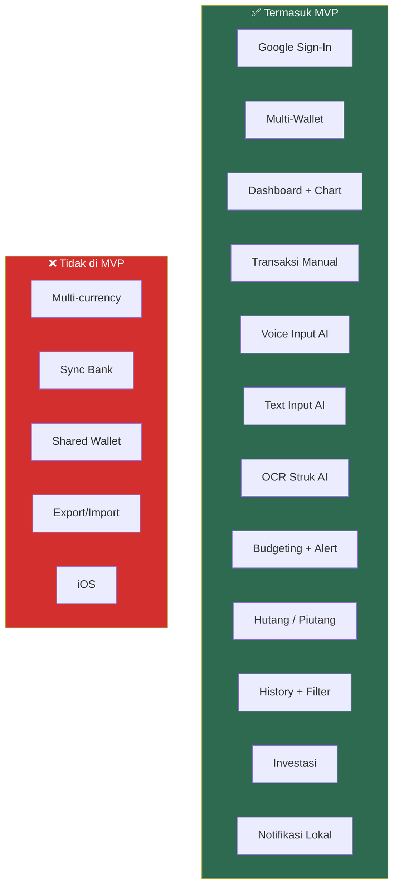

# 1. Tentang SakuRapi

[← Index](00_INDEX.md) · Berikutnya: [Prioritas Fitur →](02_PRIORITAS_FITUR.md)

---

## 1.1. Apa itu SakuRapi?
Aplikasi pencatat keuangan pribadi untuk Android yang membantu user mencatat transaksi dengan **cepat dan rapi** — baik secara manual, lewat suara (voice input), ketikan teks (text input), maupun scan struk (OCR).

## 1.2. Masalah yang Diselesaikan

| # | Masalah User | Solusi SakuRapi |
|---|---|---|
| 1 | Malas mencatat karena form panjang | Form ringkas + voice input + text input + scan struk |
| 2 | Sulit melacak banyak dompet | Multi-wallet dengan dashboard terpadu |
| 3 | Sulit lihat ringkasan keuangan | Dashboard visual + laporan chart |
| 4 | Ingin kontrol pengeluaran | Budgeting per kategori + notifikasi alert |
| 5 | Ingin lacak investasi | Portfolio investasi dengan harga live |

## 1.3. Prinsip Desain Produk

| # | Prinsip | Penjelasan |
|---|---|---|
| 1 | **Fast Capture First** | Tambah transaksi harus selesai < 20 detik |
| 2 | **Auditability** | Semua perubahan saldo wallet bisa ditelusuri dari ledger transaksi |
| 3 | **Consistent Money Model** | Saldo, histori, report, budget, investasi pakai aturan yang sama |
| 4 | **AI = Assistant, bukan Authority** | Hasil voice/text/OCR hanya prefill — user tetap konfirmasi sebelum simpan |
| 5 | **Low Ambiguity** | Semua rule penting harus eksplisit, tidak ada asumsi tersirat |

## 1.4. Yang TIDAK Termasuk di MVP

- Multi-currency conversion
- Sinkronisasi bank otomatis
- Shared wallet multi-user
- Export/import penuh
- iOS support

### Flowchart: Cakupan Produk

---

[← Index](00_INDEX.md) · Berikutnya: [Prioritas Fitur →](02_PRIORITAS_FITUR.md)
