# 2. Prioritas Fitur

[← Tentang SakuRapi](01_TENTANG_SAKURAPI.md) · [Index](00_INDEX.md) · [KPI Target →](03_KPI_TARGET.md)

---

## 2.1. P0 — Wajib Ada (Core)

| # | Fitur | Deskripsi Singkat |
|---|---|---|
| 1 | Google Sign-In + Profil | Login OAuth via Supabase |
| 2 | Multi-Wallet | CRUD dompet, balance tracking |
| 3 | Dashboard | Rangkuman keuangan + chart |
| 4 | Transaksi Manual | Income, expense, transfer, debt, loan, adjustment |
| 5 | History + Filter | Riwayat transaksi dengan filter & grouping |
| 6 | Kategori Parent-Child | Manajemen kategori 2 level |
| 7 | Settings | Profil, tema, bahasa, entry point transaksi |

## 2.2. P1 — Penting (Enhanced)

| # | Fitur | Deskripsi Singkat |
|---|---|---|
| 1 | Multi-item / Split Bill | Beberapa item dalam 1 transaksi |
| 2 | Voice Input AI | Catat transaksi dari suara |
| 3 | Text Input AI | Catat transaksi dari teks ketikan |
| 4 | OCR Struk AI | Scan struk → auto-isi form |
| 5 | Parsing Dictionary | Cache keyword → kategori untuk voice/text/OCR |
| 5 | Budgeting | Anggaran per kategori dengan alert |
| 6 | Visual Reports | Chart perbandingan & tren |
| 7 | Local Notifications | Reminder harian + budget alert |

## 2.3. P2 — Nice to Have (Future)

| # | Fitur | Deskripsi Singkat |
|---|---|---|
| 1 | Investasi | Portfolio gold/bitcoin/custom + harga live |
| 2 | Lampiran Lanjutan | Attachment management |
| 3 | Export/Import | Data portability |
| 4 | Analytics Improvement | Insight keuangan lanjutan |

### Flowchart: Prioritas Fitur

```mermaid
flowchart LR
    subgraph P0["P0 — Core (Wajib)"]
        direction TB
        P0A[Auth + Profil]
        P0B[Multi-Wallet]
        P0C[Dashboard]
        P0D[Transaksi Manual]
        P0E[History + Filter]
        P0F[Kategori]
        P0G[Settings]
    end

    subgraph P1["P1 — Enhanced (Penting)"]
        direction TB
        P1A[Multi-item]
        P1B[Voice Input AI]
        P1B2[Text Input AI]
        P1C[OCR Struk AI]
        P1D[Parsing Dictionary]
        P1E[Budgeting + Alert]
        P1F[Visual Reports]
        P1G[Notifications]
    end

    subgraph P2["P2 — Future (Nice to Have)"]
        direction TB
        P2A[Investasi]
        P2B[Lampiran Lanjutan]
        P2C[Export/Import]
        P2D[Analytics]
    end

    P0 -->|"Selesai"| P1
    P1 -->|"Selesai"| P2

    style P0 fill:#2d6a4f,color:#fff
    style P1 fill:#1565c0,color:#fff
    style P2 fill:#6a1b9a,color:#fff
```

---

[← Tentang SakuRapi](01_TENTANG_SAKURAPI.md) · [Index](00_INDEX.md) · [KPI Target →](03_KPI_TARGET.md)
