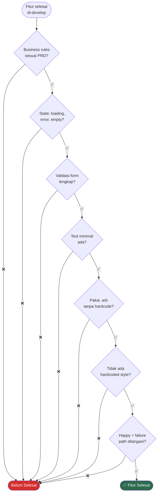

# 3. KPI Target & Definition of Done

[← Prioritas Fitur](02_PRIORITAS_FITUR.md) · [Index](00_INDEX.md) · [Aturan Keuangan →](04_ATURAN_KEUANGAN.md)

---

## 3.1. KPI Produk

| Metrik | Target |
|---|---|
| Waktu tambah transaksi manual | < 20 detik |
| Waktu tambah transaksi voice/OCR | < 45 detik end-to-end |
| Akurasi saldo wallet vs ledger | 100% match |
| Konsistensi total transaksi vs total item | 100% match (toleransi 0.01) |
| Tidak ada double-count saldo investasi | 100% |

## 3.2. Kapan Fitur Dianggap "Selesai"?

Sebuah fitur **selesai** jika memenuhi SEMUA kriteria berikut:

- [ ] Business rules terimplementasi sesuai PRD
- [ ] Ada state: loading, error, empty
- [ ] Ada validasi form
- [ ] Ada test minimal (repository/controller)
- [ ] String pakai `.arb` (tidak ada hardcode teks)
- [ ] Tidak ada hardcoded color/style
- [ ] Happy path + failure path ditangani

### Flowchart: Checklist Definition of Done

---

[← Prioritas Fitur](02_PRIORITAS_FITUR.md) · [Index](00_INDEX.md) · [Aturan Keuangan →](04_ATURAN_KEUANGAN.md)
