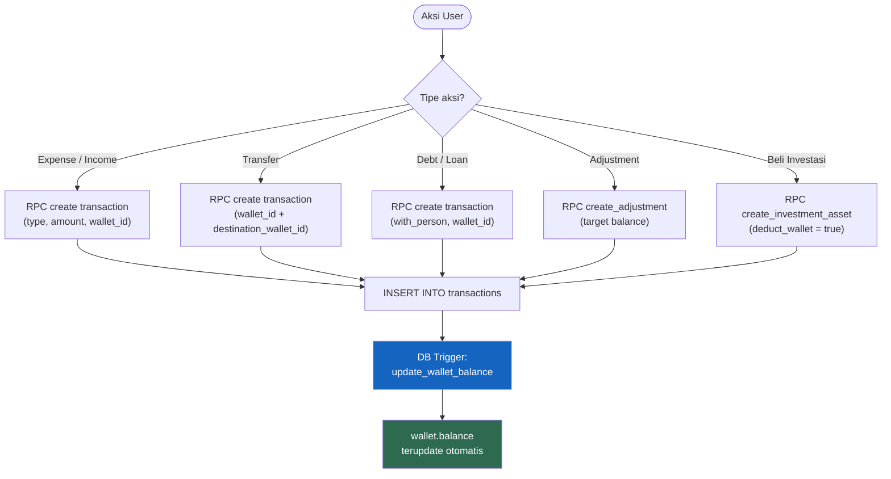
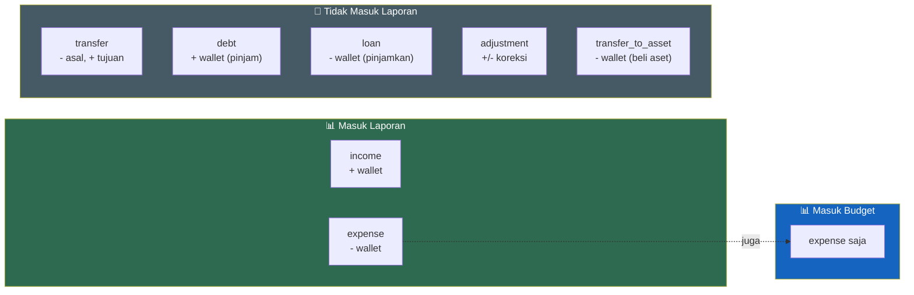
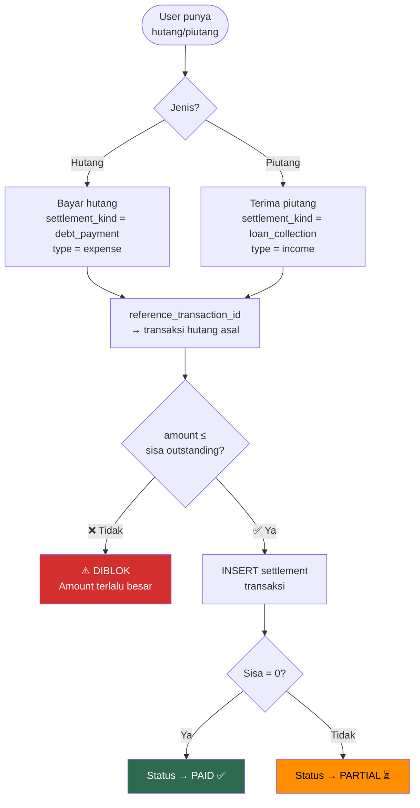
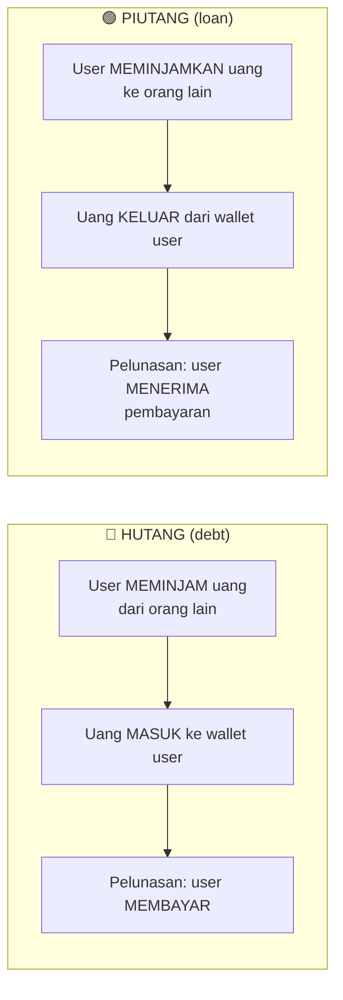

# 4. Aturan Keuangan Fundamental

[← KPI Target](03_KPI_TARGET.md) · [Index](00_INDEX.md) · [User Flows →](05_USER_FLOWS.md)

---

> **Bagian ini WAJIB dipahami oleh semua developer.**
> Aturan ini berlaku di seluruh aplikasi dan tidak boleh dilanggar.

## 4.1. Sumber Kebenaran Saldo Wallet

```
┌───────────────────────────────────────────────────────┐
│  ATURAN EMAS: Wallet balance HANYA berubah melalui    │
│  tabel `transactions` via database trigger.            │
│                                                       │
│  ❌ DILARANG mengubah balance langsung dari Flutter    │
│  ❌ DILARANG ada trigger lain di luar ledger          │
│  ✅ Semua mutasi saldo harus tercatat di transactions │
└───────────────────────────────────────────────────────┘
```

### Flowchart: Alur Perubahan Saldo Wallet



## 4.2. Matrix Tipe Transaksi

Tabel ini menjelaskan apa yang terjadi untuk setiap tipe transaksi:

| `type` | Arah Kas Wallet | Masuk Laporan? | Masuk Budget? | Butuh Wallet Tujuan? | Butuh `with_person`? |
|---|:---:|:---:|:---:|:---:|:---:|
| `income` | + (masuk) | ✅ Ya | ❌ Tidak | ❌ | ❌ |
| `expense` | - (keluar) | ✅ Ya | ✅ Ya | ❌ | ❌ |
| `transfer` | - asal, + tujuan | ❌ Tidak | ❌ Tidak | ✅ Wajib | ❌ |
| `debt` | + (pinjaman masuk) | ❌ Tidak | ❌ Tidak | ❌ | ✅ Wajib |
| `loan` | - (pinjamkan keluar) | ❌ Tidak | ❌ Tidak | ❌ | ✅ Wajib |
| `adjustment` | +/- (koreksi) | ❌ Tidak | ❌ Tidak | ❌ | ❌ |
| `transfer_to_asset` | - (beli aset) | ❌ Tidak | ❌ Tidak | ❌ | ❌ |

> **Ringkasan Sederhana:**
> - **Laporan** hanya menghitung `income` dan `expense` (bukan settlement).
> - **Budget** hanya menghitung `expense` (bukan settlement).
> - **Transfer, debt, loan, adjustment, transfer_to_asset** TIDAK masuk laporan maupun budget.

### Flowchart: Aliran Uang per Tipe



## 4.3. Aturan Settlement (Pelunasan Hutang/Piutang)

| Jenis Settlement | `settlement_kind` | `type` transaksi | Penjelasan |
|---|---|---|---|
| Bayar hutang | `debt_payment` | `expense` | User membayar hutangnya |
| Terima piutang | `loan_collection` | `income` | User menerima pembayaran piutang |

**Aturan penting:**
- Settlement **DIKECUALIKAN** dari laporan dan budget (meskipun type-nya income/expense)
- Setiap settlement wajib punya `reference_transaction_id` ke transaksi asal
- Amount settlement ≤ sisa outstanding

### Flowchart: Alur Settlement



## 4.4. Aturan Hutang/Piutang



- `with_person` (teks) **wajib** diisi untuk identifikasi pihak terkait
- `contact_id` (FK ke `contacts`) **opsional** — diisi jika user pilih dari phonebook
- Status: `unpaid` → `partial` → `paid` (dihitung dari total settlement)

## 4.5. Currency & Timezone

| Aturan | Nilai |
|---|---|
| Currency MVP | IDR only |
| Default `wallet.currency` | `'IDR'` |
| Timezone rendering | `Asia/Jakarta` |
| Penyimpanan tanggal | UTC di database |

---

[← KPI Target](03_KPI_TARGET.md) · [Index](00_INDEX.md) · [User Flows →](05_USER_FLOWS.md)
