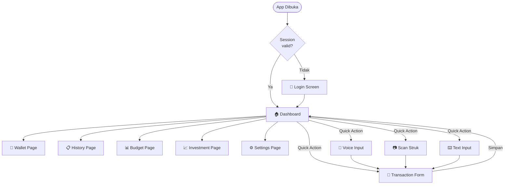
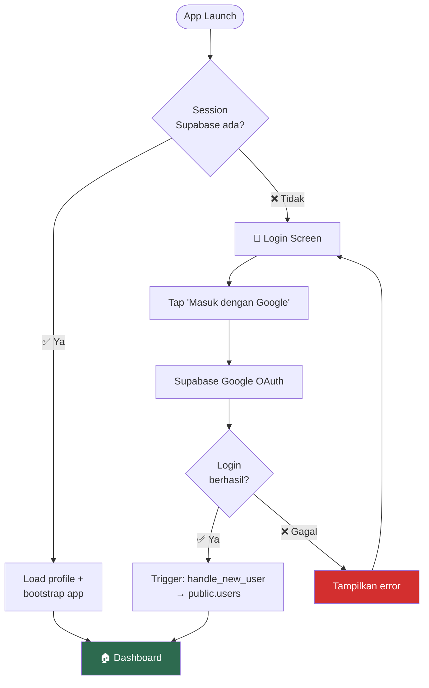
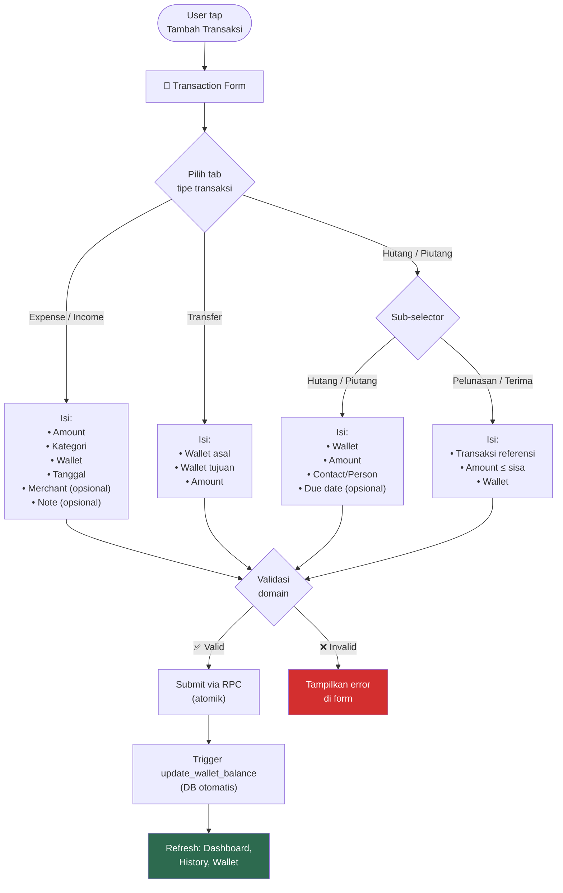
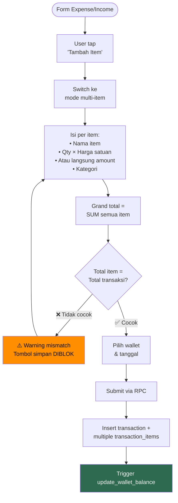
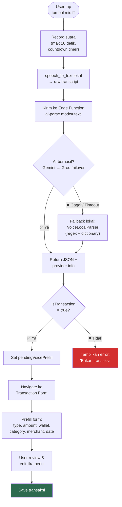
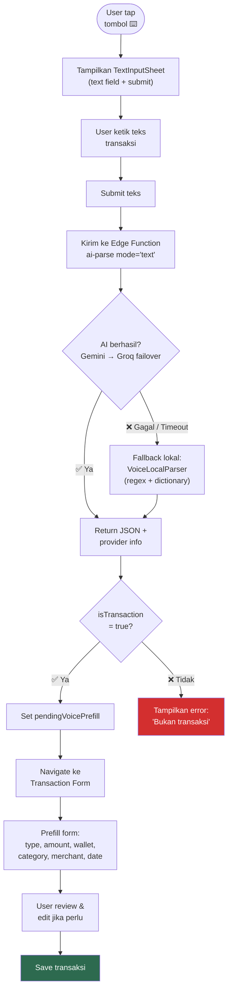
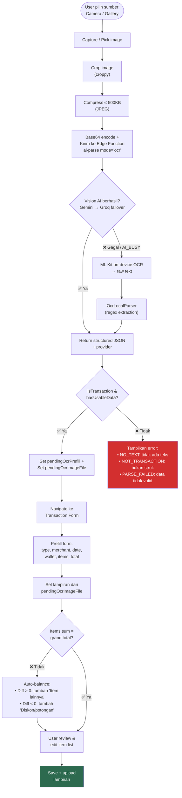
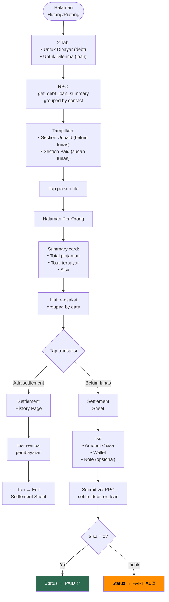
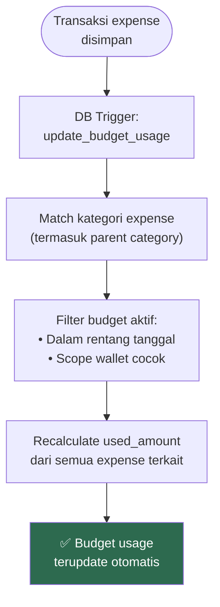
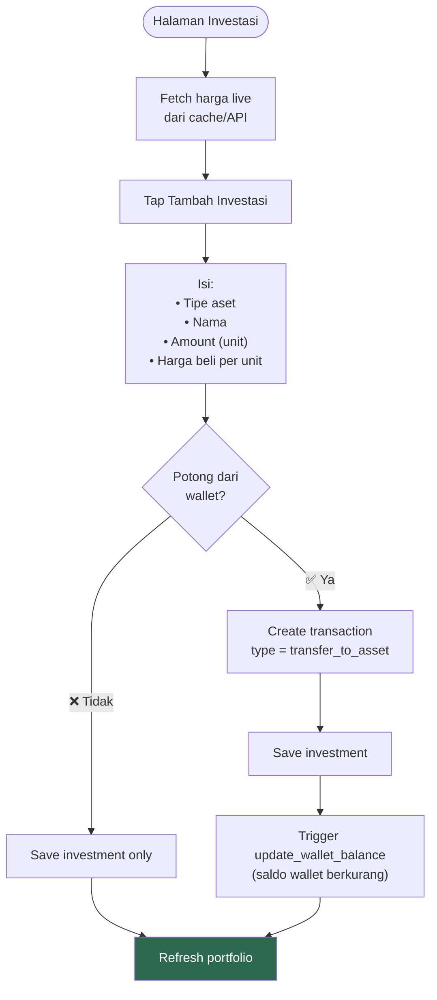

# 5. Flow Utama Aplikasi

[← Aturan Keuangan](04_ATURAN_KEUANGAN.md) · [Index](00_INDEX.md) · [Auth & Profil →](06_AUTH_PROFIL.md)

> **Katalog kategori 2026-04:** pasca-login kategori bawaan lewat **baris global** + `get_user_categories` (bukan *trigger* *seed* per pendaftaran). Lihat `My-Wiki/wiki/entities/categories.md`.

---

> **Panduan membaca flowchart:**
> - Kotak persegi = aksi/halaman
> - Diamond (belah ketupat) = keputusan/kondisi
> - Panah = alur proses
> - Warna hijau = happy path, merah = error path

## 5.1. Overview — Alur Navigasi Utama

## 5.2. Authentication Flow

**Catatan penting:**
- Flutter **TIDAK** insert manual ke `public.users` — `handle_new_user` mengisi profil
- Kategori: katalog **global** + RPC (bukan *insert* *seed* per pendaftaran, Apr 2026)
- *Notification settings* DB (baseline) sudah di-drop; notifikasi lokal di app dihapun
- Logout membersihkan session lokal + cache Hive → navigasi ke login

## 5.3. Manual Transaction Flow

> **Catatan:** Tipe `adjustment` **TIDAK** ditampilkan di form transaksi manual.
> Adjustment hanya bisa dibuat dari fitur koreksi saldo wallet.

## 5.4. Multi-item Transaction Flow

**Aturan perhitungan amount item:**
1. Jika `qty` dan `unit_price` terisi → `amount = qty × unit_price` (otomatis, read-only)
2. Jika tidak → user isi `amount` manual
3. Single-item tetap simpan 1 row di `transaction_items`

## 5.5. Voice Input Flow

**Pipeline AI:**
1. STT lokal (`speech_to_text`, locale `id_ID`) → teks
2. Edge Function `ai-parse` mode `text` → Gemini
3. Failover ke Groq (bukan Grok)
4. Fallback lokal: regex amount + keyword type + dictionary category

**Contoh parsing lokal:**
- `"1.5jt"` → 1.500.000
- `"25rb"` → 25.000
- `"transfer/kirim uang"` → type transfer
- `"kemarin"` → tanggal -1 hari

## 5.6. Text Input Flow

**Pipeline AI (sama dengan Voice, tanpa STT):**
1. User ketik teks langsung → tidak perlu mic permission / STT
2. Edge Function `ai-parse` mode `text` → Gemini
3. Failover ke Groq
4. Fallback lokal: regex amount + keyword type + dictionary category

## 5.7. OCR Receipt Flow

## 5.8. Debt/Loan Management Flow

## 5.9. Budget Usage Update Flow (Otomatis)

> **Penting:** Notifikasi alert budget (50%/80%/100%) bukan bagian dari trigger database.
> Alert dicek saat halaman budget dibuka oleh `BudgetAlertChecker` di Flutter.

## 5.10. Investment Buy Flow

---

[← Aturan Keuangan](04_ATURAN_KEUANGAN.md) · [Index](00_INDEX.md) · [Auth & Profil →](06_AUTH_PROFIL.md)
