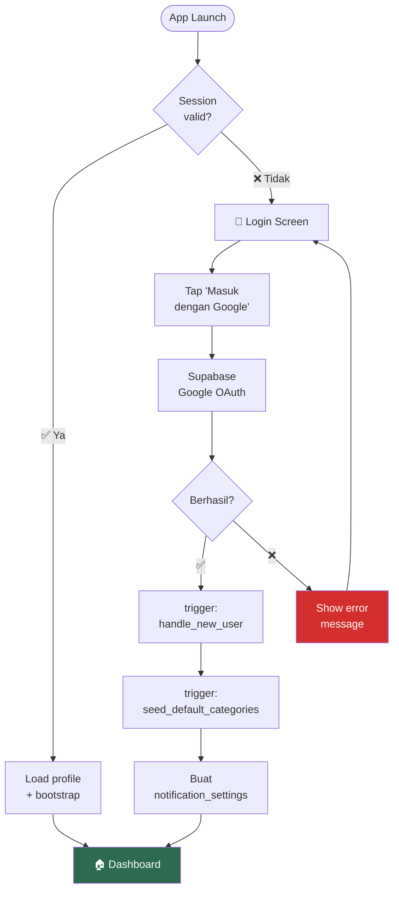
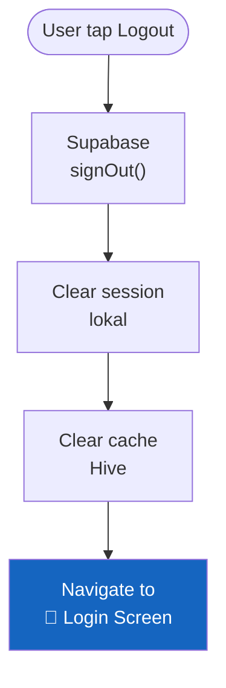

# 6. Auth & Profil

[← User Flows](05_USER_FLOWS.md) · [Index](00_INDEX.md) · [Dashboard →](07_DASHBOARD.md)

---

## 6.1. Deskripsi
Login hanya via Google Sign-In melalui Supabase Auth. Setelah login, sistem otomatis setup data awal user.

## 6.2. Alur Login
1. User tap "Masuk dengan Google"
2. Supabase handle OAuth flow
3. DB trigger `handle_new_user` → buat/update `public.users`
4. DB trigger `seed_default_categories` → buat kategori default
5. Buat `notification_settings` default
6. Navigasi ke Dashboard

### Flowchart: Alur Login & Bootstrap

### Flowchart: Alur Logout

## 6.3. Profil User
- User dapat edit `full_name` dan `avatar_url`
- Avatar disimpan di Supabase Storage

## 6.4. Acceptance Criteria
- [x] Session valid → langsung ke Dashboard
- [x] Session invalid → ke Login
- [x] Login pertama → kategori default dibuat
- [x] Logout → bersihkan session lokal → ke Login

---

[← User Flows](05_USER_FLOWS.md) · [Index](00_INDEX.md) · [Dashboard →](07_DASHBOARD.md)
