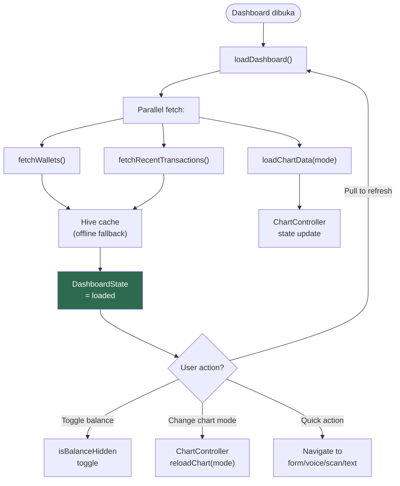

# 7. Dashboard

[← Auth & Profil](06_AUTH_PROFIL.md) · [Index](00_INDEX.md) · [Wallets →](08_WALLETS.md)

---

## 7.1. Deskripsi
Halaman utama setelah login. Menampilkan rangkuman keuangan, quick actions, dan chart tren.

## 7.2. UI Layout (CustomScrollView + RefreshIndicator)

```
┌─────────────────────────────────────┐
│  Hello, {userName}!                 │  ← Greeting
├─────────────────────────────────────┤
│  ┌─────────────────────────────┐    │
│  │  TOTAL BALANCE    👁        │    │  ← DashboardBalanceCard
│  │  Rp 12.500.000              │    │     (gradient card)
│  │  ↗ Income  ↘ Expense       │    │
│  └─────────────────────────────┘    │
├─────────────────────────────────────┤
│  [✏️ Manual] [🎤 Voice]            │  ← DashboardQuickActions
│  [📷 Scan]  [⌨️ Text]              │     (4 tombol horizontal)
├─────────────────────────────────────┤
│  My Wallets              See All → │  ← DashboardWalletSection
│  ┌────┐ ┌────┐ ┌────┐              │     (horizontal scroll cards)
│  │Cash│ │Dana│ │OVO │              │
│  └────┘ └────┘ └────┘              │
├─────────────────────────────────────┤
│  ●Income    ●Expense    Net Flow   │  ← DashboardPeriodSummary
│  Rp 8jt     Rp 5jt      +Rp 3jt   │     + comparison badge
│               See Full Report →    │
├─────────────────────────────────────┤
│  ◀ [Chart Carousel - 2 pages] ▶   │  ← DashboardChartCarousel
│  [Monthly ▼]                       │     (toggle: Monthly/Weekly/Daily)
│  Page 0: Expense Comparison Bar    │
│  Page 1: Trend Report Line Chart   │
├─────────────────────────────────────┤
│  Recent Transactions                │  ← DashboardRecentTransactions
│  - Kopi Kenangan     -Rp 25.000   │     (5 terbaru)
│  - Gaji Bulanan     +Rp 8.000.000 │
│  - ...                             │
└─────────────────────────────────────┘
```

## 7.3. State Management — Split Controller

Dashboard menggunakan **2 controller terpisah** untuk mencegah rebuild seluruh halaman saat hanya chart mode berubah:

```mermaid
flowchart LR
    subgraph DashboardController["DashboardController (Parent)"]
        A[DashboardState]
        A1["• status (loading/loaded/error)"]
        A2["• recentTransactions"]
        A3["• isBalanceHidden"]
    end

    subgraph ChartController["DashboardChartController (Chart)"]
        B[DashboardChartState]
        B1["• chartMode (monthly/weekly/daily)"]
        B2["• currentPeriod income/expense"]
        B3["• previousPeriod income/expense"]
        B4["• daily data (current/prev/avg)"]
    end

    DashboardController -->|"loadDashboard() triggers"| ChartController
    ChartController -->|"mode change = chart reload only"| ChartController
```



**Widget consumers:**
- `DashboardController` → DashboardPage, BalanceCard, WalletSection, RecentTransactions
- `ChartController` → ChartCarousel, ComparisonChart, TrendChart, PeriodSummary

### Flowchart: Dashboard Lifecycle



## 7.4. Data Queries
- Recent transactions: `ORDER BY date DESC, created_at DESC`, `LIMIT 5`, join wallet + items + categories
- Period summary: `type IN ('income','expense') AND settlement_kind IS NULL`
- Caching: recent transactions + period summary di-cache ke Hive (offline fallback)

## 7.5. Acceptance Criteria
- [x] Total saldo hanya dari wallet `exclude_from_total = false`
- [x] Quick actions: Manual → form, Voice → sheet → form, Scan → sheet → form, Text → sheet → form
- [x] Chart mode toggle reload data dengan benar
- [x] Balance hide/show toggle berfungsi
- [x] Pull-to-refresh memuat ulang wallets + dashboard paralel
- [x] Loading/error/empty states ditangani

---

[← Auth & Profil](06_AUTH_PROFIL.md) · [Index](00_INDEX.md) · [Wallets →](08_WALLETS.md)
