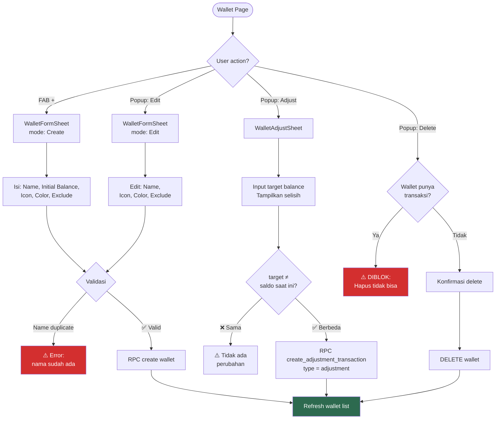
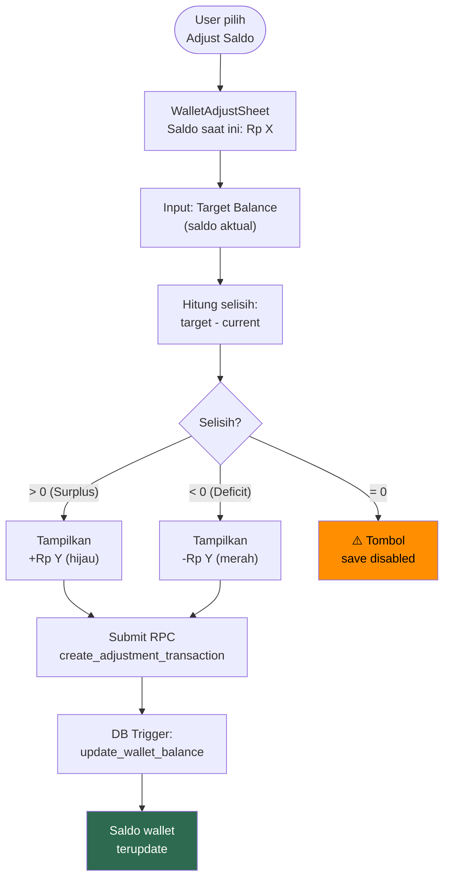

# 8. Wallets

[← Dashboard](07_DASHBOARD.md) · [Index](00_INDEX.md) · [Transaksi →](09_TRANSAKSI.md)

---

## 8.1. Deskripsi
Manajemen multi-dompet. Setiap wallet punya nama, icon, warna, dan saldo. Balance hanya berubah melalui ledger transaksi.

## 8.2. UI Layout

```
┌─────────────────────────────────────┐
│  Dompet                    [+ FAB] │  ← AppBar
├─────────────────────────────────────┤
│  ┌─────────────────────────────┐    │
│  │  TOTAL SALDO               │    │  ← WalletSummaryCard
│  │  Rp 12.500.000  (3 dompet) │    │     (gradient card)
│  └─────────────────────────────┘    │
├─────────────────────────────────────┤
│  📂 Termasuk dalam total            │  ← Section header
│  ┌─ 💰 Cash         Rp 5.000.000 ┐ │
│  ├─ 📱 Dana         Rp 4.500.000 ┤ │  ← WalletTile + popup menu
│  └─ 📱 OVO          Rp 3.000.000 ┘ │     (Edit, Adjust, Delete)
├─────────────────────────────────────┤
│  📂 Dikecualikan dari total         │  ← Section header
│  └─ 🏦 Tabungan     Rp 50.000.000┘ │
└─────────────────────────────────────┘
```

## 8.3. Forms

**WalletFormSheet (Bottom Sheet):**

| Mode | Fields yang Tampil |
|---|---|
| **Create** | Name, Initial Balance, Icon Picker, Color Picker, Exclude Toggle |
| **Edit** | Name, Icon Picker, Color Picker, Exclude Toggle (**tanpa** Initial Balance) |

Validasi:
- Name required, trimmed, unique per user (case-insensitive)
- Initial balance ≥ 0 (hanya saat create)

**WalletAdjustSheet (Bottom Sheet) — Koreksi Saldo:**
- Tampilkan: nama wallet, saldo saat ini
- Input: target balance (saldo aktual sekarang)
- Tampilkan selisih: +/- berwarna (hijau/merah)
- Validasi: target ≠ saldo saat ini
- Save → RPC `create_adjustment_transaction`

### Flowchart: Wallet CRUD Flow



### Flowchart: Balance Adjustment Flow



## 8.4. Aturan Bisnis
- `balance` adalah **READ-ONLY** di client — hanya berubah via trigger
- Transfer antar dompet = 1 record `type='transfer'` + `destination_wallet_id`
- Ordering: `sort_order ASC`, `created_at ASC`
- Caching: list wallet di-cache ke Hive

## 8.5. Acceptance Criteria
- [x] Transfer ke wallet sama → diblok
- [x] Delete wallet yang punya transaksi → diblok
- [x] Dashboard total hanya wallet `exclude_from_total = false`
- [x] Name duplicate (case-insensitive) → diblok di create & update
- [x] Balance adjustment → buat transaksi `type = adjustment` via RPC

---

[← Dashboard](07_DASHBOARD.md) · [Index](00_INDEX.md) · [Transaksi →](09_TRANSAKSI.md)
