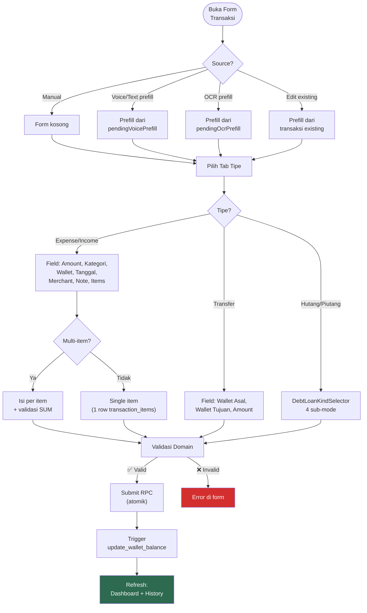
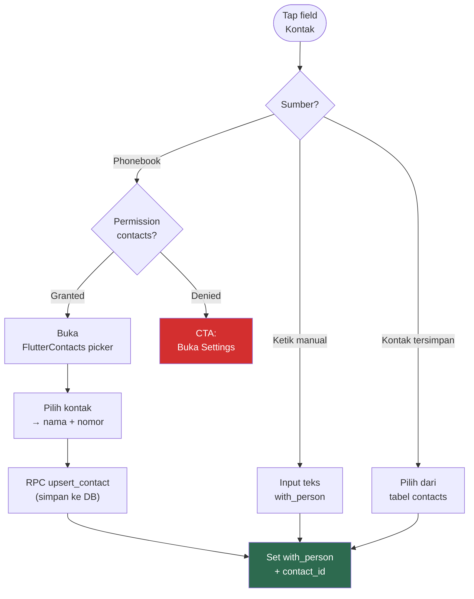
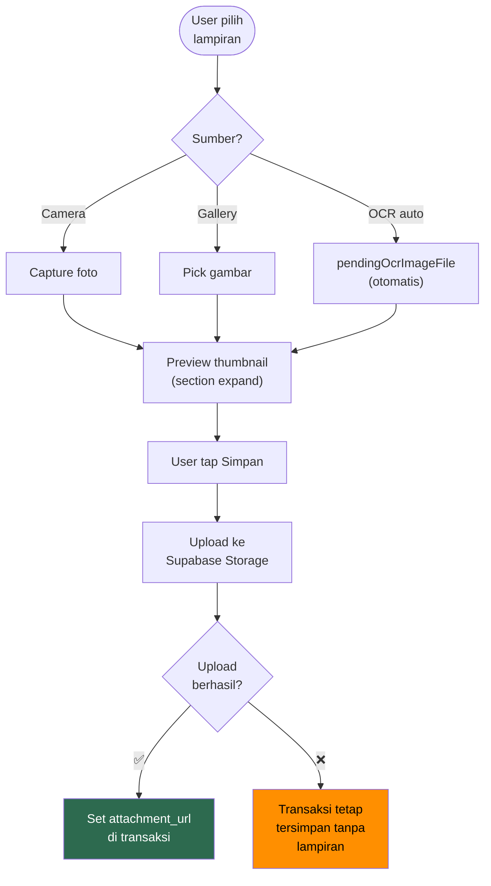

# 9. Transaksi

[← Wallets](08_WALLETS.md) · [Index](00_INDEX.md) · [Transaction Detail →](10_TRANSACTION_DETAIL.md)

---

## 9.1. Form UI — 4 Tab

```
┌─────────────────────────────────────┐
│  [Expense] [Income] [Transfer] [H/P]│  ← Tab selector
├─────────────────────────────────────┤
│  (Form fields sesuai tipe)          │
└─────────────────────────────────────┘
```

Tab **Hutang/Piutang** punya 4 sub-mode via `DebtLoanKindSelector`:

| Sub-mode | Tipe Transaksi | Penjelasan |
|---|---|---|
| Hutang | `debt` | User meminjam dari orang lain |
| Piutang | `loan` | User meminjamkan ke orang lain |
| Pelunasan | `debt_payment` | User membayar hutangnya |
| Terima | `loan_collection` | User menerima piutangnya |

### Flowchart: Alur Form Transaksi



## 9.2. Field Wajib per Tipe

| Field | Expense | Income | Transfer | Debt/Loan | Settlement |
|:---|:---:|:---:|:---:|:---:|:---:|
| `wallet_id` | ✅ | ✅ | ✅ (asal) | ✅ | ✅ |
| `destination_wallet_id` | — | — | ✅ (tujuan) | — | — |
| `category_id` (item) | ✅ | ✅ | — | — | — |
| `with_person` | — | — | — | ✅ | Dari ref |
| `contact_id` | — | — | — | Opsional | Dari ref |
| `merchant_name` | Opsional | Opsional | — | — | — |
| `note` | Opsional | Opsional | Opsional | Opsional | Opsional |
| `attachment_url` | Opsional | Opsional | Opsional | Opsional | — |
| `due_date` | — | — | — | Opsional | — |
| `reference_transaction_id` | — | — | — | — | ✅ |
| Multi-item | ✅ | ✅ | ❌ | ❌ | ❌ |

## 9.3. Kontak (Contact Picker)
Untuk hutang/piutang, user dapat memilih kontak dari:
1. **Phonebook device** — via `FlutterContacts`, perlu permission
2. **Kontak tersimpan** — dari tabel `contacts` di database
3. Kontak dari phonebook di-upsert ke `contacts` via RPC `upsert_contact`

### Flowchart: Contact Picker Flow



## 9.4. Validasi Domain

| Rule | Detail |
|---|---|
| Amount | `total_amount > 0` untuk semua type (kecuali adjustment) |
| Transfer | `destination_wallet_id ≠ wallet_id` |
| Debt/Loan | `with_person` wajib diisi |
| Items | Minimal 1 record di `transaction_items` |
| Item total | `SUM(items.amount) == total_amount` (toleransi 0.01) |
| Kategori | Wajib untuk `income` dan `expense`; boleh null untuk lainnya |
| Settlement | Amount ≤ remaining dari transaksi referensi |
| Anti double-submit | Status flag `saving` mencegah submit ganda |

## 9.5. Lampiran (Attachment)
- **Lazy upload:** Lampiran dipilih lokal, upload ke Supabase Storage saat simpan
- **Preview:** Tap thumbnail → dialog fullscreen + `InteractiveViewer` (pinch-to-zoom, max 5x)
- **Auto-expand:** Jika `localAttachmentPath` berubah (misal dari OCR), section otomatis expand
- Jika upload gagal → transaksi tetap tersimpan tanpa lampiran

### Flowchart: Attachment Upload Flow



## 9.6. Edit/Delete Policy

| Aksi | Transaksi Biasa | Settlement |
|---|---|---|
| Edit | Boleh (selama belum locked) | Via RPC `update_settlement` |
| Delete | Via mekanisme trigger (reverse saldo) | Via RPC `delete_settlement` |

- Delete settlement harus dicek agar outstanding principal tidak negatif
- Edit settlement via bottom sheet (bukan form page)

## 9.7. Acceptance Criteria
- [x] Double tap submit → diabaikan
- [x] Transfer ke wallet sama → diblok
- [x] Total item ≠ total transaksi → blok simpan
- [x] Settlement > outstanding → diblok
- [x] Lampiran lazy upload berfungsi

---

[← Wallets](08_WALLETS.md) · [Index](00_INDEX.md) · [Transaction Detail →](10_TRANSACTION_DETAIL.md)
