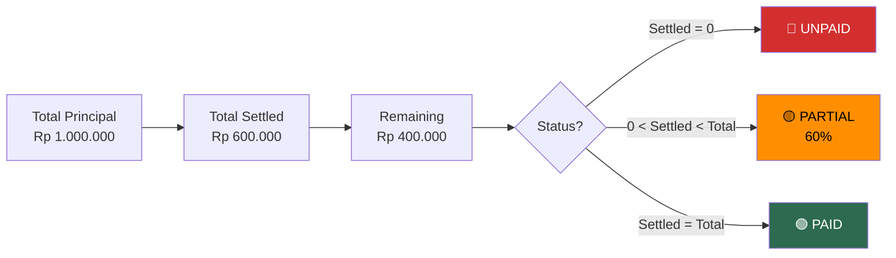

# 10. Transaction Detail Page

[← Transaksi](09_TRANSAKSI.md) · [Index](00_INDEX.md) · [Hutang / Piutang →](11_HUTANG_PIUTANG.md)

---

## 10.1. Deskripsi
Menampilkan detail lengkap satu transaksi (read-only) dengan aksi edit/delete.

## 10.2. Layout

```
┌─────────────────────────────────────┐
│  [Badge: EXPENSE]                   │
│  -Rp 45.000                        │  ← Header card
│  Indomaret                          │     (tipe + amount + merchant)
├─────────────────────────────────────┤
│  Wallet: Cash                       │
│  Tanggal: 29/03/2026               │  ← Detail section
│  Catatan: Belanja harian           │
├─────────────────────────────────────┤
│  Items (3)                   [▼]    │
│  • Kopi Kenangan    2x  Rp 30.000  │  ← Items section (expandable)
│  • Roti Sobek            Rp 15.000  │
│  Grand Total:            Rp 45.000  │
├─────────────────────────────────────┤
│  [✏️ Edit]  [🗑️ Delete]             │  ← Action buttons
└─────────────────────────────────────┘
```

**Khusus Debt/Loan:**
- Info kontak: avatar (huruf pertama), label lender/borrower
- Progress pelunasan: jumlah terbayar, sisa, progress bar
- Tombol: "Bayar Hutang" / "Terima Piutang" + "Riwayat Pelunasan"
- Label "Dikecualikan dari laporan"

### Flowchart: Transaction Detail Actions

```mermaid
flowchart TD
    A([Buka Transaction\nDetail Page]) --> B["Load detail + items\n+ wallet + categories"]
    B --> C{Tipe transaksi?}

    C -->|Expense / Income| D["Tampilkan:\n• Amount, Merchant\n• Items (expandable)\n• Wallet, Tanggal, Note"]
    C -->|Transfer| E["Tampilkan:\n• Amount\n• Wallet Asal → Tujuan"]
    C -->|Debt / Loan| F["Tampilkan:\n• Kontak (avatar)\n• Progress pelunasan\n• Tombol Settlement"]

    D --> G{User action?}
    E --> G
    F --> G

    G -->|Edit| H["Navigate ke\nTransaction Form\n(mode: edit)"]
    G -->|Delete| I["Dialog konfirmasi"]
    I --> J{Konfirmasi?}
    J -->|Ya| K["Delete via RPC\n→ Trigger reverse saldo"]
    J -->|Tidak| A

    G -->|Bayar/Terima\n(debt/loan only)| L["Buka Settlement\nSheet"]
    G -->|Riwayat Pelunasan\n(debt/loan only)| M["Navigate ke\nSettlement History"]

    K --> N["Pop + refresh\nHistory"]

    style N fill:#2d6a4f,color:#fff
```

### Flowchart: Debt/Loan Progress View



---

[← Transaksi](09_TRANSAKSI.md) · [Index](00_INDEX.md) · [Hutang / Piutang →](11_HUTANG_PIUTANG.md)
