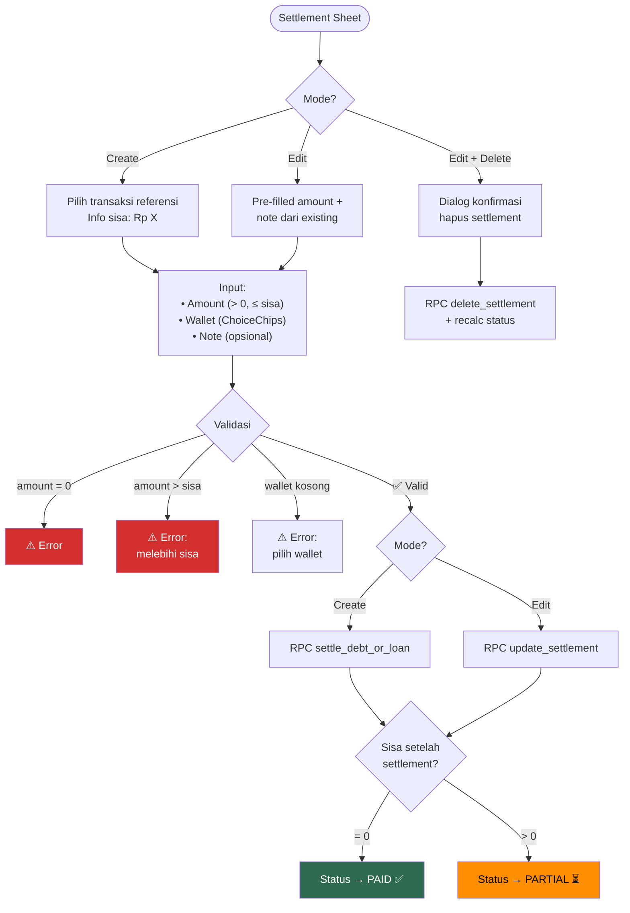

# 11. Debt/Loan Management

[← Transaction Detail](10_TRANSACTION_DETAIL.md) · [Index](00_INDEX.md) · [History →](12_HISTORY.md)

---

## 11.1. Halaman Utama — 2 Tab

| Tab | Konten | Data dari |
|---|---|---|
| Untuk Dibayar | Daftar hutang user | RPC `get_debt_loan_summary` type=debt |
| Untuk Diterima | Daftar piutang user | RPC `get_debt_loan_summary` type=loan |

Setiap tab menampilkan:
- **Section Unpaid:** Kontak dengan sisa hutang/piutang + total remaining
- **Section Paid:** Kontak yang sudah lunas + total principal
- **Wallet filter** di AppBar

### Flowchart: Navigasi Hutang/Piutang

```mermaid
flowchart TD
    A([Halaman\nHutang/Piutang]) --> B["2 Tab:\n• Untuk Dibayar\n• Untuk Diterima"]
    B --> C["RPC get_debt_loan_summary\ngrouped by contact"]
    C --> D["Section Unpaid:\nkontak belum lunas"]
    C --> E["Section Paid:\nkontak sudah lunas"]

    D --> F[Tap person tile]
    E --> F
    F --> G[Halaman Per-Orang]

    G --> H["Summary card +\nList transaksi"]
    H --> I{Action?}

    I -->|Tap transaksi\n(belum lunas)| J[Settlement Sheet]
    I -->|Tap transaksi\n(ada settlement)| K[Settlement History]
    I -->|FAB| L["New Settlement\n(hidden jika semua paid)"]

    style G fill:#1565c0,color:#fff
```

## 11.2. Halaman Per-Orang
- Summary card: total principal vs settled vs remaining
- List transaksi grouped by date
- Status badge per transaksi: Paid (hijau), Partial (oranye), Unpaid (abu)
- FAB settlement (hidden jika semua sudah paid)

## 11.3. Settlement Sheet

| Mode | Fitur |
|---|---|
| **Create** | Pilih referensi, info sisa, input amount + MAX, wallet ChoiceChips, note |
| **Edit** | Pre-filled amount + note, tombol delete (konfirmasi) |

Validasi: amount > 0, amount ≤ remaining, wallet dipilih.

### Flowchart: Settlement Create/Edit Flow



## 11.4. RPC Terkait

| RPC | Kegunaan |
|---|---|
| `get_debt_loan_summary` | Summary grouped by contact per type |
| `get_debt_loan_transactions_by_person` | Semua transaksi dengan satu orang |
| `get_all_unpaid_debt_loan` | Semua transaksi belum lunas (untuk picker) |
| `get_settlement_history` | Riwayat pelunasan untuk satu referensi |
| `settle_debt_or_loan` | Buat transaksi pelunasan |
| `update_settlement` | Edit pelunasan |
| `delete_settlement` | Hapus pelunasan + recalc status |

---

[← Transaction Detail](10_TRANSACTION_DETAIL.md) · [Index](00_INDEX.md) · [History →](12_HISTORY.md)
