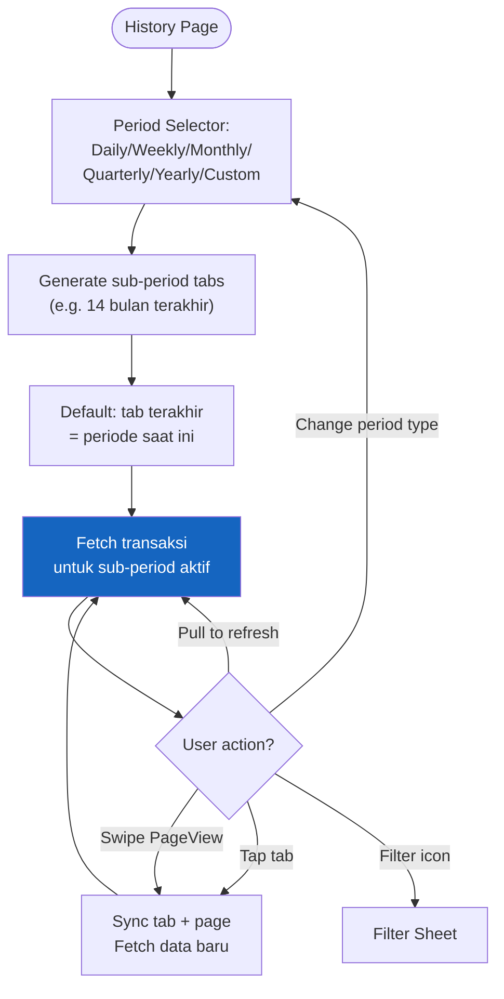
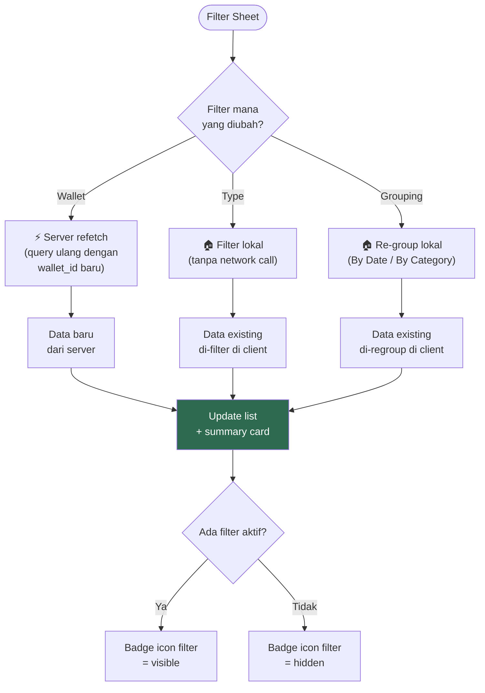
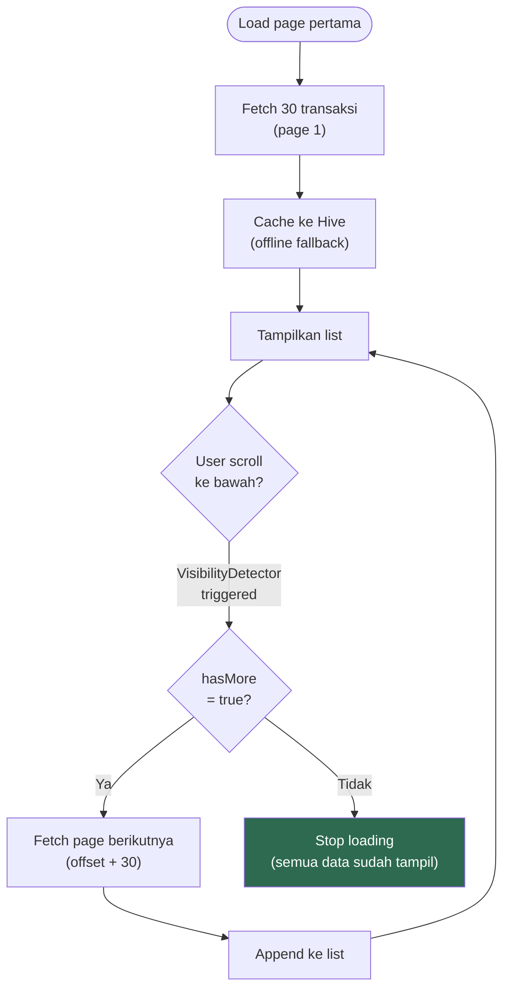

# 12. History

[← Hutang / Piutang](11_HUTANG_PIUTANG.md) · [Index](00_INDEX.md) · [Categories →](13_CATEGORIES.md)

---

## 12.1. Deskripsi
Riwayat transaksi dengan filter periode, filter tipe, grouping, dan pagination.

## 12.2. Period Selector — 6 Opsi

| Opsi | Rentang | Label Contoh |
|---|---|---|
| **Daily** | 30 hari terakhir | "29 Mar" atau "Hari Ini" |
| **Weekly** | 30 minggu terakhir | "24–30 Mar" atau "Minggu Ini" |
| **Monthly** (default) | 14 bulan terakhir | "Maret 2026" atau "Bulan Ini" |
| **Quarterly** | 2+ tahun | "Q1 2026" atau "Kuartal Ini" |
| **Yearly** | 5 tahun terakhir | "2026" atau "Tahun Ini" |
| **Custom** | Date range picker | "1 Mar – 31 Mar" |

Sub-period tabs sinkron dengan swipeable PageView. Tab terakhir = periode saat ini.

### Flowchart: Period Selection & Data Flow

## 12.3. Filter Sheet (Bottom Modal)

| Filter | Opsi | Behavior |
|---|---|---|
| **Wallet** | All / per-wallet | ⚡ Trigger refetch dari server |
| **Type** | All / Expense / Income / Transfer / Debt / Loan | 🏠 Lokal (tanpa refetch) |
| **Grouping** | By Date (default) / By Category | 🏠 Lokal (tanpa refetch) |

Badge ditampilkan di icon filter jika ada filter aktif.

### Flowchart: Filter Logic

## 12.4. Summary Card
Di atas list, menampilkan:
- Total income (tanpa settlement) — hijau
- Total expense (tanpa settlement) — merah
- Jumlah transaksi
- Format compact: "Rp 1.2M"

## 12.5. Pagination & Caching
- Page size: 30 transaksi
- Infinite scroll via `VisibilityDetector`
- `hasMore` flag untuk stop loading
- Halaman pertama di-cache ke Hive

### Flowchart: Infinite Scroll Pagination

## 12.6. Acceptance Criteria
- [x] Ganti period tidak crash
- [x] Swipe antar sub-period bekerja (tab + PageView sync)
- [x] Filter type/grouping lokal (tanpa refetch)
- [x] Summary card exclude settlement
- [x] Infinite scroll berhenti saat data habis
- [x] Pull-to-refresh berfungsi

---

[← Hutang / Piutang](11_HUTANG_PIUTANG.md) · [Index](00_INDEX.md) · [Categories →](13_CATEGORIES.md)
