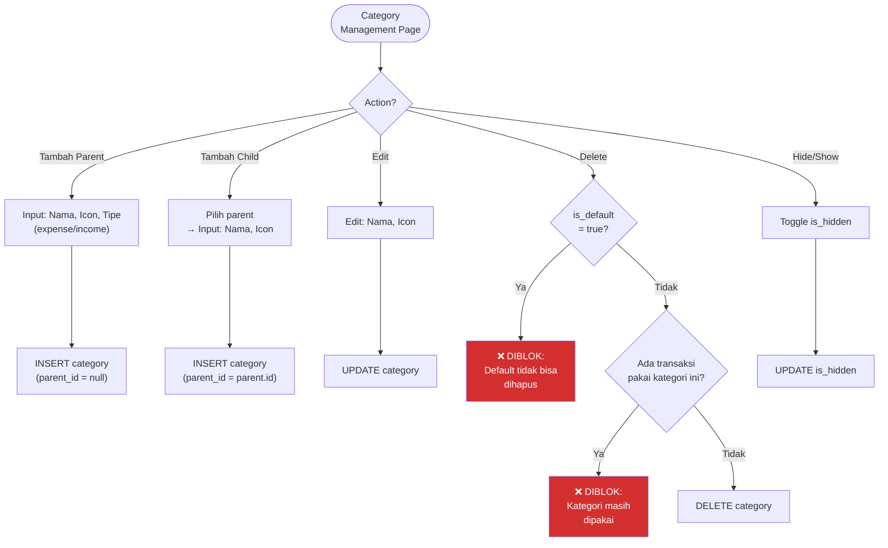
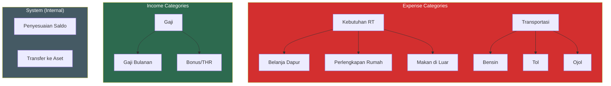

# 13. Categories

[← History](12_HISTORY.md) · [Index](00_INDEX.md) · [Budgeting →](14_BUDGETING.md)

---

## 13.1. Aturan
- Parent-child max 2 level
- `is_default = true` → tidak boleh hard delete
- Default category bisa di-hide (`is_hidden = true`)
- Form transaksi hanya tampilkan kategori sesuai type (expense → expense categories)
- Tipe debt/loan tidak pakai taxonomy kategori normal di MVP

### Flowchart: Category CRUD

### Flowchart: Category Hierarchy

---

[← History](12_HISTORY.md) · [Index](00_INDEX.md) · [Budgeting →](14_BUDGETING.md)
