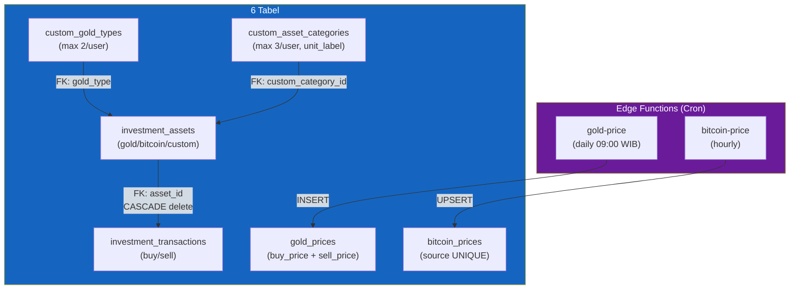
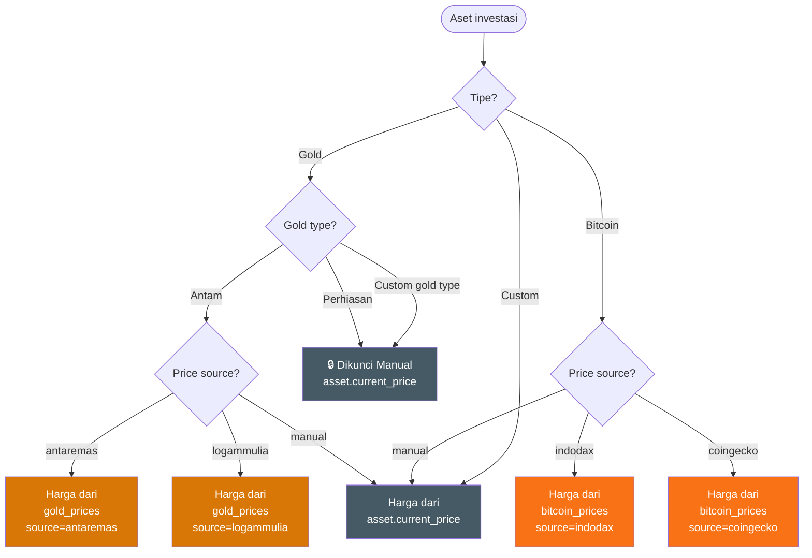
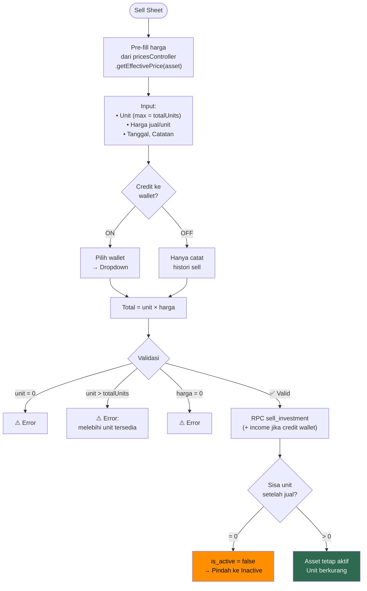
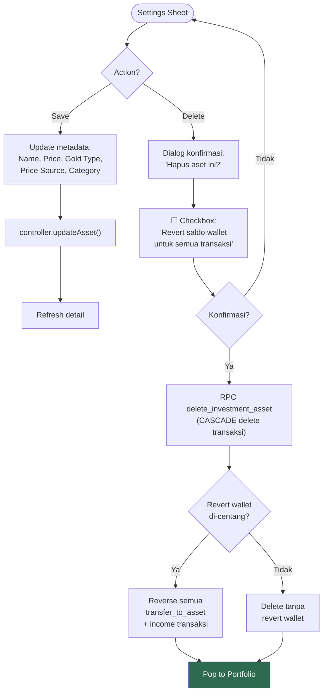
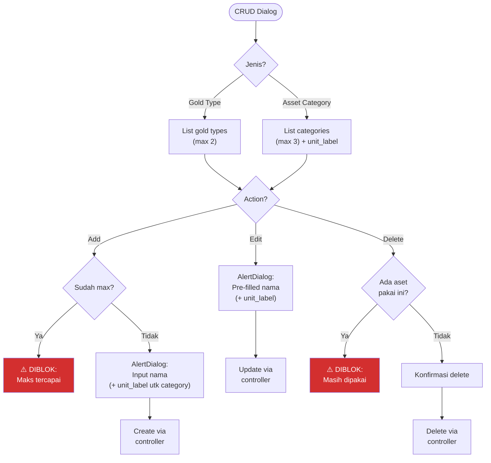
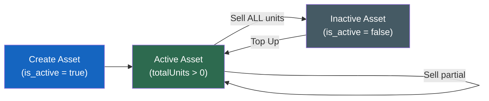

# 15. Investasi

[← Budgeting](14_BUDGETING.md) · [Index](00_INDEX.md) · [Settings →](16_SETTINGS.md)

---

## 15.1. Deskripsi
Portfolio investasi dengan 3 jenis aset utama (gold, bitcoin, custom), harga live via Edge Functions, dan integrasi wallet dua arah (deduct saat beli, credit saat jual).

## 15.2. Arsitektur Database

**6 Tabel:**

| Tabel | Deskripsi | Constraint |
|---|---|---|
| `custom_gold_types` | Jenis emas custom user | Max 2 per user (trigger) |
| `custom_asset_categories` | Kategori aset custom + `unit_label` | Max 3 per user (trigger) |
| `investment_assets` | Master aset investasi | type CHECK(gold/bitcoin/custom), FK ke gold types & categories |
| `investment_transactions` | Transaksi beli/jual per aset | direction CHECK(buy/sell), CASCADE delete |
| `gold_prices` | Cache harga emas dari API (buy_price + sell_price per gram) | source CHECK(antaremas/logammulia), append-only untuk charting historis |
| `bitcoin_prices` | Cache harga Bitcoin dari API | source UNIQUE untuk UPSERT |

**7 RPC Functions:**
- `create_investment_asset` — Buat aset + transaksi pembelian awal (atomik, opsional deduct wallet)
- `topup_investment` — Tambah pembelian ke aset existing (atomik, opsional deduct wallet)
- `sell_investment` — Jual unit aset (atomik, opsional credit wallet via `income` type)
- `edit_investment_transaction` — Edit transaksi existing
- `delete_investment_transaction` — Hapus transaksi + revert wallet jika ada
- `delete_investment_asset` — Hapus master aset beserta semua transaksi (CASCADE)
- `get_investment_dashboard` — Dashboard data dengan aggregated fields (total units, invested, fee, avg price, count)
- `upsert_bitcoin_price` — UPSERT harga Bitcoin per source

**2 Edge Functions:**
- `gold-price` — Gemini AI Search Grounding untuk antaremas + logammulia, cross-reference harga-emas.org (pg_cron daily 09:00 WIB / 02:00 UTC)
- `bitcoin-price` — Indodax + CoinGecko parallel fetch, UPSERT via RPC (pg_cron hourly `0 * * * *`)

### Flowchart: Arsitektur Database Investasi



## 15.2b. Jenis Aset

| Tipe | Sumber Harga | Satuan | Icon | Warna |
|---|---|---|---|---|
| `gold` | Edge Function `gold-price` atau Manual | gram | coins | #D97706 (amber) |
| `bitcoin` | Edge Function `bitcoin-price` atau Manual | BTC | bitcoin | #F97316 (oranye) |
| `custom` | Manual via `investment_assets.current_price` | dari `custom_asset_categories.unit_label` | chart-line | primary |

**Sub-tipe Emas (Gold Type):**

| Gold Type | Sumber Harga | Keterangan |
|---|---|---|
| `antam` | Live (Antaremas API) atau Manual | Emas Antam |
| `perhiasan` | Manual only (dikunci) | Emas perhiasan, harga selalu manual |
| Custom (dari tabel `custom_gold_types`) | Manual only | User membuat jenis emas custom (max 2), misal "UBS", "Dinar" |

> **Catatan:** Jika gold type = `perhiasan` atau custom (bukan antam), maka sumber harga otomatis dikunci ke **Manual**.

### Flowchart: Penentuan Sumber Harga



## 15.3. Navigation & Page Structure

**Bottom Navigation:** 5 tab — Dashboard, History, Budget, **Investment**, Settings

**Route Structure:**
- `/investment` — Dashboard (Investment Page)
- `/investment/detail` — Detail aset + transaksi
- `/investment/form` — Smart form (create/topup/edit)
- `/investment/inactive` — Daftar aset tidak aktif

## 15.3b. Investment Page Layout (Dashboard)

```
┌─────────────────────────────────────┐
│  Investasi                    [🔄] │  ← AppBar
├─────────────────────────────────────┤
│  ┌─────────────────────────────┐    │
│  │ ▓▓▓▓▓▓▓▓▓▓ GRADIENT ▓▓▓▓▓▓ │    │  ← PortfolioSummaryCard
│  │  Total Nilai                │    │     (SakuCard + gradient)
│  │  Rp 25.000.000             │    │
│  │  Modal: Rp22jt  P/L: +12%↑ │    │  ← P&L badge + trend icon
│  └─────────────────────────────┘    │
├─────────────────────────────────────┤
│  🪙 Emas               ─ Section ─ │
│  ┌──────────────────────────────┐   │
│  │ 🪙 Emas Antam          +5.2%│   │  ← AssetListItem + type icon
│  │    5 gram   Rp 8.500.000    │   │     badge (amber/orange/primary)
│  ├──────────────────────────────┤   │
│  ₿ Bitcoin             ─ Section ─  │
│  │ ₿ Bitcoin            +2.1%  │   │
│  │   0.001    Rp 16.500.000    │   │
│  └──────────────────────────────┘   │
│  📦 Custom             ─ Section ─  │
│  └──────────────────────────────┘   │
│                                     │
│  📁 Lihat Aset Tidak Aktif →       │  ← Link ke inactive page
├─────────────────────────────────────┤
│                [+ FAB]              │  ← Buat aset baru
└─────────────────────────────────────┘
```

**UI Details:**
- **PortfolioSummaryCard:** Gradient emerald background (`primaryDark → primary`), white text, P&L percentage badge, trend icon (↑/↓)
- **AssetListItem:** Type icon badge (🪙 amber untuk gold, ₿ orange untuk bitcoin, 📦 primary untuk custom), P&L percentage chip

## 15.3c. Investment Detail Page

```
┌─────────────────────────────────────┐
│  ← Emas Antam              [⚙️]   │  ← AppBar + Settings Sheet
├─────────────────────────────────────┤
│  ┌─────────────────────────────┐    │
│  │  Rp 8.500.000     +5.2% ↑  │    │  ← AssetSummaryCard
│  │  Total: 5gr | Avg: Rp1.7jt │    │     (nilai, P&L badge)
│  │  Invested: Rp8jt | Fee:50k │    │
│  │  Harga: Rp1.5jt/gr  [✏️]   │    │  ← Edit pencil (custom only)
│  └─────────────────────────────┘    │
├─────────────────────────────────────┤
│  [ + Top Up ]    [ − Jual ]        │  ← QuickActionButtons
├─────────────────────────────────────┤
│  [_Pembelian_] [_Penjualan_]       │  ← TabBar (2 tabs)
│  ┌──────────────────────────────┐   │
│  │ 🟢 2gr  |  07 Mar 2026      │   │  ← TransactionItem
│  │    Rp 3.400.000 @ Rp1.7jt   │   │
│  ├──────────────────────────────┤   │
│  │ 🟢 3gr  |  01 Feb 2026      │   │
│  │    Rp 5.100.000 @ Rp1.7jt   │   │
│  └──────────────────────────────┘   │
└─────────────────────────────────────┘
```

### Flowchart: Investment Detail Actions

```mermaid
flowchart TD
    A([Detail Page]) --> B["Load asset data\n+ transaksi"]
    B --> C["Asset Summary Card:\nNilai, P&L, Harga"]
    C --> D{User action?}

    D -->|Top Up| E["Navigate ke\nSmart Form\n(mode: topup)"]
    D -->|Jual| F["Buka Sell Sheet"]
    D -->|⚙️ Settings| G["Buka Settings Sheet"]
    D -->|Tap transaksi| H["Navigate ke\nSmart Form\n(mode: edit)"]
    D -->|✏️ Edit harga\n(custom only)| I["Inline edit\ncurrent_price"]

    E --> J["Refresh detail\nsetelah save"]
    F --> J
    G --> J
    H --> J

    style J fill:#2d6a4f,color:#fff
```

## 15.4. Investment Form Page (Smart Form)

Form cerdas dengan 3 mode: **create**, **topup**, **edit**.

| Field | Kapan Tampil | Wajib | Widget | Validasi |
|---|---|---|---|---|
| Type Selector | create only | ✅ | Card-style selector (gold/bitcoin/custom) dengan icon + animated border | Pilih salah satu |
| Price Source | type = gold, create only | ❌ | DropdownButtonFormField (antaremas/logammulia/manual) | Auto-lock manual untuk perhiasan/custom gold |
| Gold Type Dropdown | type = gold, create only | ✅ | DropdownButtonFormField (Antam, Perhiasan, + custom) + "Kelola Jenis Emas" button | Pilih salah satu |
| Custom Category Dropdown | type = custom, create only | ✅ | DropdownButtonFormField + tombol "Manage Categories" | FK ke custom_asset_categories |
| Asset Name | create only | ✅ | SakuTextField | Not empty |
| Amount (unit) | Selalu | ✅ | SakuTextField (number, decimal) | > 0 |
| Buy Price per Unit | Selalu | ✅ | SakuCurrencyField | > 0 |
| Fee (Biaya) | Selalu | ❌ | SakuCurrencyField | ≥ 0 |
| Purchase Date | Selalu | ✅ | Date Picker (SakuTextField readOnly) | Default hari ini |
| Deduct from Wallet | create & topup only | ❌ | SwitchListTile + Dropdown wallet | Wallet picker |
| Notes | Selalu | ❌ | SakuTextField (multiline) | — |
| Save Button | Selalu | — | SakuButton (isLoading) | — |

**Mode Behavior:**

| Mode | Route Extra | Locked Fields | Action |
|---|---|---|---|
| create | null | — | controller.createAsset() |
| topup | `{mode:'topup', asset}` | type, gold type, category, name | controller.topupAsset() |
| edit | `{mode:'edit', asset, transaction}` | type, gold type, category, name. AppBar ada icon 🗑️ delete | controller.editTransaction() |

**Deduct from Wallet:**
- SwitchListTile toggle → wallet dropdown (dari `walletListProvider`)
- RPC atomik: insert investment + create `transfer_to_asset` transaction

### Flowchart: Smart Form Flow (3 Modes)

```mermaid
flowchart TD
    A([Smart Form]) --> B{Mode?}

    B -->|Create| C["Semua field visible:\nType, Gold Type/Category,\nName, Price Source"]
    B -->|Topup| D["Locked: Type, Gold Type,\nCategory, Name\nOpen: Unit, Price, Fee, Date"]
    B -->|Edit| E["Locked: Type, Gold Type,\nCategory, Name\nOpen: Unit, Price, Fee, Date\nAppBar: 🗑️ Delete icon"]

    C --> F["Isi field sesuai mode"]
    D --> F
    E --> F

    F --> G{Deduct from\nwallet? (create/topup)}
    G -->|ON| H["Pilih wallet\n→ SwitchListTile + Dropdown"]
    G -->|OFF / Edit| I["Skip wallet"]

    H --> J[Validasi Form]
    I --> J

    J -->|❌ Invalid| K["Error messages\ndi form fields"]
    J -->|✅ Valid| L{Mode?}

    L -->|Create| M["RPC create_investment_asset\n(+ transfer_to_asset jika deduct)"]
    L -->|Topup| N["RPC topup_investment\n(+ transfer_to_asset jika deduct)"]
    L -->|Edit| O["RPC edit_investment_transaction"]

    M --> P["Refresh portfolio"]
    N --> P
    O --> P

    style P fill:#2d6a4f,color:#fff
    style K fill:#d32f2f,color:#fff
```

## 15.4b. Sell Sheet (BottomSheet)

```
┌─────────────────────────────────────┐
│  ━━━ (drag handle)                  │
│  Jual Investasi                     │
│  Emas Antam • 5.00 gram            │
├─────────────────────────────────────┤
│  Unit dijual      [_____] [Jual All]│  ← max = asset.totalUnits
│  Harga jual/unit  [Rp________]     │  ← pre-fill currentPrice
│  Tanggal          [dd/mm/yyyy]     │
│  Catatan          [___________]    │
│  ┌─ Credit ke Wallet ───── [ON] ─┐ │
│  │  Pilih Wallet: [Dropdown]     │ │  ← wallet income
│  └───────────────────────────────┘ │
│  Total Hasil: Rp X.XXX.XXX        │
│  [ Konfirmasi Penjualan ]          │
└─────────────────────────────────────┘
```

- Validasi unit: max = `asset.totalUnits`, min > 0
- Credit wallet: menggunakan tipe `income` (bukan `transfer_to_asset`)
- Total = units × pricePerUnit (sell RPC tidak support fee)
- **Harga jual** pre-filled dengan harga efektif dari prices controller (bukan `asset.currentPrice`)
- **Catatan:** Fee field dihapus dari sell sheet karena `sell_investment` RPC tidak memiliki parameter fee

### Flowchart: Sell Investment Flow



## 15.4c. Settings Sheet (BottomSheet)

Untuk edit metadata aset + delete.

| Field | Widget | Keterangan |
|---|---|---|
| Asset Name | SakuTextField | Editable |
| Current Price | SakuCurrencyField | Update harga manual |
| Gold Type (gold only) | DropdownButtonFormField | Ganti jenis emas |
| Price Source (gold/bitcoin) | DropdownButtonFormField | antaremas/logammulia/manual (gold), indodax/coingecko/manual (bitcoin) |
| Category (custom only) | DropdownButtonFormField + manage button | Ganti kategori → unit_label ikut parent |
| Save | SakuButton | controller.updateAsset() |
| Delete | SakuButton (isOutlined) | Konfirmasi dialog + checkbox opsional "Revert saldo wallet" |

> **PENTING:** Untuk tipe `custom`, satuan aset (`unit_label`) dibaca dari `custom_asset_categories.unit_label`. Jika user ingin mengubah satuan, user memindahkan aset ke kategori lain via dropdown. Tombol "Manage Categories" langsung men-trigger `CustomAssetCategoryDialog`.

### Flowchart: Settings Sheet & Delete Flow



## 15.4d. CRUD Dialogs

**Custom Gold Type Dialog (BottomSheet):**
- List existing (max 2) dengan edit/delete per item
- Add dialog: AlertDialog dengan SakuTextField (name)
- Edit dialog: AlertDialog dengan SakuTextField (name, pre-filled)
- Delete: konfirmasi dialog

**Custom Asset Category Dialog (BottomSheet):**
- List existing (max 3) dengan edit/delete per item, menampilkan `unitLabel`
- Add dialog: AlertDialog dengan 2 SakuTextField (name + unitLabel)
- Edit dialog: AlertDialog with 2 SakuTextField (name + unitLabel, pre-filled)
- Delete: konfirmasi dialog

### Flowchart: Custom Type/Category CRUD



## 15.4e. Inactive Page

Menampilkan aset yang sudah dijual seluruhnya (totalUnits = 0, isActive = false).
- AppBar: "Aset Tidak Aktif"
- SakuEmptyState jika kosong
- ListView aset inactive dengan SakuCard, tap → detail page
- Dari detail page, user bisa top up untuk mengaktifkan kembali

### Flowchart: Asset Lifecycle



## 15.5. Price Service

**Centralized Price Controller (`InvestmentPricesController`):**
- Load SEMUA harga sekaligus saat masuk halaman investasi (parallel fetch 4 source)
- State menyimpan `Map<String, GoldPriceModel>` dan `Map<String, BitcoinPriceModel>`
- Method `getEffectivePrice(asset)` → akses sync, fallback ke `asset.currentPrice` jika data belum ada
- Loading indicator saat harga sedang di-fetch
- Auto-refresh saat tab investasi dikunjungi ulang / pull-to-refresh

```mermaid
flowchart TD
    subgraph Controller["InvestmentPricesController"]
        LOAD["loadPrices()"]
        LOAD --> P1["Future.wait 4 source"]
        P1 --> STATE["State: goldPrices + bitcoinPrices"]
        STATE --> SYNC["getEffectivePrice(asset)\n→ sync access"]
    end

    subgraph Bitcoin["Bitcoin Price (Cron: setiap jam)"]
        BTC1["Edge Function\nbitcoin-price"]
        BTC2["Indodax + CoinGecko\nparallel fetch"]
        BTC3["UPSERT via RPC\nupsert_bitcoin_price"]
        BTC1 --> BTC2
        BTC2 -->|"Success"| BTC3
    end

    subgraph Gold["Gold Price (Cron: 09:00 WIB)"]
        G1["Edge Function\ngold-price"]
        G2["Gemini AI Search\nGrinding (antaremas\n+ logammulia)"]
        G3["harga-emas.org\nscraping (cross-ref)"]
        G4["INSERT gold_prices\n(append for history)"]
        G1 --> G2
        G1 --> G3
        G2 -->|"Success"| G4
        G3 -->|"Success"| G4
    end

    subgraph Manual["Manual Price"]
        M1["User input via\nSakuCurrencyField\n(saat beli/form)"]
        M2["User update via\nSettings Sheet\n(update harga terkini)"]
    end

    subgraph Custom["Custom Asset"]
        C1["Manual dari\ninvestment_assets.current_price"]
    end
```



**Last Updated Indicator:**
- Tampilkan `fetched_at` timestamp di bawah harga untuk aset non-manual
- Format: "Terakhir diperbarui: DD MMM HH:mm"
- Agar user menyadari jika data harga sedang lambat tersinkronisasi

## 15.6. Dart Architecture (3-File Pattern)

**Models (6 file):**
- `InvestmentAssetModel` — type enum(gold/bitcoin/custom), computed: currentValue, profitLoss, profitLossPercent
- `InvestmentTransactionModel` — direction enum(buy/sell), computed: totalValue, totalCost
- `CustomGoldTypeModel` — id, name (max 2 per user)
- `CustomAssetCategoryModel` — id, name, unitLabel (max 3 per user, unit_label lives here)
- `GoldPriceModel`, `BitcoinPriceModel`

**DataSource:**
- `InvestmentRemoteDataSource` — Semua operasi Supabase via SupabaseHandler.call
- `InvestmentLocalDataSource` — Hive cache untuk dashboard

**Repository:**
- `InvestmentRepository` — Orchestration remote + local, offline fallback dashboard

**Controllers/Providers:**
| Provider | Tipe | Deskripsi |
|---|---|---|
| `investmentControllerProvider` | StateNotifier | Dashboard state + CRUD |
| `investmentPricesProvider` | StateNotifier | Centralized prices: load semua harga (gold+bitcoin) sekaligus, akses sync via `getEffectivePrice(asset)` |
| `investmentTotalValueProvider` | Computed | Sum(aset × effective price dari prices controller) |
| `investmentTotalInvestedProvider` | Computed | Sum(total invested) |
| `investmentProfitLossProvider` | Computed | Total value − invested |
| `activeInvestmentAssetsProvider` | Computed | Filter isActive=true |
| `inactiveInvestmentAssetsProvider` | Computed | Filter isActive=false |
| `investmentTransactionsProvider(assetId)` | Family StateNotifier | Transaksi per aset (buy/sell tabs) |
| `customGoldTypesProvider` | StateNotifier | CRUD custom gold types |
| `customAssetCategoriesProvider` | StateNotifier | CRUD custom categories |

## 15.7. Asset Type Management

**Custom Gold Types:**
- CRUD via `CustomGoldTypesController`
- Max 2 per user (enforced by DB trigger)
- Fields: Name only
- Digunakan sebagai gold_type pada aset emas custom

**Custom Asset Categories:**
- CRUD via `CustomAssetCategoriesController`
- Max 3 per user (enforced by DB trigger)
- Fields: Name + Unit Label (contoh: "Saham" → "Lot", "Reksadana" → "Unit")
- `unit_label` dari sini menjadi sumber tunggal satuan aset custom
- Integritas FK: `investment_assets.custom_category_id` → `custom_asset_categories.id`

## 15.8. Acceptance Criteria
- [x] Harga live tidak mengubah `avg_buy_price`
- [x] Deduct wallet → buat `transfer_to_asset` via RPC atomik
- [x] Credit wallet saat jual → buat `income` via RPC atomik
- [x] P/L unrealized ditampilkan (per aset + total portfolio)
- [x] 3 jenis aset (gold, bitcoin, custom) dengan icon/warna berbeda
- [x] Gold sub-types: Antam, Perhiasan, custom gold types (max 2)
- [x] Perhiasan gold type locks price source to Manual
- [x] Custom asset categories (max 3) dengan unit_label per kategori
- [x] Detail page dengan tab pembelian/penjualan
- [x] Sell sheet dengan validasi max unit dan credit wallet toggle (tanpa fee — RPC tidak support)
- [x] Sell sheet toggle OFF = hanya catat histori sell di `investment_transactions`, TIDAK ada interaksi wallet
- [x] Sell sheet harga pre-filled dari harga efektif (prices controller), BUKAN `asset.currentPrice`
- [x] Settings sheet untuk edit metadata aset + delete konfirmasi dengan checkbox revert wallet
- [x] Inactive page untuk aset yang sudah dijual seluruhnya
- [x] CRUD dialog untuk custom gold types dan custom asset categories
- [x] Cache harga via Hive (offline fallback)
- [x] Delete investasi via settings sheet + konfirmasi dialog (revert wallet opsional via checkbox)
- [x] Semua UI menggunakan global widgets (SakuButton, SakuTextField, SakuCurrencyField, SakuCard, SakuEmptyState, SakuErrorState, SakuLoadingIndicator)
- [x] Color theme konsisten (gold amber, bitcoin orange, custom primary)
- [x] Localization lengkap (ID + EN, ~145 keys)
- [x] unit_label untuk custom dibaca dari custom_asset_categories, BUKAN hardcode di aset
- [x] **Portfolio summary card** menggunakan gradient emerald (modern, elegant)
- [x] **Type selector** menggunakan card-style dengan icon + animated border (bukan SegmentedButton)
- [x] **Price source dropdown** di form create gold (antaremas/logammulia/manual), auto-lock untuk non-antam
- [x] **Manage Gold Types** button di area gold type dropdown
- [x] **Delete transaction** icon (trash) di AppBar edit mode form
- [x] **Edit pencil icon** di detail page untuk update harga custom asset secara inline
- [x] **Transaction history onTap** navigasi ke edit form
- [x] **P&L percentage badge** di asset list items
- [x] **Asset type icon badge** di dashboard list (amber gold, orange bitcoin, primary custom)
- [x] **Settings sheet** mendukung edit gold type dan price source per aset
- [x] **Terakhir diperbarui** timestamp di detail page untuk aset non-manual (agar user tahu data harga sedang lambat sinkron)

## 15.8b. Edge Cases Investasi

| # | Kasus | Solusi |
|---|---|---|
| 1 | **Edit/delete beli → unit negatif** | RPC cek `SUM(buy) - SUM(sell) ≥ 0` sebelum commit. Jika tidak, ROLLBACK + error ke Flutter |
| 2 | **API harga timeout/error** | Client baca `Last Known Price` dari DB. UI tampilkan "Terakhir diperbarui: [Timestamp]" |
| 3 | **Revert sell → wallet saldo kurang** | Sistem izinkan saldo wallet negatif (*Negative Balance Allowance*) untuk integritas data |
| 4 | **Jual semua unit (sell all)** | RPC set `is_active = false`. Aset pindah ke "Aset Tidak Aktif". Top up → `is_active = true` |
| 5 | **Satuan custom berubah** | UI baca dari `custom_asset_categories.unit_label`, BUKAN hardcode di transaksi |
| 6 | **Bitcoin charting historis** | Tabel `bitcoin_prices` hanya 2 row (UPSERT). Untuk chart historis di masa depan, gunakan public kline API endpoint (Indodax/CoinGecko) |

## 15.9. UI/UX & Global Widget Usage

| Global Widget | Dipakai Di | Fungsi |
|---|---|---|
| `SakuTextField` | Smart Form, Sell Sheet, Settings Sheet, CRUD Dialogs | Input teks (nama, unit, catatan) |
| `SakuCurrencyField` | Smart Form, Sell Sheet, Settings Sheet | Input mata uang (harga beli/jual, fee) |
| `SakuButton` | Smart Form, Sell Sheet, Settings Sheet, CRUD Dialogs | Tombol aksi (simpan, jual, hapus) dengan isLoading |
| `SakuCard` | Dashboard, Detail Page | Container card untuk summary dan list items |
| `SakuEmptyState` | Dashboard, Inactive Page | State kosong |
| `SakuErrorState` | Dashboard, Detail Page | State error dengan tombol retry |
| `SakuLoadingIndicator` | Dashboard, Detail Page | Loading spinner |

**Type Selector:** Card-style selector (gold/bitcoin/custom) dengan icon + animated border — create mode only
**Gold Type:** DropdownButtonFormField (Antam, Perhiasan, + custom gold types dari DB) + "Kelola Jenis Emas" button
**Price Source:** DropdownButtonFormField (antaremas/logammulia/manual untuk gold, indodax/coingecko/manual untuk bitcoin) — auto-lock manual untuk perhiasan/custom gold
**Category:** DropdownButtonFormField + "Manage Categories" button → CustomAssetCategoryDialog
**Wallet:** SwitchListTile + DropdownButtonFormField dari walletListProvider

## 15.10. File Structure

```
lib/features/investment/
├── controllers/
│   └── investment_controller.dart
├── datasource/
│   ├── investment_remote_data_source.dart
│   └── investment_local_data_source.dart
├── models/
│   ├── investment_asset_model.dart
│   ├── investment_transaction_model.dart
│   ├── custom_gold_type_model.dart
│   ├── custom_asset_category_model.dart
│   ├── gold_price_model.dart
│   └── bitcoin_price_model.dart
├── repositories/
│   └── investment_repository.dart
└── view/
    ├── ui/
    │   ├── investment_page.dart          (dashboard)
    │   ├── investment_detail_page.dart   (detail + transaksi)
    │   ├── investment_smart_form_page.dart (create/topup/edit)
    │   └── investment_inactive_page.dart (aset tidak aktif)
    └── widgets/
        ├── investment_sell_sheet.dart     (jual unit)
        ├── investment_settings_sheet.dart (edit metadata + delete)
        ├── custom_gold_type_dialog.dart   (CRUD gold types)
        └── custom_asset_category_dialog.dart (CRUD categories)
```

---

[← Budgeting](14_BUDGETING.md) · [Index](00_INDEX.md) · [Settings →](16_SETTINGS.md)
