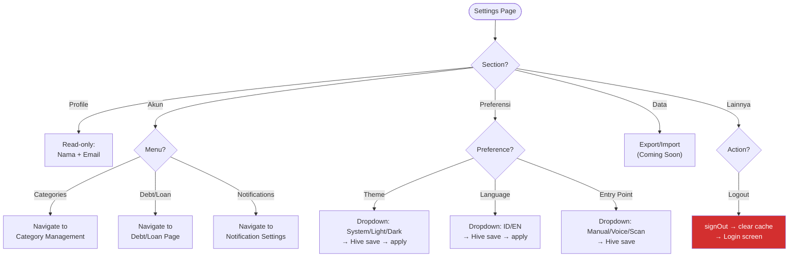
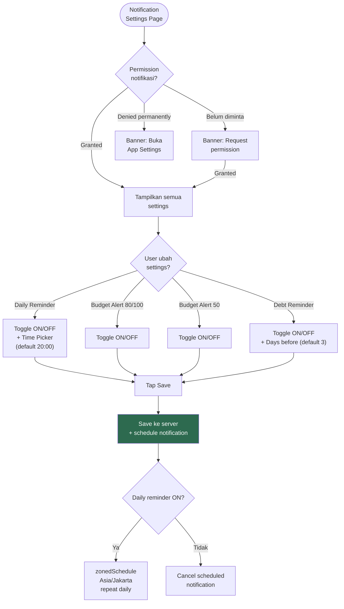
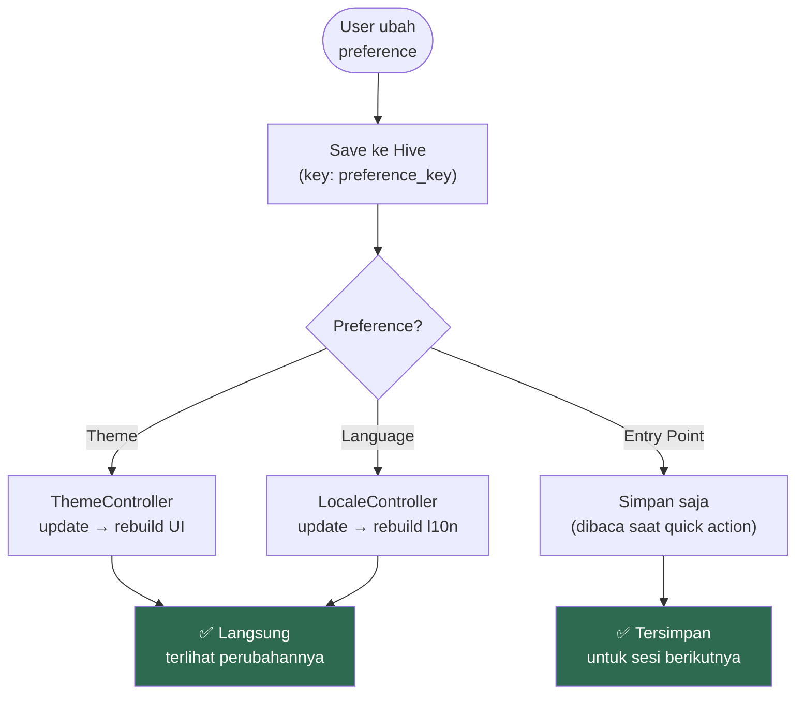

# 16. Settings

[← Investasi](15_INVESTASI.md) · [Index](00_INDEX.md) · [Voice & Text Input →](17_VOICE_INPUT.md)

---

## 16.1. Layout

```
┌─────────────────────────────────────┐
│  ┌───┐                             │
│  │ 👤│  John Doe                   │  ← Section 1: Profile (read-only)
│  └───┘  john@example.com           │
├─────────────────────────────────────┤
│  AKUN                               │  ← Section 2
│  ├─ 📂 Categories                   │
│  ├─ 🤝 Debt/Loan                    │
│  └─ 🔔 Notifications                │
├─────────────────────────────────────┤
│  PREFERENSI                         │  ← Section 3
│  ├─ 🎨 Theme       [System ▼]      │
│  ├─ 🌐 Language    [Indonesia ▼]   │
│  └─ ⚡ Entry Point [Manual ▼]      │
├─────────────────────────────────────┤
│  DATA                               │  ← Section 4
│  └─ 📤 Export/Import  [Coming Soon]│
├─────────────────────────────────────┤
│  LAINNYA                            │  ← Section 5
│  ├─ ℹ️ App Version   1.0.0 (1)     │
│  └─ 🚪 Logout                      │
└─────────────────────────────────────┘
```

### Flowchart: Settings Navigation



## 16.2. Notification Settings Page

| Section | Kontrol | Default |
|---|---|---|
| Permission banner | Request / Open Settings | Tampil jika permission ditolak |
| Pengingat Harian | Toggle + Time Picker | OFF, 20:00 |
| Alert Anggaran 80%/100% | Toggle | ON |
| Alert Anggaran 50% | Toggle | OFF |
| Pengingat Piutang | Toggle + Days Before | ON, 3 hari |
| Tombol Save | Full-width button | — |

**Notification channels:**

| Channel ID | Nama | Importance |
|---|---|---|
| `saku_rapi_reminder` | Pengingat Harian | HIGH |
| `saku_rapi_budget` | Alert Anggaran | HIGH |

### Flowchart: Notification Settings Flow



**Implementation:**
- Daily reminder: `zonedSchedule` + `DateTimeComponents.time` (repeat harian), timezone Asia/Jakarta
- WorkManager: re-sync jadwal setelah device restart dari cache Hive
- Debt reminder: settings tersimpan, **logika pengiriman belum implementasi**

## 16.3. Preferences (Hive-persisted)

| Preference | Key Hive | Opsi |
|---|---|---|
| Theme | `theme_mode` | System / Light / Dark |
| Language | `app_locale` | Indonesian / English |
| Entry Point | `transaction_entry_point` | Manual / Voice / Scan |

### Flowchart: Preference Change Flow



## 16.4. Acceptance Criteria
- [x] Semua preference survive restart (Hive)
- [x] Theme & language berubah langsung setelah dipilih
- [x] Logout → bersihkan session + cache → ke Login
- [x] Notification settings simpan ke server via save button
- [x] Permission check: request jika belum granted, settings jika permanently denied

---

[← Investasi](15_INVESTASI.md) · [Index](00_INDEX.md) · [Voice & Text Input →](17_VOICE_INPUT.md)
