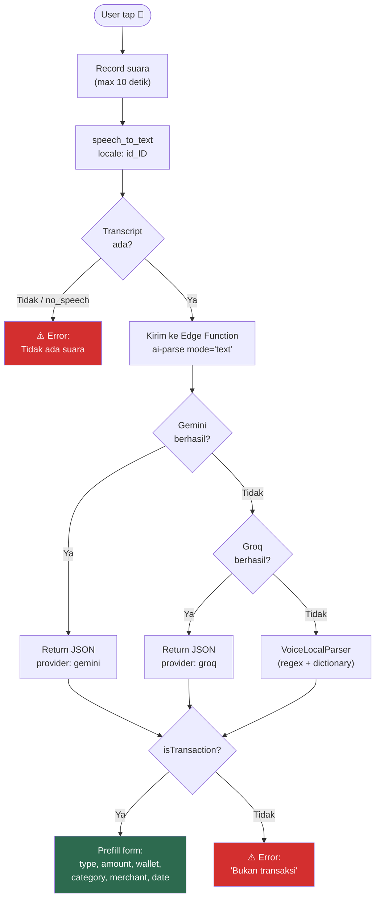
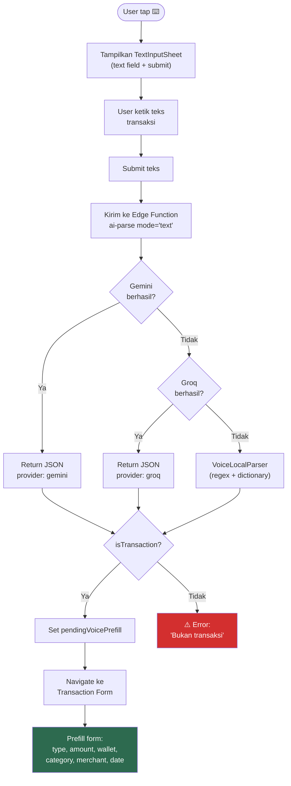
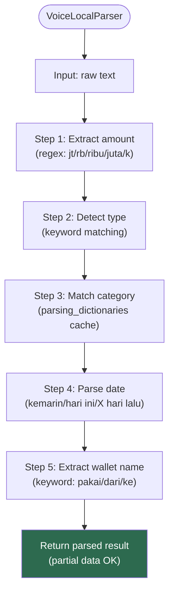

# 17. Voice & Text Input — Detail Teknis

[← Settings](16_SETTINGS.md) · [Index](00_INDEX.md) · [OCR Receipt →](18_OCR_RECEIPT.md)

---

> **Catatan:** Voice input dan text input menggunakan Edge Function yang sama (`ai-parse`, mode `text`).
> Voice flow menambahkan tahap Speech-to-Text (STT) sebelum mengirim teks ke AI.
> Text input mengirim teks langsung ke AI tanpa STT.

## 17.1. Request ke Edge Function

```json
{
  "mode": "text",
  "text": "beli kopi kenangan 20 ribu pakai gopay",
  "categories": [
    { "id": "uuid", "name": "Makanan & Minuman", "type": "expense" }
  ]
}
```

## 17.2. Response dari Edge Function

```json
{
  "success": true,
  "mode": "text",
  "provider": "gemini",
  "data": {
    "isTransaction": true,
    "type": "expense",
    "amount": 20000,
    "categoryId": "uuid-kategori",
    "categoryKeyword": "kopi",
    "note": "Beli kopi kenangan",
    "suggestedWallet": "GoPay",
    "destinationWallet": null,
    "withPerson": null,
    "merchantName": "Kopi Kenangan",
    "date": "2026-03-29"
  }
}
```

## 17.3. Mapping Response → Form

| AI Field | Form Field | Matching Logic |
|---|---|---|
| `type` | Tab selection | Direct enum match |
| `amount` | `totalAmount` + single item | Direct |
| `suggestedWallet` | `wallet` | Case-insensitive name match |
| `destinationWallet` | `destinationWallet` | Case-insensitive name match |
| `categoryId` | Item category | Direct UUID |
| `categoryKeyword` | Item category | Fallback: dictionary lookup |
| `merchantName` | `merchantName` | Direct |
| `note` | `note` | Direct |
| `date` | `date` | Parse yyyy-MM-dd |
| `withPerson` | `withPerson` | Direct (debt/loan) |

## 17.4. Voice Input Flow

### Flowchart: Voice Processing Pipeline



**Pipeline:**
1. STT lokal (`speech_to_text`, locale `id_ID`) → teks
2. Edge Function `ai-parse` mode `text` → Gemini
3. Failover ke Groq
4. Fallback lokal: regex amount + keyword type + dictionary category

## 17.5. Text Input Flow

### Flowchart: Text Input Pipeline



**Pipeline:**
1. User ketik teks langsung (tidak perlu mic permission / STT)
2. Edge Function `ai-parse` mode `text` → Gemini
3. Failover ke Groq
4. Fallback lokal: regex amount + keyword type + dictionary category

> **Perbedaan dengan Voice Input:**
> - Tidak ada STT → langsung kirim teks ke AI
> - Tidak perlu mic permission
> - Tidak ada countdown timer
> - Menggunakan `TextInputController` (lebih sederhana dari `VoiceInputController`)
> - Hasil tetap masuk ke `pendingVoicePrefillProvider` (shared dengan voice)

## 17.6. Local Fallback Parser Patterns

| Pola | Contoh | Hasil |
|---|---|---|
| Amount | `"1.5jt"` | 1.500.000 |
| Amount | `"25rb"` | 25.000 |
| Amount | `"150.000"` | 150.000 |
| Type keyword | `"transfer/kirim uang"` | transfer |
| Type keyword | `"hutang/ngutang"` | debt |
| Type keyword | `"piutang/kasih pinjam"` | loan |
| Type keyword | `"gaji/terima uang"` | income |
| Type keyword | (default) | expense |
| Date | `"kemarin"` | -1 hari |
| Date | `"tadi/hari ini"` | today |
| Date | `"X hari lalu"` | dynamic |

### Flowchart: Local Parser Fallback Logic



---

[← Settings](16_SETTINGS.md) · [Index](00_INDEX.md) · [OCR Receipt →](18_OCR_RECEIPT.md)
