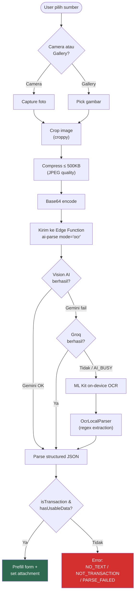
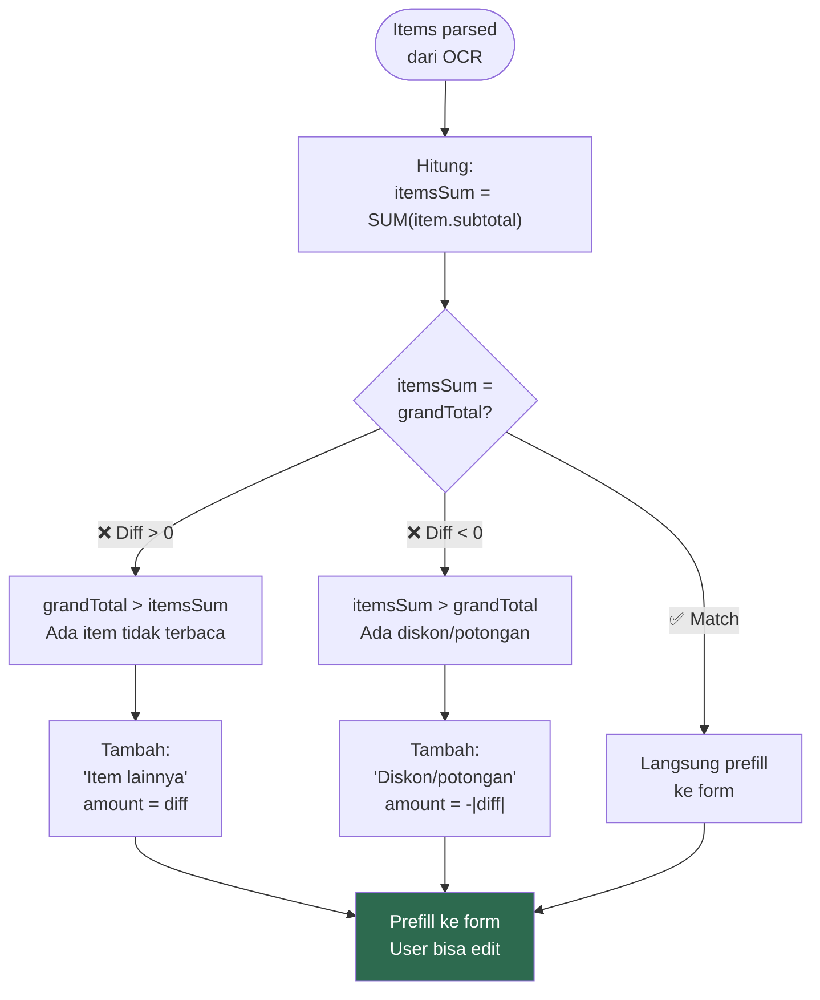
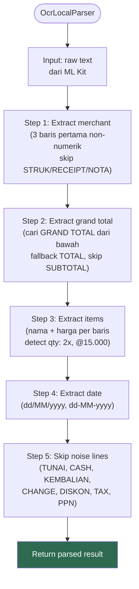

# 18. OCR Receipt — Detail Teknis

[← Voice & Text Input](17_VOICE_INPUT.md) · [Index](00_INDEX.md) · [Parsing Dictionary →](19_PARSING_DICTIONARY.md)

---

## 18.1. Request ke Edge Function

```json
{
  "mode": "ocr",
  "image": "<base64-encoded-jpeg>",
  "mimeType": "image/jpeg",
  "categories": [
    { "id": "uuid", "name": "Kebutuhan Harian" }
  ]
}
```

## 18.2. Response dari Edge Function

```json
{
  "success": true,
  "mode": "ocr",
  "provider": "gemini",
  "data": {
    "isTransaction": true,
    "type": "expense",
    "merchantName": "Indomaret",
    "date": "2026-03-29",
    "grandTotal": 45000,
    "categoryId": null,
    "categoryKeyword": null,
    "suggestedWallet": null,
    "destinationWallet": null,
    "withPerson": null,
    "note": null,
    "items": [
      {
        "name": "Kopi Kenangan Mantan",
        "qty": 2,
        "unitPrice": 15000,
        "subtotal": 30000,
        "categoryId": "uuid-kategori"
      },
      {
        "name": "Roti Sobek Coklat",
        "qty": 1,
        "unitPrice": 15000,
        "subtotal": 15000,
        "categoryId": "uuid-kategori"
      }
    ]
  }
}
```

## 18.3. OCR Error States

| Error Code | Arti | Aksi UI |
|---|---|---|
| `NO_TEXT` | ML Kit tidak menemukan teks | Pesan + rescan |
| `NOT_TRANSACTION` | `isTransaction = false` | Pesan: "bukan struk/nota" |
| `PARSE_FAILED` | Tidak ada data berguna | Pesan + rescan |

## 18.4. Local OCR Parser Patterns

| Target | Teknik |
|---|---|
| Grand total | Cari "GRAND TOTAL" dari bawah, fallback "TOTAL" (skip SUBTOTAL) |
| Items | Extract nama + harga, detect qty ("2x", "2 x"), unit price ("@15.000") |
| Skip lines | TOTAL, SUBTOTAL, TUNAI, CASH, KEMBALIAN, CHANGE, DISKON, TAX, PPN |
| Amount format | "15.000" → 15000 (dot=thousands), strip "Rp" |
| Date | dd/MM/yyyy, dd-MM-yyyy, dd.MM.yyyy |
| Merchant | 3 baris pertama non-numerik, skip "STRUK"/"RECEIPT"/"NOTA" |

### Flowchart: OCR Image Processing Pipeline



### Flowchart: Auto-Balance Items Logic



### Flowchart: Local OCR Parser



---

[← Voice & Text Input](17_VOICE_INPUT.md) · [Index](00_INDEX.md) · [Parsing Dictionary →](19_PARSING_DICTIONARY.md)
