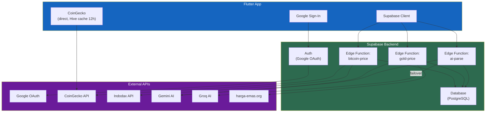
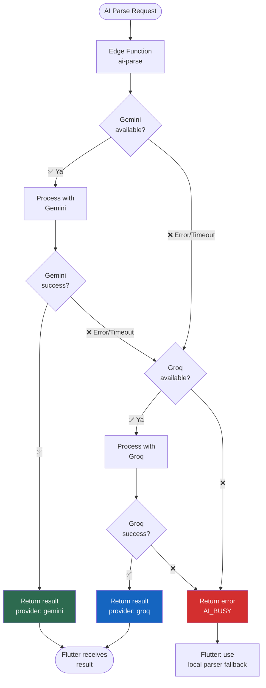

# 20. External API & Integration

[← Parsing Dictionary](19_PARSING_DICTIONARY.md) · [Index](00_INDEX.md) · [Kategori Default →](21_KATEGORI_DEFAULT.md)

---

## 20.1. Ringkasan Integrasi

| API | Digunakan Untuk | Dipanggil Dari | Cache |
|---|---|---|---|
| CoinGecko | Harga Bitcoin/IDR | Flutter langsung | Hive 12 jam (TTL) |
| Edge Function `gold-price` | Harga emas Antam | Flutter → Supabase | Server 1 hari |
| Edge Function `ai-parse` | Text/OCR parsing | Flutter → Supabase | Tidak |
| Google Sign-In | Authentication | Flutter → Supabase Auth | Session |

## 20.2. Aturan Penting
- Flutter **TIDAK** memanggil API key AI (Gemini/Groq) secara langsung
- Semua AI call melalui Edge Function `ai-parse`
- Edge Function handle failover internal: Gemini → Groq
- CoinGecko API key via environment variable

### Flowchart: Arsitektur Integrasi Eksternal

### Flowchart: AI Failover Chain

---

[← Parsing Dictionary](19_PARSING_DICTIONARY.md) · [Index](00_INDEX.md) · [Kategori Default →](21_KATEGORI_DEFAULT.md)
