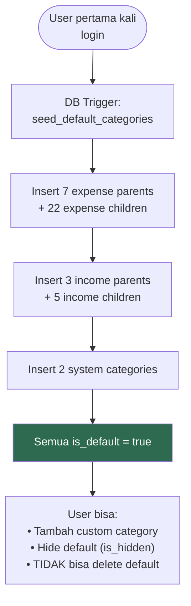

# 21. Kategori Default

[← External API](20_EXTERNAL_API.md) · [Index](00_INDEX.md) · [Edge Cases →](22_EDGE_CASES.md)

---

## 21.1. Expense (Pengeluaran)

| Parent | Children |
|---|---|
| Kebutuhan Rumah Tangga | Belanja Dapur / Bahan Makanan, Perlengkapan Rumah, Makan di Luar / Jajan |
| Kesehatan & Kebugaran | Olahraga / Gym, Suplemen & Nutrisi, Medis / Dokter / Obat |
| Transportasi | Bensin, Tol, Parkir, Transportasi Umum, Ojol, Servis Kendaraan |
| Tagihan & Kewajiban | Listrik & Air, Internet & Pulsa, Cicilan / Asuransi |
| Teknologi & Edukasi | Langganan Digital, Kursus, Buku, Server & Hosting |
| Keluarga & Sosial | Kebutuhan Pasangan, Kondangan / Donasi, Nongkrong / Hiburan |
| Lain-lain | Biaya Admin / Pajak / Selisih, Pengeluaran Tak Terduga, Pengeluaran yang tidak diketahui |

## 21.2. Income (Pemasukan)

| Parent | Children |
|---|---|
| Gaji & Pendapatan Utama | Gaji Bulanan, Bonus / THR |
| Pendapatan Tambahan | Pekerjaan Sampingan / Freelance, Hasil Investasi / Dividen, Pencairan Dana |
| Lain-lain | Hadiah / Pemberian |

## 21.3. System (Internal)

| Kategori | Kegunaan |
|---|---|
| Penyesuaian Saldo | Untuk transaksi `adjustment` |
| Transfer ke Aset | Untuk transaksi `transfer_to_asset` |

### Flowchart: Default Category Seeding

---

[← External API](20_EXTERNAL_API.md) · [Index](00_INDEX.md) · [Edge Cases →](22_EDGE_CASES.md)
