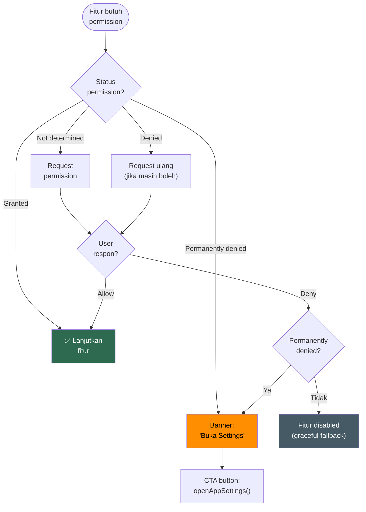

# 23. Permission Requirements

[← Edge Cases](22_EDGE_CASES.md) · [Index](00_INDEX.md) · [Testing →](24_TESTING.md)

---

| Permission | Kapan Diminta |
|---|---|
| Google Sign-In | Saat login |
| Camera | Saat scan struk |
| Microphone | Saat voice input |
| Photos/Media | Saat pilih lampiran |
| Contacts | Saat buka contact picker (debt/loan) |
| Notifications (Android 13+) | Saat pertama kali aktifkan reminder |

**Aturan:** Permission diminta **just in time**, bukan saat app launch. Jika ditolak permanen → CTA ke app settings.

### Flowchart: Permission Request Flow

---

[← Edge Cases](22_EDGE_CASES.md) · [Index](00_INDEX.md) · [Testing →](24_TESTING.md)
