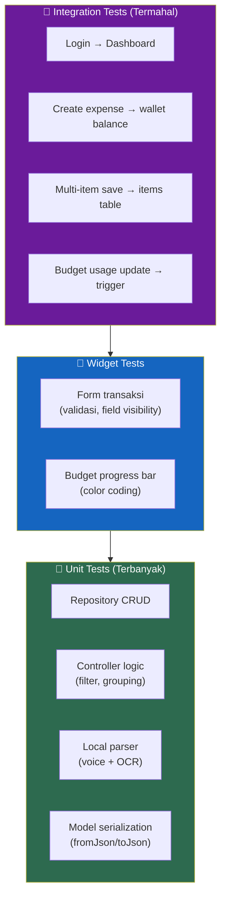
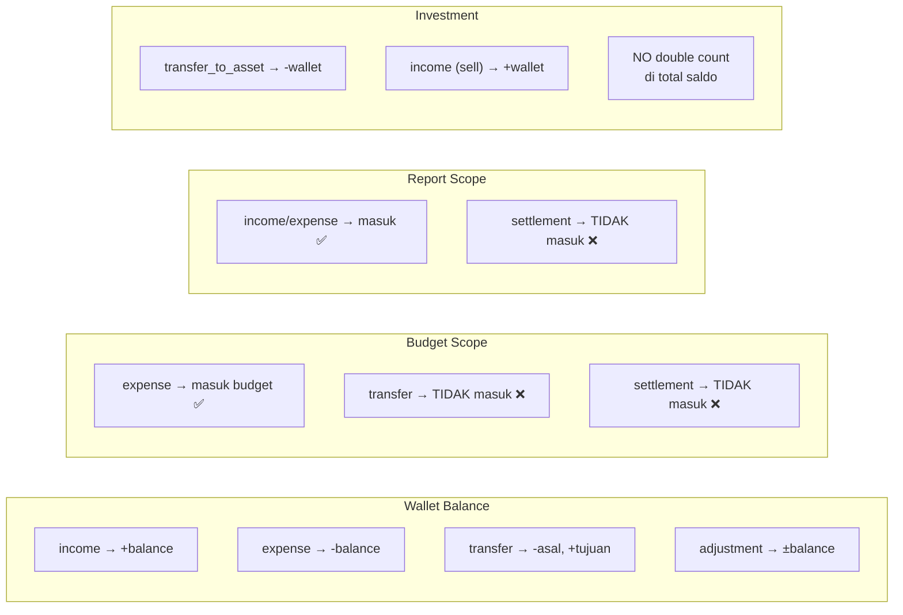

# 24. Testing Requirements

[← Permissions](23_PERMISSIONS.md) · [Index](00_INDEX.md) · [Roadmap →](25_ROADMAP.md)

---

## 24.1. Minimum Test Coverage

| Layer | Yang Ditest |
|---|---|
| Unit test | Repository: transaction create/update/delete |
| Unit test | Controller: history filter/grouping |
| Unit test | Local parser: voice & OCR fallback |
| Widget test | Form transaksi |
| Integration test | Login → dashboard |
| Integration test | Create expense, create transfer |
| Integration test | Multi-item save |
| Integration test | Budget usage update |

## 24.2. Assertion Penting
- Saldo wallet berubah sesuai matrix tipe transaksi
- Budget **TIDAK** menghitung transfer/settlement
- Settlement **TIDAK** masuk laporan
- Investment deduction **TIDAK** double count

### Flowchart: Test Pyramid

### Flowchart: Key Test Assertions

---

[← Permissions](23_PERMISSIONS.md) · [Index](00_INDEX.md) · [Roadmap →](25_ROADMAP.md)
