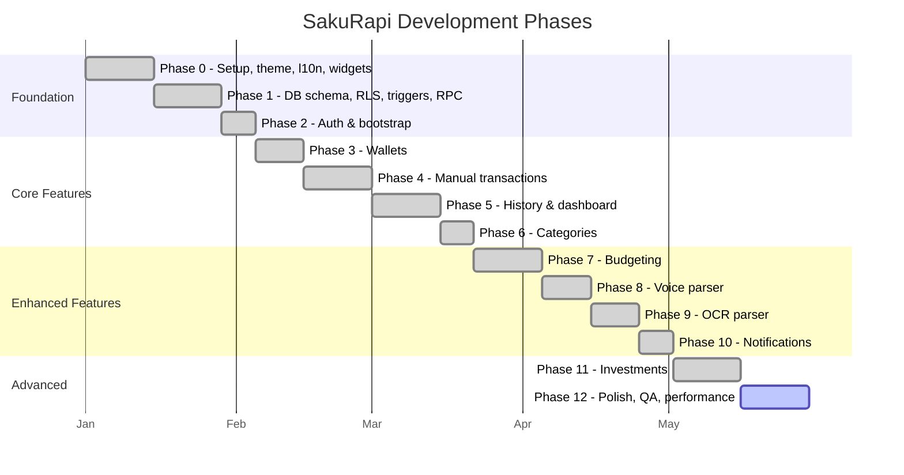
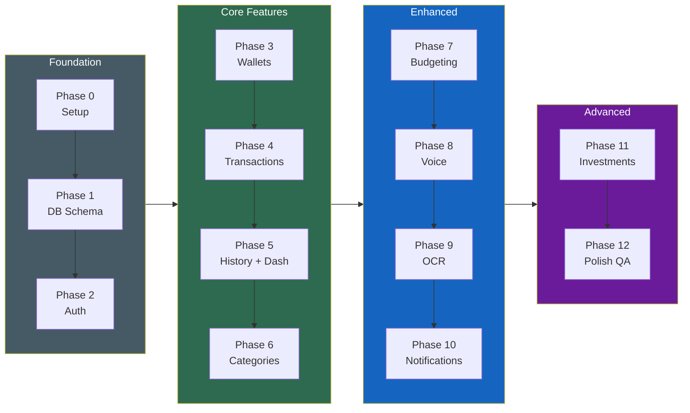

# 25. Roadmap Pengembangan

[← Testing](24_TESTING.md) · [Index](00_INDEX.md) · [Keputusan Final →](26_KEPUTUSAN_FINAL.md)

---

## Phase Pengembangan

### Flowchart: Phase Dependencies

---

[← Testing](24_TESTING.md) · [Index](00_INDEX.md) · [Keputusan Final →](26_KEPUTUSAN_FINAL.md)
