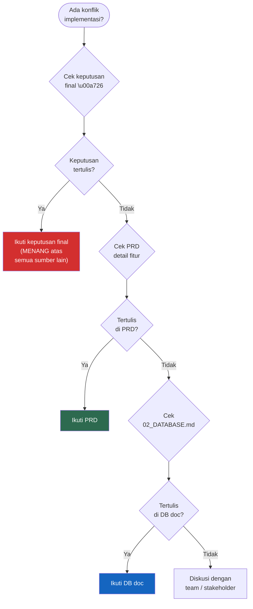

# 26. Keputusan Final

[← Roadmap](25_ROADMAP.md) · [Index](00_INDEX.md)

---

> Jika ada konflik antara implementasi lama, asumsi Copilot, atau prompt lain,
> keputusan berikut yang **MENANG**:

| # | Keputusan | Tidak Boleh Dilanggar |
|---|---|---|
| 1 | Saldo wallet berubah hanya dari ledger `transactions` | ❌ Bypass trigger |
| 2 | Report hanya menghitung income/expense non-settlement | ❌ Include settlement |
| 3 | Budget hanya menghitung expense | ❌ Include income/transfer |
| 4 | Multi-item selalu menggunakan `transaction_items` | ❌ Simpan di field JSON |
| 5 | Transfer dan transfer_to_asset bukan expense | ❌ Masukkan ke laporan |
| 6 | AI hanya prefill, user tetap review | ❌ Auto-save tanpa konfirmasi |
| 7 | Semua nominal MVP memakai IDR | ❌ Multi-currency |

### Flowchart: Decision Priority

---

*Dokumen ini adalah sumber kebenaran utama untuk requirement produk SakuRapi.*  
*Last updated: 2026-03-31 — PRD v7.0*

---

[← Roadmap](25_ROADMAP.md) · [Index](00_INDEX.md)
