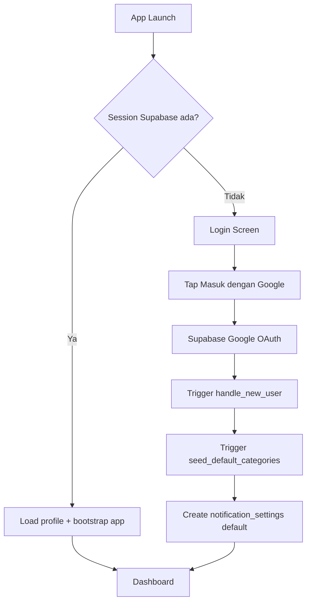
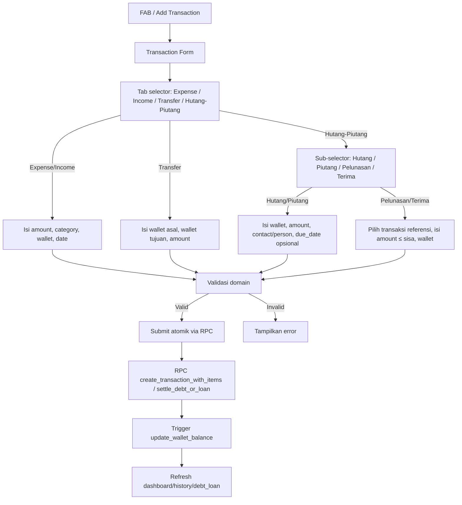
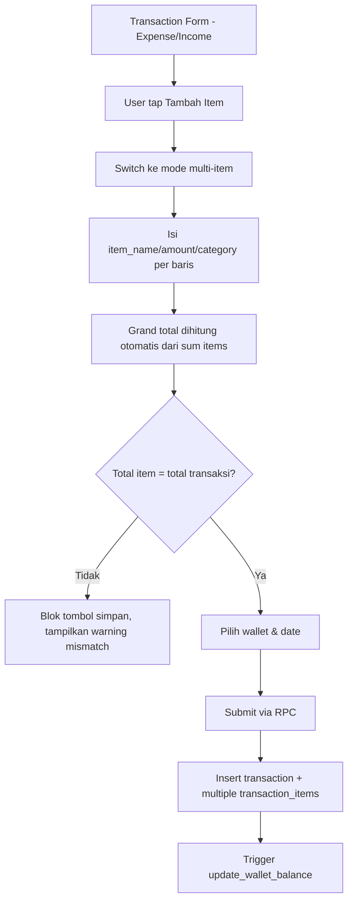
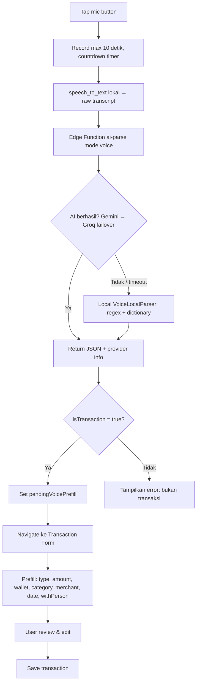
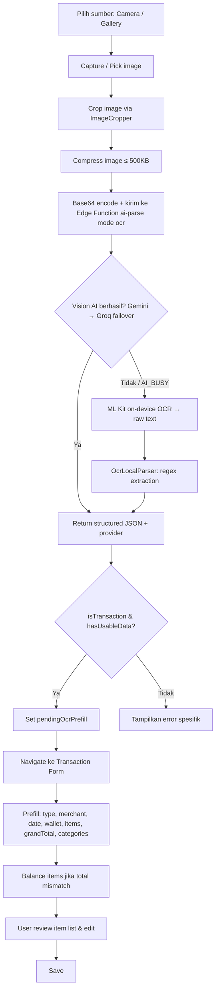
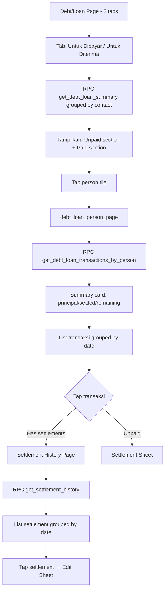
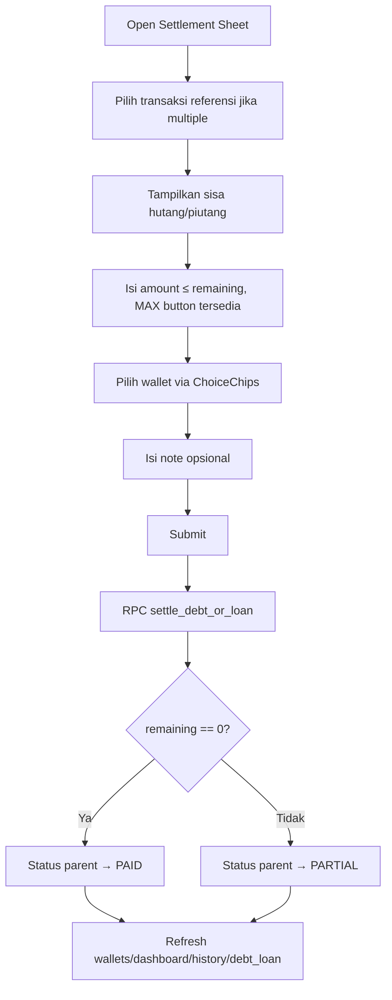
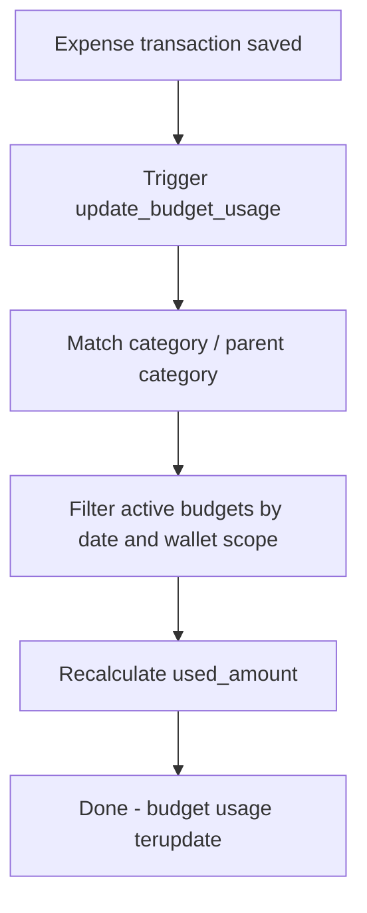
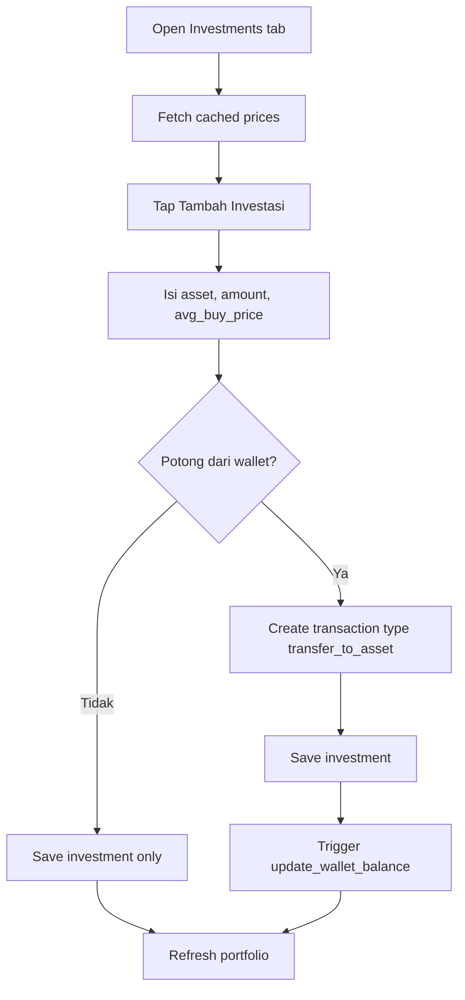

# SakuRapi — PRD Final v6.5
## Product Requirements Document (Copilot Ready)

> Dokumen ini adalah sumber kebenaran utama untuk requirement produk dan flow implementasi SakuRapi.
> Untuk schema, constraint database, trigger, RPC, dan indexing, lihat `02_DATABASE.md`.
> Untuk aturan implementasi Flutter + guardrails Copilot, lihat `03_COPILOT_RULES.md`.

**Tanggal revisi:** 2026-03-29 v6.5  
**Platform:** Android Only  
**Bahasa UI default:** Bahasa Indonesia  
**Timezone aplikasi:** Asia/Jakarta  
**Currency MVP:** IDR only  
**Status:** Final for implementation

---

## 1. Tujuan Produk

### 1.1 Visi
SakuRapi membantu pengguna mencatat keuangan pribadi dengan cepat, rapi, dan minim friksi, terutama melalui input manual yang simpel, input suara, dan scan struk OCR.

### 1.2 Masalah yang diselesaikan
- Pengguna malas mencatat transaksi karena form terasa panjang.
- Pengguna sulit melacak banyak dompet.
- Pengguna ingin melihat ringkasan, budget, dan histori tanpa ribet.
- Pengguna ingin AI membantu mengisi transaksi dari suara atau foto struk.

### 1.3 Prinsip produk
1. **Fast capture first** — tambah transaksi harus cepat.
2. **Auditability** — semua perubahan saldo harus bisa ditelusuri.
3. **Consistent money model** — saldo, histori, report, budget, dan investasi harus memakai aturan yang konsisten.
4. **AI as assistant, not authority** — hasil Voice/OCR hanya prefill, user tetap konfirmasi sebelum simpan.
5. **Low ambiguity for Copilot** — semua rule penting harus eksplisit.

### 1.4 Non-goals MVP
- Multi-currency conversion.
- Sinkronisasi bank otomatis.
- Shared wallet multi-user.
- Export/import penuh.
- Debt budgeting / receivable cap sebagai budget utama.
- iOS support.

---

## 2. Scope Fitur

### 2.1 P0
1. Google Sign-In + profil
2. Multi-wallet CRUD
3. Dashboard
4. Transaksi manual: income, expense, transfer, debt, loan, adjustment
5. History + filter periode + grouping
6. Kategori parent-child
7. Settings: profil, tema, bahasa, entry point transaksi

### 2.2 P1
1. Multi-item / split bill
2. Voice input AI
3. OCR struk AI
4. Parsing dictionary cache
5. Budgeting parent / child
6. Visual reports
7. Local notifications reminder / budget alert

### 2.3 P2
1. Wealth management / investasi
2. Lampiran lanjutan
3. Export/import
4. Improvement analytics

---

## 3. Outcome yang harus dicapai

### 3.1 KPI produk
- Waktu tambah transaksi manual < 20 detik
- Waktu tambah transaksi dari voice/OCR < 45 detik end-to-end
- 100% perubahan saldo wallet dapat dijelaskan dari transaction ledger
- Tidak ada mismatch antara total transaksi vs total item
- Tidak ada pengurangan saldo ganda saat investasi

### 3.2 Definition of done global
Sebuah fitur dianggap selesai jika:
- business rules-nya sudah terimplementasi,
- ada empty/loading/error states,
- ada validasi form,
- ada test minimal pada repository/controller,
- string memakai `.arb`,
- tidak ada hardcoded color/style/text,
- flow happy path dan failure path ditangani.

---

## 4. Domain Rules Finansial (Wajib)

### 4.1 Sumber kebenaran saldo
**Wallet balance hanya boleh berubah melalui tabel `transactions`.**  
Tidak boleh ada trigger lain yang mengurangi atau menambah `wallets.balance` di luar ledger transaksi.

### 4.2 Aturan laporan
Laporan pemasukan/pengeluaran **hanya** menghitung:
- `income`
- `expense`

Yang **tidak** masuk laporan P&L:
- `transfer`
- `adjustment`
- `transfer_to_asset`
- transaksi settlement hutang/piutang
- transaksi internal system correction

### 4.3 Aturan budget
Budget v6.1 hanya berlaku untuk **expense categories**.  
Budget tidak menghitung:
- income
- transfer
- adjustment
- transfer_to_asset
- debt
- loan
- settlement hutang/piutang

### 4.4 Aturan hutang/piutang
- `debt`: uang masuk ke wallet karena meminjam dari orang lain.
- `loan`: uang keluar dari wallet karena meminjamkan ke orang lain.
- Keduanya mencatat **principal position**.
- `with_person` (text) wajib diisi untuk identifikasi pihak terkait.
- `contact_id` (FK ke `contacts`) opsional — diisi jika user memilih dari phonebook/saved contacts.
- Kontak disimpan di tabel `contacts` dan di-upsert via RPC `upsert_contact`.
- Status hutang/piutang: `unpaid`, `partial`, `paid` — dihitung dari total settlement.
- Saat ada pelunasan, sistem membuat transaksi baru dengan `reference_transaction_id` ke transaksi asal via RPC `settle_debt_or_loan`.
- Pelunasan **tidak** dihitung sebagai income/expense murni pada laporan.
- Edit pelunasan via RPC `update_settlement`, delete via `delete_settlement`.

### 4.5 Currency & timezone
- MVP hanya IDR.
- `wallet.currency` wajib default `IDR`.
- Total saldo dashboard hanya aman dijumlahkan karena semua wallet memakai currency yang sama.
- Semua filter hari/minggu/bulan menggunakan Asia/Jakarta saat rendering.

---

## 5. Accounting Rules Matrix

| `transactions.type` | Arah kas wallet asal | Masuk laporan? | Masuk budget? | Butuh wallet tujuan? | Butuh `with_person`? | Butuh `contact_id`? | Catatan |
|---|---:|---|---|---|---|---|---|
| `income` | + | Ya | Tidak | Tidak | Tidak | Tidak | pemasukan normal |
| `expense` | - | Ya | Ya jika kategori expense | Tidak | Tidak | Tidak | pengeluaran normal |
| `transfer` | - dari asal, + ke tujuan | Tidak | Tidak | Ya | Tidak | Tidak | internal transfer |
| `debt` | + | Tidak | Tidak | Tidak | Ya | Ya (opsional) | uang pinjaman diterima |
| `loan` | - | Tidak | Tidak | Tidak | Ya | Ya (opsional) | uang dipinjamkan |
| `adjustment` | +/- sesuai selisih | Tidak | Tidak | Tidak | Tidak | Tidak | koreksi saldo |
| `transfer_to_asset` | - | Tidak | Tidak | Tidak | Tidak | Tidak | pembelian aset dari wallet |

### 5.1 Aturan settlement
Tambahkan field:
- `reference_transaction_id` nullable FK ke `transactions.id`
- `settlement_kind` nullable enum:
  - `debt_payment`
  - `loan_collection`

Aturan:
- `settlement_kind = debt_payment` harus memakai `type = expense`
- `settlement_kind = loan_collection` harus memakai `type = income`
- transaksi dengan `settlement_kind` **dikecualikan dari laporan dan budget**

---

## 6. User Flows (Mermaid)

## 6.1 Auth Flow


## 6.2 Manual Transaction Flow


> **Catatan:** Adjustment **tidak** ditampilkan sebagai tab form manual.
> Adjustment dibuat melalui RPC `create_adjustment_transaction` yang dipanggil dari fitur wallet (koreksi saldo).

## 6.3 Multi-item Flow


## 6.4 Voice Input Flow


## 6.5 OCR Receipt Flow


## 6.6 Debt/Loan Management Flow


## 6.7 Settlement Flow


## 6.8 Budget Update Flow


> **Catatan:** Notifikasi alert budget (80%/100%) **bukan** bagian dari trigger database.
> Alert dicek saat halaman budget di-load oleh `BudgetAlertChecker` — lihat §7.13 untuk detail.

## 6.9 Investment Buy Flow


---

## 7. Feature Requirements Detail

## 7.1 Auth & Profil
- Login hanya via Google Sign-In melalui Supabase Auth.
- Setelah login sukses:
  - trigger membuat / update `public.users`,
  - seed kategori default,
  - seed `notification_settings`.
- Flutter **tidak** insert manual ke `public.users`.
- User dapat edit `full_name` dan `avatar_url`.
- Avatar disimpan di Supabase Storage.

### Acceptance criteria
- Jika session valid, app langsung ke dashboard.
- Jika session tidak valid, app ke login.
- Login pertama kali membuat kategori default.
- Logout membersihkan session lokal dan kembali ke login.

## 7.2 Dashboard
Halaman utama aplikasi setelah login, menampilkan rangkuman keuangan dan aksi cepat.

### Layout (CustomScrollView)
Dashboard menggunakan `CustomScrollView` dengan `RefreshIndicator` (pull-to-refresh). Widget tree:

1. **Greeting** — "Hello, {userName}!" (dari `UserModel.fullName`).
2. **DashboardBalanceCard** — Kartu gradient menampilkan:
   - Label "Total Balance" + tombol eye toggle (show/hide balance).
   - Total saldo (dari wallet non-excluded), atau "••••••••" jika hidden.
   - Mini-stats: income (hijau, ↗) dan expense (merah, ↘) periode berjalan.
3. **DashboardQuickActions** — 4 tombol horizontal (bukan FAB expandable):
   | # | Label | Icon | Aksi |
   |---|---|---|---|
   | 1 | Manual Input | ✏️ | Navigasi ke form transaksi |
   | 2 | Voice Input | 🎤 | Buka VoiceInputSheet → prefill form |
   | 3 | Scan Receipt | 📷 | Buka OcrResultSheet → prefill form |
   | 4 | Wallets | 💼 | Navigasi ke WalletPage |
4. **DashboardWalletSection** — Horizontal scroll wallet mini cards.
   - Header: "My Wallets" + "See All →" (navigasi ke WalletPage).
   - Setiap card (160w×100h): icon + nama + balance + eye-slash jika excluded.
   - Empty state: icon wallet + pesan kosong.
5. **DashboardPeriodSummary** — Snapshot income/expense/net flow.
   - 3 kolom: Income (●hijau), Expense (●merah), Net Flow (dinamis).
   - Comparison badge: persentase perubahan expense vs periode sebelumnya (↑merah / ↓hijau).
   - Link: "See Full Report →" navigasi ke ReportsPage.
6. **DashboardChartCarousel** — 2 halaman chart (PageView).
   - Navigasi: panah kiri/kanan + dot indicator.
   - Toggle mode: Monthly → Weekly → Daily (siklus).
   - **Page 0 — Expense Comparison Bar Chart:**
     - 2 group (current vs previous period), masing-masing bar income + expense.
     - Summary: total expense + change badge.
     - Smart insight text (expense naik/turun/stabil).
     - Tombol fullscreen.
   - **Page 1 — Trend Report Line Chart:**
     - 3 garis: current (solid), previous (dashed), 3-period average (dashed gray).
     - Data: cumulative daily expense.
     - Legend dinamis per mode:
       - Monthly: "Bulan ini" / "Bulan lalu" / "Rata-rata 3 bulan lalu"
       - Weekly: "Minggu Ini" / "Minggu Lalu" / "Rata-rata 3 minggu lalu"
       - Daily: "Hari Ini" / "Kemarin" / "Rata-rata 3 hari lalu"
     - X-axis dinamis: tanggal (monthly), nama hari (weekly), jam (daily).
     - Insight text: if currentTotal > avgTotal → peringatan, else → pujian.
     - Legend + fullscreen.
7. **DashboardRecentTransactions** — 5 transaksi terbaru.
   - Menggunakan `HistoryTransactionTile` (reuse dari fitur History).
   - Tap → TransactionDetailPage; setelah edit/delete → reload dashboard + wallets.
   - Empty state jika belum ada transaksi.

### State management

**Arsitektur split controller (optimasi rebuild):**

Controller dashboard dipisah menjadi 2 untuk menghindari full-page rebuild saat chart mode berubah:

1. **`DashboardController`** (parent/core) — mengelola state inti halaman:
   - `DashboardState`: status, recentTransactions, errorMessage, isBalanceHidden.
   - `loadDashboard()`: fetch recent transactions + trigger chart data loading via chart controller.
   - `toggleBalanceVisibility()`: toggle show/hide balance.
   - Widget consumers: DashboardPage, DashboardBalanceCard, DashboardWalletSection, DashboardRecentTransactions.

2. **`DashboardChartController`** (chart-specific) — mengelola data chart & period:
   - `DashboardChartState`: chartMode (monthly/weekly/daily), currentPeriodIncome/Expense, previousPeriodIncome/Expense, currentPeriodDaily, previousPeriodDaily, month2Daily, month3Daily, status, errorMessage.
   - `loadChartData()`: fetch 6 data sources paralel via `Future.wait()`.
   - `selectChartMode(DashboardChartMode mode)`: set mode, simpan ke Hive, reload chart data. Mode terakhir persist dan di-restore saat app dibuka ulang.
   - `periodRanges()` / `extraPeriodRanges()`: static methods untuk hitung rentang waktu.
   - Widget consumers: DashboardChartCarousel, DashboardComparisonChart, DashboardTrendReportChart, DashboardPeriodSummary.

- Computed providers: `dashboardWalletsProvider`, `dashboardTotalBalanceProvider`.
- External callers (TransactionFormPage, HistoryPage, dll.) cukup memanggil `loadDashboard()` — chart data otomatis ikut di-refresh.

### Data queries
- Recent transactions: Supabase REST, `ORDER BY date DESC, created_at DESC`, `LIMIT 5`, dengan join wallet + items + categories.
- Period summary: query `type IN ('income','expense') AND settlement_kind IS NULL`, aggregasi lokal.
- Daily aggregation: query sama, group by date, untuk chart data.
- Caching: recent transactions + period summary di-cache ke Hive untuk offline fallback.

### Acceptance criteria
- Total saldo hanya dari wallet `exclude_from_total = false`.
- Quick actions berfungsi: manual → form, voice → sheet → form, scan → sheet → form, wallets → wallet page.
- Chart mode toggle reload data dengan benar.
- Balance hide/show tersimpan di state (session only).
- Pull-to-refresh memuat ulang wallets + dashboard paralel.
- Loading/error/empty states ditangani.

## 7.3 Wallets
- CRUD wallet lengkap.
- Field wajib: `name`, `initial_balance`, `icon`, `color`.
- `exclude_from_total` default `false`.
- Wallet archived/deleted tidak boleh menyebabkan ledger orphan.
- Transfer antar dompet harus membuat satu transaction record `type='transfer'` dengan `destination_wallet_id` terisi.

### Wallet page UI
- **AppBar:** Judul "Dompet", FAB untuk tambah wallet baru.
- **Body:** ListView dengan RefreshIndicator.
  - **WalletSummaryCard** (atas): gradient card menampilkan total saldo (wallet non-excluded) + jumlah dompet.
  - **Section "Termasuk dalam total"**: Daftar wallet `exclude_from_total = false`.
  - **Section "Dikecualikan dari total"**: Daftar wallet `exclude_from_total = true`.
- **Wallet tile:** Icon (warna wallet), nama, balance (hijau jika ≥ 0, merah jika < 0), popup menu.
- **Popup menu per wallet:** Edit, Adjust (koreksi saldo), Delete.
- **States:** loading (spinner), error (retry), empty (pesan kosong + tombol tambah).

### WalletFormSheet (Bottom Sheet)
- **Create mode** (`editWallet = null`):
  - Field: name (required, capitalized words), initial_balance (currency field, default 0), icon picker, color picker, exclude_from_total toggle.
  - `initial_balance` hanya diisi saat create, **tidak bisa diubah** setelah wallet dibuat.
- **Edit mode** (`editWallet != null`):
  - Field: name, icon, color, exclude_from_total.
  - **Tidak** menampilkan initial_balance field.
- **Validasi:**
  - Name required (trimmed).
  - Name unique per user (case-insensitive).
  - `initial_balance >= 0` (create mode).
- Save → `walletControllerProvider.createWallet()` / `updateWallet()`.

### WalletAdjustSheet (Bottom Sheet)
- Terpisah dari form wallet, untuk koreksi saldo ke nilai aktual.
- Menampilkan: nama wallet, saldo saat ini.
- Input: target balance (saldo aktual).
- Display selisih: +/- berwarna (hijau/merah).
- Validasi: target balance harus berbeda dari saldo saat ini.
- Save → `create_adjustment_transaction` RPC.

### WalletPickerSheet (Bottom Sheet)
- Digunakan di form transaksi untuk memilih wallet source/destination.
- Menampilkan semua wallet user (bisa exclude satu wallet).
- Selected wallet di-highlight dengan border + background.
- Returns `WalletModel?` ke parent caller.

### Data layer
- `balance` adalah **READ-ONLY** pada client, hanya berubah via trigger `update_wallet_balance`.
- Ordering: `sort_order ASC`, `created_at ASC`.
- Caching: list wallet di-cache ke Hive (offline fallback).
- Toggle `exclude_from_total`: method terpisah, update single field.

### Acceptance criteria
- Tidak boleh transfer ke wallet yang sama.
- Wallet dengan transaksi tidak boleh hard delete; guard check `hasTransactions()` → blok delete.
- Dashboard total hanya menghitung wallet `exclude_from_total = false`.
- Name duplicate (case-insensitive) diblok saat create dan update.
- Balance adjustment membuat transaksi `type = adjustment` via RPC.

## 7.4 Transactions
### Form UI structure
Form transaksi memiliki **4 tab** (bukan 5):
1. **Expense** — pengeluaran
2. **Income** — pemasukan
3. **Transfer** — transfer antar wallet
4. **Hutang/Piutang** — gabungan debt & loan dengan sub-selector

Tab Hutang/Piutang memiliki **DebtLoanKindSelector** dengan 4 mode:
- **Hutang** → `type = debt`
- **Piutang** → `type = loan`
- **Pelunasan** → settlement `debt_payment` (link ke transaksi debt)
- **Terima** → settlement `loan_collection` (link ke transaksi loan)

> **Adjustment** tidak ditampilkan di form transaksi manual.
> Adjustment hanya tersedia melalui fitur koreksi saldo wallet via RPC `create_adjustment_transaction`.

### Field wajib minimal
- `type`
- `wallet_id`
- `total_amount`
- `date`

### Field tambahan per type
| Field | Expense | Income | Transfer | Debt/Loan | Settlement |
|---|---|---|---|---|---|
| `wallet_id` | Wajib | Wajib | Wajib (asal) | Wajib | Wajib |
| `destination_wallet_id` | — | — | Wajib (tujuan) | — | — |
| `category_id` (item) | Wajib | Wajib | Auto-clear | Auto-clear | — |
| `with_person` | — | — | — | Wajib | Dari referensi |
| `contact_id` | — | — | — | Opsional (FK contacts) | Dari referensi |
| `merchant_name` | Opsional | Opsional | — | — | — |
| `note` | Opsional | Opsional | Opsional | Opsional | Opsional |
| `attachment_url` | Opsional | Opsional | Opsional | Opsional | — |
| `due_date` | — | — | — | Opsional | — |
| `reference_transaction_id` | — | — | — | — | Wajib |
| `settlement_kind` | — | — | — | — | Wajib |
| Multi-item | Ya | Ya | Tidak | Tidak | Tidak |

### Kontak (Contact Picker)
- Untuk hutang/piutang, user dapat memilih kontak dari:
  1. **Phonebook device** — menggunakan `FlutterContacts`, memerlukan permission
  2. **Kontak tersimpan** — dari tabel `contacts` di database
- Kontak yang dipilih dari phonebook di-upsert ke tabel `contacts` via RPC `upsert_contact`
- Field `with_person` diisi dari nama kontak, `contact_id` dari ID kontak tersimpan
- Contact picker memiliki fitur search di kedua tab

### Validasi domain
- `total_amount > 0` untuk semua type kecuali adjustment yang dihitung dari selisih.
- `destination_wallet_id` wajib untuk transfer dan tidak boleh sama dengan `wallet_id`.
- `with_person` wajib untuk `debt` dan `loan`.
- `transaction_items` minimal 1 record.
- `SUM(transaction_items.amount)` harus sama dengan `transactions.total_amount` (toleransi 0.01).
- `category_id` item wajib untuk `income` dan `expense`.
- `category_id` item boleh null untuk `transfer`, `debt`, `loan`.
- Settlement: amount ≤ remaining dari transaksi referensi.
- Settlement: reference_transaction_id wajib.
- Lampiran bersifat opsional.
- Anti double-submit via status flag `saving`.

### Edit/delete policy
- Edit transaksi boleh selama status belum locked.
- Delete transaksi harus mereverse dampak saldo melalui mekanisme trigger.
- Untuk transaksi settlement:
  - Delete menggunakan RPC `delete_settlement` (terpisah dari `delete_transaction`).
  - Edit menggunakan RPC `update_settlement`.
  - Delete harus dicek agar tidak membuat outstanding principal negatif.
- Edit settlement dilakukan via bottom sheet, bukan form page biasa.

## 7.5 Multi-item
- Tersedia untuk `expense` dan `income`.
- Setiap item punya:
  - `item_name` nullable
  - `qty` default 1
  - `unit_price` nullable
  - `amount` authoritative subtotal
  - `category_id`
  - `note`
  - `sort_order`
- Perhitungan amount:
  - **Prioritas 1:** Jika `qty` dan `unit_price` tersedia, `amount = qty * unit_price` (auto-computed, read-only).
  - **Prioritas 2:** Manual entry `amount` jika qty/unit_price tidak lengkap.
- Untuk single-item, tetap simpan 1 row di `transaction_items`.
- Item dapat di-reorder via drag handle (ReorderableListView).
- Setiap item memiliki stable key untuk state management.
- Grand total ditampilkan dengan warning merah jika mismatch.
- Tombol simpan diblok jika total items ≠ total transaksi.

## 7.6 Voice Input
- Tap tombol mic untuk mulai, countdown timer 10 detik.
- Pause threshold 2 detik sebelum finalisasi transcript.
- Locale STT: `id_ID` (Bahasa Indonesia).
- Output pipeline:
  1. STT lokal (`speech_to_text`) menghasilkan teks
  2. Edge Function `ai-parse` dengan `mode: "voice"` → Gemini
  3. failover ke Groq (bukan Grok)
  4. fallback lokal `VoiceLocalParser`: regex amount + keyword type + dictionary category
- Hasil akhir hanya prefill form via `pendingVoicePrefillProvider`, user harus konfirmasi.
- Jika AI mengembalikan `isTransaction = false`, tampilkan error "bukan transaksi".

### Request Edge Function voice
```json
{
  "mode": "voice",
  "text": "beli kopi kenangan 20 ribu pakai gopay",
  "categories": [
    { "id": "uuid", "name": "Makanan & Minuman", "type": "expense" }
  ]
}
```

### Kontrak JSON voice response
```json
{
  "success": true,
  "mode": "voice",
  "provider": "gemini",
  "data": {
    "isTransaction": true,
    "type": "expense",
    "amount": 20000,
    "categoryId": "uuid-kategori",
    "categoryKeyword": "kopi",
    "note": "Beli kopi kenangan",
    "suggestedWallet": "GoPay",
    "destinationWallet": null,
    "withPerson": null,
    "merchantName": "Kopi Kenangan",
    "date": "2026-03-29"
  }
}
```

### Prefill mapping voice → form
| Voice field | Form field | Matching logic |
|---|---|---|
| `type` | Tab selection | Direct enum match |
| `amount` | `totalAmount` + single item amount | Direct |
| `suggestedWallet` | `wallet` | Case-insensitive name match |
| `destinationWallet` | `destinationWallet` | Case-insensitive name match |
| `categoryId` | Item category | Direct UUID |
| `categoryKeyword` | Item category | Fallback: dictionary lookup → category match |
| `merchantName` | `merchantName` | Direct |
| `note` | `note` | Direct |
| `date` | `date` | Parse yyyy-MM-dd |
| `withPerson` | `withPerson` | Direct (for debt/loan) |

### Local fallback parser patterns
- **Amount:** "1.5jt"→1.500.000, "25rb"→25.000, "150.000"→150.000
- **Type keywords:** "transfer/kirim uang"→transfer, "hutang/ngutang"→debt, "piutang/kasih pinjam"→loan, "gaji/terima uang"→income, default→expense
- **Date:** "kemarin"→-1 hari, "tadi/hari ini"→today, "X hari lalu"→dynamic, "minggu lalu"→-7 hari

## 7.7 OCR Receipt
- User memilih sumber gambar: **Camera** atau **Gallery**.
- Image processing pipeline:
  1. Crop via ImageCropper (judul: "Pilih Area Struk")
  2. Compress ke ≤ 500KB (JPEG)
  3. Base64 encode
- AI pipeline:
  1. Edge Function `ai-parse` dengan `mode: "ocr"` + base64 image → Vision AI (Gemini → Groq)
  2. Jika AI gagal (AI_BUSY/timeout) → ML Kit on-device OCR → `OcrLocalParser` regex
- Mendukung **semua tipe transaksi**: expense, income, transfer, debt, loan.
- Expense: multi-item extraction. Tipe lain: single grandTotal + type.
- Jika items_sum ≠ grandTotal, repository auto-balance:
  - Diff > 0: tambah item "Item lainnya"
  - Diff < 0: tambah item "Diskon/potongan"
- Foto struk dapat disimpan sebagai lampiran.
- Hasil OCR di-preview di `OcrResultSheet` sebelum navigasi ke form.

### Request Edge Function OCR
```json
{
  "mode": "ocr",
  "image": "<base64-encoded-jpeg>",
  "mimeType": "image/jpeg",
  "categories": [
    { "id": "uuid", "name": "Kebutuhan Harian" }
  ]
}
```

### Kontrak JSON OCR response
```json
{
  "success": true,
  "mode": "ocr",
  "provider": "gemini",
  "data": {
    "isTransaction": true,
    "type": "expense",
    "merchantName": "Indomaret",
    "date": "2026-03-29",
    "grandTotal": 45000,
    "categoryId": null,
    "categoryKeyword": null,
    "suggestedWallet": null,
    "destinationWallet": null,
    "withPerson": null,
    "note": null,
    "items": [
      {
        "name": "Kopi Kenangan Mantan",
        "qty": 2,
        "unitPrice": 15000,
        "subtotal": 30000,
        "categoryId": "uuid-kategori"
      },
      {
        "name": "Roti Sobek Coklat",
        "qty": 1,
        "unitPrice": 15000,
        "subtotal": 15000,
        "categoryId": "uuid-kategori"
      }
    ]
  }
}
```

### OCR error states
| Error code | Arti | Aksi UI |
|---|---|---|
| `NO_TEXT` | ML Kit tidak menemukan teks | Tampilkan pesan + rescan |
| `NOT_TRANSACTION` | `isTransaction = false` | Tampilkan pesan: bukan struk/nota |
| `PARSE_FAILED` | Tidak ada data berguna | Tampilkan pesan + rescan |

### Local OCR parser patterns
- **Grand total:** cari "GRAND TOTAL" dari bawah, fallback "TOTAL" (skip SUBTOTAL)
- **Items:** extract nama + harga, detect qty ("2x", "2 x"), unit price ("@15.000")
- **Skip lines:** TOTAL, SUBTOTAL, TUNAI, CASH, KEMBALIAN, CHANGE, DISKON, TAX, PPN
- **Amount format:** "15.000"→15000 (dot=thousands), "15.000,00"→15000, strip "Rp"
- **Date:** dd/MM/yyyy, dd-MM-yyyy, dd.MM.yyyy
- **Merchant:** 3 baris pertama non-numerik, skip "STRUK"/"RECEIPT"/"NOTA"

## 7.8 Parsing Dictionary
- Disimpan di Supabase table `parsing_dictionaries`.
- Di-cache ke Hive selama 24 jam (key: `cached_parsing_dictionaries` + timestamp).
- Jika keyword tidak ditemukan, fallback ke kategori default "Lain-lain".
- Keyword disimpan lowercase, matching case-insensitive.
- Digunakan oleh local fallback parser (voice & OCR) untuk category matching.

## 7.9 Transaction Detail Page
- Menampilkan detail lengkap satu transaksi (read-only).
- **Header card:** badge tipe transaksi, total amount berwarna sesuai type, merchant name.
- **Detail section:** wallet, destination wallet (transfer), date, withPerson, merchant, note, dueDate, category (single-item), itemName.
- **Items section (multi-item):** expandable list dengan icon/warna kategori per item, grand total.
- **Debt/Loan section** (khusus tipe debt/loan):
  - Info kontak: avatar (huruf pertama), label lender/borrower.
  - Progress pelunasan: jumlah terbayar, sisa, progress bar.
  - Tombol aksi:
    - **Bayar Hutang / Terima Piutang** — buka settlement sheet (jika belum lunas).
    - **Riwayat Pelunasan** — navigasi ke settlement history page.
- **Label excluded:** transaksi debt/loan/settlement ditandai sebagai "dikecualikan dari laporan".
- **Actions:** Edit (form page atau settlement sheet), Delete (dengan konfirmasi).

## 7.10 Debt/Loan Management
Fitur terpisah dengan modul sendiri (`lib/features/debt_loan/`).

### 7.10.1 Halaman utama (debt_loan_page)
- **2 tab:** "Untuk Dibayar" (debt) | "Untuk Diterima" (loan).
- Setiap tab menampilkan:
  - **Unpaid section** — daftar kontak dengan sisa hutang/piutang, total remaining.
  - **Paid section** — daftar kontak yang sudah lunas, total principal.
- Setiap person tile menampilkan: avatar, nama (atau "Seseorang"), jumlah transaksi, sisa.
- **Wallet filter** — popup menu di AppBar untuk filter berdasarkan wallet.
- Data dari RPC `get_debt_loan_summary` yang di-group oleh kontak.

### 7.10.2 Halaman per-orang (debt_loan_person_page)
- **Summary card:** total principal vs total settled vs remaining.
- **List transaksi** grouped by date.
- Setiap transaksi menampilkan: status indicator (warna), note, wallet, status badge, amount + remaining.
- **Status badge:** Paid (hijau), Partial (oranye), Unpaid (abu-abu).
- **FAB:** tombol settlement (hidden jika semua sudah paid).
- Tap transaksi → settlement history (jika ada) atau settlement sheet (jika unpaid).

### 7.10.3 Settlement history page
- List semua pembayaran/penerimaan untuk satu transaksi referensi.
- Grouped by date.
- Setiap tile: icon arah (bayar/terima), judul, deskripsi dengan nama orang, wallet, amount.
- Tap tile → edit settlement sheet.

### 7.10.4 Settlement sheet (bottom sheet)
**Create mode:**
- Selector transaksi (jika multiple unpaid).
- Info sisa hutang (read-only).
- Amount input + tombol MAX.
- Wallet selector via ChoiceChips.
- Note opsional.
- Validasi: amount > 0, amount ≤ remaining, wallet selected.

**Edit mode:**
- Pre-filled amount + note dari settlement.
- Tombol delete (dengan konfirmasi).
- Calls RPC `update_settlement` / `delete_settlement`.

### 7.10.5 RPC Debt/Loan
| RPC | Kegunaan |
|---|---|
| `get_debt_loan_summary` | Summary grouped by contact per type |
| `get_debt_loan_transactions_by_person` | All transactions with one person |
| `get_all_unpaid_debt_loan` | All unpaid transactions for picker |
| `get_settlement_history` | Settlement records for one reference tx |
| `settle_debt_or_loan` | Create settlement transaction |
| `update_settlement` | Edit settlement amount/wallet/note |
| `delete_settlement` | Remove settlement + recalc status |

## 7.11 History
Halaman riwayat transaksi dengan filter, grouping, dan pagination.

### Period selector
6 opsi pill button horizontal (auto-scroll ke selected):
- **Daily** — 30 hari terakhir, label "d MMM" atau "Hari Ini".
- **Weekly** — 30 minggu terakhir, label "d-d MMM" atau "Minggu Ini".
- **Monthly** (default) — 14 bulan terakhir, label "MMMM yyyy" atau "Bulan Ini".
- **Quarterly** — 2+ tahun, label "Qn yyyy" atau "Kuartal Ini".
- **Yearly** — 5 tahun terakhir, label "yyyy" atau "Tahun Ini".
- **Custom** — Date range picker, label "d MMM – d MMM".

### Sub-period tabs
- Scrollable tabs di bawah period selector (satu tab per sub-period).
- Synchronized dengan swipeable PageView (satu halaman per sub-period).
- Tab terakhir selalu = periode saat ini.
- Auto-scroll ke tab aktif.

### Summary card
Ditampilkan di atas list jika data sudah loaded:
- Total income (tanpa settlement) — hijau.
- Total expense (tanpa settlement) — merah.
- Jumlah transaksi.
- Format compact: "Rp 1.2M".

### Filter sheet (bottom modal)
Dibuka via icon filter di AppBar (badge jika ada filter aktif):
1. **Wallet filter** — Chips: All / per-wallet (dengan warna indicator). **Triggers refetch.**
2. **Type filter** — Chips: All / Expense / Income / Transfer / Debt / Loan. **Local only** (tanpa refetch).
3. **Grouping mode** — Chips: By Date (default) / By Category. **Local only.**
4. **Actions:** Apply | Reset.

### Grouping logic (client-side)
- **By Date:** group by YYYY-MM-DD, header: tanggal + count, net total (income − expense).
- **By Category:** group by category name (atau tipe jika tanpa kategori), header: nama, net total.

### Transaction tile
- Icon: category icon (warna by type) atau default icon per type.
- Title: category > merchant > person (debt/loan) > transfer info.
- Subtitle: wallet name + waktu.
- Amount: ± currency dengan warna (income hijau, expense merah, dll).
- Badge: "N items" jika multi-item.
- Tap → navigasi ke `TransactionDetailPage`; setelah edit/delete → refresh history + dashboard + wallets.

### Pagination & caching
- Page size: 30 transaksi.
- Infinite scroll via `VisibilityDetector` pada item terakhir.
- `hasMore` flag untuk stop loading.
- Hanya halaman pertama yang di-cache ke Hive (offline fallback).

### Query backend
- Filter server-side: `user_id`, `date` range (dari period), `wallet_id` (opsional).
- Type filter dan grouping dilakukan **lokal**, bukan query ulang.
- Order: `date DESC, created_at DESC`.
- Join: wallets (source + destination), transaction_items → categories.

### Acceptance criteria
- Ganti period tidak crash.
- Swipe antar sub-period bekerja (synchronized tab + pageview).
- Group by date/category tidak memicu refetch jika source data sama.
- Summary card menampilkan total yang benar (exclude settlement).
- Infinite scroll berhenti saat semua data terload.
- Pull-to-refresh memuat ulang semua data.

## 7.12 Categories
- Parent-child max 2 level.
- `is_default = true` tidak boleh hard delete.
- Default category bisa di-hide.
- Hanya category `expense` dan `income` yang tampil di form sesuai type.
- Kategori debt/loan tidak memakai taxonomy kategori normal pada MVP.

## 7.13 Budgeting
- Hanya untuk `expense`.
- Dapat dibuat pada parent category atau child category.
- Scope:
  - global (`wallet_id = null`)
  - specific wallet
- Auto-renew opsional (pg_cron daily job: clone ke periode berikutnya, reset `used_amount = 0`, reset notification flags).
- Threshold alert:
  - 80% — `notification_sent_80`
  - 100% — `notification_sent_100`
- Alert dicek saat halaman budget di-load via `BudgetAlertChecker`.

### Period types
Budget mendukung 5 tipe periode:
- **Weekly** — Senin s/d Minggu.
- **Monthly** (default) — tanggal 1 s/d akhir bulan.
- **Quarterly** — Q1: Jan–Mar, Q2: Apr–Jun, Q3: Jul–Sep, Q4: Oct–Dec.
- **Yearly** — 1 Jan s/d 31 Des.
- **Custom** — date range picker.

### Budget page UI
- **AppBar:** Judul "Anggaran" + wallet filter button (popup menu: All / per-wallet).
- **Period type tabs:** Dynamic TabBar menampilkan hanya tipe periode yang ada.
- **BudgetSummaryCard:**
  - Arc gauge semicircle (180°) dengan warna gradient:
    - Hijau: < 60% (aman).
    - Kuning: 60–79% (hati-hati).
    - Oranye: 80–99% (mendekati limit).
    - Merah: ≥ 100% (over budget).
  - Label "Spendable" + jumlah tersisa (hijau jika positif, merah jika negatif/over).
  - 3 kolom stats: total budget, total used, days remaining.
- **Tombol tambah budget** → buka `BudgetFormSheet`.
- **Budget groups:** Parent-child hierarchy berdasarkan `category.parentId`.
  - Budget single: tampil seperti card biasa.
  - Budget dengan children: parent row (atas) → connector line (kiri) → children list.
- **Link ke completed budgets** → `CompletedBudgetsPage`.
- **Auto-refresh** saat user navigasi kembali ke tab Budget.

### Budget detail page
- **Header:** icon kategori (warna), nama, jumlah budget.
- **Progress section:**
  - Spent vs Remaining (kolom berwarna).
  - Linear progress bar dengan marker "Hari ini" (posisi `expectedRatio`).
  - Persentase penggunaan (e.g., "45%").
- **Info section:** periode (dd/MM – dd/MM), days left, wallet scope.
- **Stats section (computed):**
  - Daily recommended: `amount / totalDays`.
  - Projected spend: `(usedAmount / elapsedDays) * totalDays`.
  - Actual daily: `usedAmount / elapsedDays`.
- **Transaction list:** semua transaksi expense dalam periode + kategori budget.
- **AppBar actions:** Edit (buka form sheet), Delete (konfirmasi dialog).

### Completed budgets page
- Daftar budget expired (`end_date < today`).
- Setiap card menampilkan: kategori, progress, wallet scope.
- Tap → budget detail page.
- Empty state jika tidak ada completed budget.

### BudgetFormSheet (Bottom Sheet)
**Fields:**
| Field | Tipe | Wajib | Default |
|---|---|---|---|
| Category | Picker (expense only) | Ya | — |
| Amount | Currency field (> 0) | Ya | 0 |
| Period | Presets + Custom | Tidak | This Month |
| Wallet scope | Global / per-wallet | Tidak | Global |
| Recurring | Toggle checkbox | Tidak | false |

**Period presets:**
- This Week (Senin – Minggu)
- This Month (1 – akhir bulan)
- This Quarter (Q1/Q2/Q3/Q4)
- This Year (1 Jan – 31 Des)
- Custom (date range picker)

**Duplicate detection:**
- Saat submit, controller memanggil `findDuplicateBudgetId(categoryId, walletId, startDate, endDate)`.
- Jika duplikat ditemukan → dialog konfirmasi:
  - **"Replace"**: delete old + create new (`replaceBudget`).
  - **"Keep both"**: create new alongside existing.
- Jika tidak ada duplikat → create langsung.

### Progress bar color coding
| Usage ratio | Warna |
|---|---|
| < 60% | Hijau |
| 60–79% | Kuning |
| 80–99% | Oranye |
| ≥ 100% | Merah |

Animasi fill: 400ms easeOutCubic.

### Budget alarm (BudgetAlertChecker)
Notifikasi lokal saat budget mendekati atau melebihi limit.

**Trigger:** `BudgetAlertChecker` dijalankan saat halaman budget di-load (`ref.listenManual` pada `budgetControllerProvider`). **Bukan** background worker atau DB trigger.

**Logic:**
1. Ambil semua budget aktif dari state.
2. Filter budget dengan `isOverBudget` (≥ 100%) → kirim alert jika `notification_sent_100 == false`.
3. Filter budget dengan `isNearLimit` (≥ 80%) **DAN** belum over budget → kirim alert jika `notification_sent_80 == false`.
4. Prioritas: 100% dicek lebih dulu. Jika sudah over 100%, alert 80% **tidak** dikirim.
5. Setelah kirim, update flag di database via `markBudgetNotificationSent()`.

**Prasyarat:** `budget_alert_enabled = true` pada `notification_settings`.

**Notification channel:** `saku_rapi_budget` ("Alert Anggaran", importance HIGH).

**Notification ID:** `2000 + hashCode(budget.id)` — unik per budget.

**Konten notifikasi:**
- 80%: "Anggaran {category} sudah mencapai 80%"
- 100%: "Anggaran {category} sudah melampaui batas!"

**Reset:** Flag `notification_sent_80` dan `notification_sent_100` di-reset oleh `auto_renew_budgets` pg_cron job saat budget di-clone ke periode baru.

### Acceptance criteria
- Expense pada child category dapat mengurangi budget parent.
- Scope wallet bekerja benar.
- Threshold 80% dan 100% hanya terkirim sekali per periode.
- Period tabs hanya menampilkan tipe yang memiliki budget aktif.
- Duplicate detection mencegah overlap unintentional.
- Budget usage (used_amount) diupdate otomatis via trigger dari transaction_items.
- BudgetAlertChecker triggered saat halaman budget load, bukan via background worker.
- Alert 100% diprioritaskan; jika sudah over 100%, alert 80% tidak dikirim.

## 7.14 Investments
Fitur portfolio investasi dengan 3 jenis aset, harga live, dan integrasi wallet.

### Jenis aset
| Tipe | Sumber harga live | Satuan | Icon |
|---|---|---|---|
| `gold` | Supabase Edge Function `gold-price` | gram | coins |
| `crypto` | CoinGecko API (Bitcoin/IDR) | unit | bitcoin |
| `custom` | Manual via `asset_types.current_price` | sesuai symbol | chart-line |

### Investment page UI
Halaman utama investasi (tab ke-3 bottom nav) menggunakan `CustomScrollView` + `RefreshIndicator`.

**Sections:**
1. **AppBar** — Judul "Investasi", tombol filter (badge jika aktif), tombol refresh harga (spinner saat loading).
2. **Portfolio Summary Card** — Gradient emerald:
   - Total value (semua aset × harga terkini).
   - P/L badge (emoji + persentase unrealized).
   - Total modal (invested amount).
   - Unit summary grid (gold gr, crypto unit, custom units).
3. **Asset List Header** — Judul + link "Manage Asset Types" → `AssetTypeManagementPage`.
4. **Asset List (SliverList)** — Dismissible cards (swipe left = delete dengan konfirmasi).
5. **FAB** — Tambah investasi baru.

**Inline features:**
- Filter sheet (search, sort, type filter).
- Background live price fetch saat halaman dibuka.
- Loading/error/empty states.

### Investment form page
Mode: **Create** atau **Edit** (berdasarkan parameter `existingInvestment`).

**Form sections:**
1. **Type Selector** — 3 chips: Gold (#D4A017), Crypto (#F7931A), Custom (primary). Animated selection.
2. **Custom Asset Type Picker** — Hanya tampil jika type = `custom`, pilih dari `asset_types`.
3. **Asset Name** — Text field dengan autocomplete (suggestions dari investasi existing), hidden jika custom.
4. **Amount** — Numeric, decimal. Hint "(gram)" untuk gold.
5. **Buy Price per Unit** — Currency field.
6. **Current Price** — Hanya tampil untuk custom tanpa asset type.
7. **Deduct from Wallet** — Hanya mode create:
   - Toggle switch.
   - Wallet picker sheet.
   - Estimated cost banner (`amount × buy_price`).
   - Validasi: saldo wallet >= total cost.
8. **Notes** — Multiline.
9. **Submit Button** — Save.
10. **Delete Button** — Hanya mode edit, di AppBar.

**Validasi:**
- Name: required, not empty.
- Amount: > 0.
- Buy price: > 0.
- Wallet: required jika deduct_from_wallet = true.
- Wallet balance: >= total cost jika deduct = true.

### Asset type management page
CRUD untuk jenis aset kustom.

- **List:** Sorted by name, setiap card: icon + name + symbol + current price.
- **Tap card** → Edit.
- **Delete** → Soft delete (`is_deleted = true`).
- **FAB** → Tambah asset type baru.
- **Empty state** jika belum ada custom asset types.

### Asset type form page
**Fields:**
| Field | Tipe | Wajib | Validasi |
|---|---|---|---|
| Name | Text, Title Case | Ya | Max 50 chars, unique |
| Symbol | Text, UPPERCASE | Tidak | Max 10 chars |
| Current Price | Currency | Ya | > 0 |

Mode: Create atau Edit.

### Filter sheet
| Section | Opsi |
|---|---|
| Search | Text field, filter by name |
| Sort | Newest, Oldest, Highest value, Lowest value |
| Type | All, Gold, Crypto, [custom asset types dari DB] |
| Actions | Reset, Apply |

State: `InvestmentFilterState` (sortOption, selectedType, selectedAssetTypeId, searchQuery).

### Price service
| Aset | Endpoint | Cache strategy | TTL |
|---|---|---|---|
| Crypto (Bitcoin) | CoinGecko `simple/price?ids=bitcoin&vs_currencies=idr` | Hive TTL (`investment_btc_price`) | 12 jam |
| Gold | Supabase Edge Function `gold-price` | **Server-side 1-day cache** (`gold_prices_cache` table). Flutter hanya Hive fallback offline (`investment_gold_price`). | 1 hari (server) |
| Custom | Dari `asset_types.current_price` | — | — |

**Cache logic BTC (client-side):**
1. Cek Hive untuk harga yang masih valid (belum expired).
2. Jika expired atau `forceRefresh = true`, fetch fresh dari CoinGecko.
3. Jika fetch gagal, gunakan harga Hive terakhir.
4. Jika tidak ada cache, return null.

**Cache logic Gold (server-side):**
1. Flutter selalu memanggil Edge Function `gold-price`.
2. Edge Function cek tabel `gold_prices_cache` (PK: `date`). Jika hari ini sudah ada → return instan tanpa AI call.
3. Jika belum ada → panggil AI (Gemini → Groq/OpenRouter failover) → upsert ke cache → return.
4. Flutter menyimpan hasil ke Hive hanya sebagai fallback offline.
5. Jika Edge Function gagal, Flutter gunakan harga Hive terakhir (atau null).

**Hive keys:** `investment_btc_price`, `investment_btc_timestamp`, `investment_gold_price`.

### Computed providers
| Provider | Deskripsi |
|---|---|
| `investmentTotalValueProvider` | Sum semua aset × harga terkini |
| `investmentTotalInvestedProvider` | Sum semua aset × avg_buy_price |
| `investmentTotalPLProvider` | Total value − total invested |
| `investmentTotalPLPercentProvider` | (P/L / total invested) × 100 |
| `investmentByTypeProvider(type)` | Filter list berdasarkan tipe |
| `investmentUnitSummaryProvider` | Per-type unit breakdown (gold: X gr, crypto: Y, custom: Z) |
| `investmentSuggestionsProvider` | List nama aset unik untuk autocomplete form |

### Widget: Asset Card
- Type icon (gold → coins emas #D4A017, crypto → bitcoin oranye #F7931A, custom → chart primary).
- Asset name, type badge, symbol.
- Current value (large).
- P/L percentage badge (hijau jika positif, merah jika negatif).
- Badge "LIVE" jika harga dari price service (bukan manual).

### Widget: Portfolio Summary
- Emerald gradient background.
- Portfolio icon + label.
- Total value (large).
- P/L badge (amount + %).
- Investment box (coins icon, total modal).
- Unit summary box (multi-line grid of holdings per type).
- Loading spinner di header saat fetching harga.

### Data layer
- **Create:** Via RPC `create_investment_with_optional_wallet_deduction` (atomik: insert investment + optional transaction + wallet deduction).
- **Update:** Via Supabase REST (update kolom langsung, tanpa wallet deduction pada edit).
- **Delete:** Hard delete via Supabase REST.
- **Read:** Supabase REST dengan join: `wallets(name)`, `asset_types(name, current_price, is_deleted)`.
- **Caching:** List investasi di-cache ke Hive (offline fallback).
- **Ordering:** `created_at DESC`.

### RPC: create_investment_with_optional_wallet_deduction
**Parameter:**
- `p_type TEXT` — 'gold', 'crypto', 'custom'
- `p_name TEXT`
- `p_amount NUMERIC` — jumlah unit
- `p_avg_buy_price NUMERIC`
- `p_symbol TEXT?`
- `p_custom_current_price NUMERIC?`
- `p_linked_wallet_id UUID?`
- `p_asset_type_id UUID?` — untuk custom type
- `p_deduct_from_wallet BOOLEAN DEFAULT FALSE`
- `p_notes TEXT?`
- `p_date TIMESTAMPTZ DEFAULT NOW()`

**Atomik behavior:**
- Jika `deduct = false`: insert investment saja.
- Jika `deduct = true` + wallet_id:
  1. Validasi wallet ownership.
  2. Insert investment.
  3. Cari system category "Transfer ke Aset".
  4. Create transaction `type = transfer_to_asset`, `amount = total_cost`.
  5. Insert transaction_item.
  6. Trigger `update_wallet_balance` mengurangi saldo wallet.

**Return:** `{ investment_id, transaction_id, deducted_from_wallet, total_cost }`

### Routing
| Route | Halaman | Extra |
|---|---|---|
| `/investment` | InvestmentPage (tab ke-3 bottom nav) | — |
| `/investment/form` | InvestmentFormPage | `InvestmentModel?` (null = create) |

### Acceptance criteria
- Harga live tidak mengubah `avg_buy_price`.
- Pembelian dengan wallet membuat transaksi `transfer_to_asset` via RPC atomik.
- Portfolio menampilkan profit/loss unrealized.
- 3 jenis aset (gold, crypto, custom) ditampilkan dengan icon/warna berbeda.
- Filter dan sort bekerja pada semua tipe aset.
- Cache harga 12 jam, fallback ke cache terakhir jika fetch gagal.
- Custom asset types mendukung CRUD dengan soft delete.
- Estimated cost ditampilkan saat deduct dari wallet.
- Wallet balance dicek sebelum submit jika deduct = true.
- Asset name autocomplete dari investasi existing.
- Delete investasi via swipe (dismissible) dengan konfirmasi.
- Loading/error/empty states ditangani.

## 7.15 Settings
Halaman pengaturan utama dengan 5 section.

### Section 1: Profile Header
- Read-only display: avatar (`CachedNetworkImage` + fallback icon), nama lengkap, email.
- **Tidak** ada tombol edit profil dari halaman settings (edit profil dilakukan di halaman terpisah).

### Section 2: AKUN (Account)
| Item | Icon | Aksi |
|---|---|---|
| Categories | Layer Group | Navigasi → `CategoryManagementPage` |
| Debt/Loan | Handshake | Navigasi → `DebtLoanPage` |
| Notifications | Bell | Navigasi → `NotificationSettingsPage` |

### Section 3: PREFERENSI (Preferences)
| Item | Icon | Opsi | Penyimpanan |
|---|---|---|---|
| Theme | Paintbrush | System / Light / Dark | Hive (`theme_mode`) |
| Language | Globe | Indonesian / English | Hive (`app_locale`) |
| Entry Point | Bolt | Manual / Voice / Scan | Hive (`transaction_entry_point`) |

- Setiap preference dibuka via bottom sheet picker dengan radio-like options.
- Selected option di-highlight dengan border + background + checkmark.
- Entry Point mengontrol metode default saat membuat transaksi baru.

### Section 4: DATA
| Item | Icon | Status |
|---|---|---|
| Export/Import | File Export | **Coming Soon** (disabled, badge kuning) |

### Section 5: LAINNYA (Other)
| Item | Icon | Aksi |
|---|---|---|
| App Version | Circle Info | Read-only, menampilkan `{version} ({buildNumber})` |
| Logout | Right Bracket | Konfirmasi dialog → `signOut()` → navigasi ke login |

### Notification settings page
Halaman terpisah (`NotificationSettingsPage`) dengan section-section:
1. **Permission banner** — Tampil jika permission notifikasi ditolak/permanently denied.
   - Tombol "Izinkan" (request) atau "Pengaturan" (buka app settings).
2. **Pengingat Harian** — Toggle + time picker (default 20:00, format HH:mm).
3. **Alert Anggaran** — Toggle (default true). Trigger di 80% dan 100% budget.
4. **Pengingat Piutang** — Toggle (default true) + days-before picker (opsi: 1, 2, 3, 5, 7 hari; default 3).
5. **Tombol Save** — Full-width, loading spinner saat menyimpan, cek permission sebelum save.

### Notification implementation
- **Package:** `flutter_local_notifications` v18.0.0 (singleton `NotificationService`).
- **Android channels:**
  | ID | Nama | Importance |
  |---|---|---|
  | `saku_rapi_reminder` | Pengingat Harian | HIGH |
  | `saku_rapi_budget` | Alert Anggaran | HIGH |
- **Daily reminder:** Dijadwalkan via `zonedSchedule` dengan `DateTimeComponents.time` (repeat harian). Timezone Asia/Jakarta. Notification ID: 1001.
- **WorkManager:** Callback `_workmanagerCallbackDispatcher` me-resync jadwal notifikasi setelah device restart menggunakan cache Hive.
- **Debt reminder:** Settings tersimpan di database, UI controls ada, tetapi **logika pengiriman notifikasi belum diimplementasi**.
- **Permission:** Android 13+ `POST_NOTIFICATIONS` via `permission_handler`. iOS: alert/badge/sound.
- **Offline support:** Settings di-cache ke Hive (`cached_notification_settings`), WorkManager re-sync dari cache.

### Theme & locale controllers
- `ThemeController`: state `ThemeMode`, method `setTheme()` + `toggleTheme()`, persisted di Hive.
- `LocaleController`: state `Locale`, method `setLanguage()` + `toggleLanguage()`, persisted di Hive. Default: `id`.
- `SettingsController`: state `TransactionEntryPoint` (manual/voice/scan), persisted di Hive.

### Acceptance criteria
- Semua preference tersimpan persisten di Hive (survive restart).
- Theme berubah langsung setelah dipilih.
- Language berubah langsung setelah dipilih (semua string `.arb` terupdate).
- Logout membersihkan session dan cache, lalu kembali ke login.
- Notification settings disimpan ke server via save button.
- Permission check bekerja: request jika belum granted, arahkan ke settings jika permanently denied.

---

## 8. Default Categories

## 8.1 Expense
- Kebutuhan Rumah Tangga
  - Belanja Dapur / Bahan Makanan
  - Perlengkapan Rumah
  - Makan di Luar / Jajan
- Kesehatan & Kebugaran
  - Olahraga / Gym
  - Suplemen & Nutrisi
  - Medis / Dokter / Obat
- Transportasi
  - Bensin / Tol / Parkir
  - Transportasi Umum / Ojol
  - Servis Kendaraan
- Tagihan & Kewajiban
  - Listrik & Air
  - Internet & Pulsa
  - Cicilan / Asuransi
- Teknologi & Edukasi
  - Langganan Digital
  - Kursus / Buku
  - Server & Hosting
- Keluarga & Sosial
  - Kebutuhan Pasangan
  - Kondangan / Donasi
  - Nongkrong / Hiburan
- Lain-lain
  - Biaya Admin / Pajak / Selisih
  - Pengeluaran Tak Terduga

## 8.2 Income
- Gaji & Pendapatan Utama
  - Gaji Bulanan
  - Bonus / THR
- Pendapatan Tambahan
  - Pekerjaan Sampingan / Freelance
  - Hasil Investasi / Dividen
  - Pencairan Dana
- Lain-lain
  - Hadiah / Pemberian

## 8.3 System Categories
- Penyesuaian Saldo
- Transfer ke Aset

---

## 9. Edge Cases & Failure Handling

### 9.1 Voice/OCR
- Permission mic/kamera ditolak -> tampilkan explainer + CTA buka settings.
- Permission ditolak permanen -> `isPermanentlyDenied` flag, tampilkan tombol "Buka Settings".
- Gemini timeout -> failover ke Groq.
- Groq timeout / AI_BUSY -> fallback lokal parser.
- `isTransaction = false` -> tampilkan error "bukan transaksi", jangan prefill form.
- `hasUsableData = false` -> tampilkan error PARSE_FAILED.
- JSON invalid -> tampilkan raw parse preview, jangan auto-save.
- Wallet/kategori hasil AI tidak ditemukan -> form tetap terbuka dengan field kosong parsial.
- OCR: jika items_sum ≠ grandTotal → auto-balance dengan item "Item lainnya" atau "Diskon/potongan".
- Voice: "no_speech" jika tidak ada suara terdeteksi.

### 9.2 Transactions
- Double tap submit -> request kedua diabaikan.
- Transfer ke wallet sama -> blok.
- Total item tidak cocok -> blok save.
- Delete wallet yang masih punya transaksi -> blok atau arahkan archive.
- Settlement melebihi outstanding principal -> blok.

### 9.3 Notifications
- Permission notifikasi ditolak -> fitur reminder dianggap disabled di UI.
- Android OEM battery restriction dapat membuat scheduled notification tidak konsisten; tampilkan info di settings jika diperlukan.

---

## 10. Permission Requirements

### Android runtime / platform
- Google Sign-In
- Camera
- Microphone
- Photos/Media bila perlu ambil lampiran
- Contacts (untuk phonebook picker pada hutang/piutang)
- Notifications (Android 13+)

### Rule
- Permission diminta **just in time**, bukan saat app launch.
- Jika ditolak permanen, tampilkan CTA ke app settings.

---

## 11. External API & Integration Rules

### 11.1 CoinGecko
- Digunakan untuk harga crypto (Bitcoin/IDR).
- Endpoint: `https://api.coingecko.com/api/v3/simple/price?ids=bitcoin&vs_currencies=idr`.
- Gunakan Demo/Pro API key langsung di Flutter client (tersimpan di environment).
- Cache 12 jam di Hive (TTL-based, key: `investment_btc_price`).
- Jika fetch gagal, gunakan harga cache terakhir tanpa TTL.

### 11.2 Gold price
- Diambil via Supabase Edge Function `gold-price`.
- **Server-side 1-day cache** di tabel `gold_prices_cache` (PK: `date`, kolom: `price_per_gram_idr`, `provider`, `source`).
- Edge Function flow: cek cache hari ini → jika ada return instan → jika tidak ada panggil AI (Gemini + Google Search grounding → Groq/OpenRouter fallback) → upsert ke cache → return.
- Prompt spesifik untuk **harga buyback Emas Antam (Logam Mulia)**, bukan harga emas global (XAU/USD).
- Flutter **tidak** menerapkan TTL cache sendiri untuk gold — cukup Hive fallback untuk offline.
- Jika Edge Function gagal, Flutter gunakan harga Hive terakhir; ultimate fallback ke `custom_current_price`.
- Harga live hanya untuk display portfolio.

### 11.3 AI parsers
- Semua panggilan Gemini/Groq dilakukan melalui Supabase Edge Function `ai-parse`.
- Satu Edge Function, dua mode: `"voice"` dan `"ocr"`.
- Mode voice mengirim `text` + `categories` (user's category list untuk matching).
- Mode OCR mengirim `image` (base64) + `mimeType` + `categories`.
- Edge Function handle failover internal: Gemini → Groq.
- Flutter tidak memanggil API key provider AI secara langsung.
- Response format konsisten: `{ success, mode, provider, data: {...} }`.

---

## 12. Testing Requirements

### Minimum
- Unit test repository untuk transaction create/update/delete.
- Unit test controller untuk history filter/grouping.
- Unit test parser fallback lokal.
- Widget test untuk form transaksi.
- Integration test minimal untuk:
  - login -> dashboard
  - create expense
  - create transfer
  - multi-item save
  - budget usage update

### Assertion penting
- saldo wallet berubah sesuai matrix
- budget tidak menghitung transfer/settlement
- settlement tidak masuk laporan
- investment deduction tidak double count

---

## 13. Acceptance Criteria Ringkas per Modul

## 13.1 Dashboard
- Menampilkan total saldo hanya dari wallet non-excluded.
- Menampilkan greeting dengan nama user.
- Balance card memiliki toggle show/hide.
- Quick actions row: 4 tombol (Manual, Voice, Scan, Wallets) — bukan FAB expandable.
- Wallet section: horizontal scroll wallet mini cards + "See All".
- Period summary: income/expense/net flow + comparison badge vs periode sebelumnya.
- Chart carousel: 2 halaman (comparison bar + trend line), toggle monthly/weekly.
- Recent transactions: 5 terbaru, tap → detail, edit/delete → refresh.
- Pull-to-refresh memuat ulang wallets + dashboard paralel.
- Loading/error/empty states ditangani.

## 13.2 History
- Ganti period tidak crash.
- Swipe antar sub-period bekerja (tab + PageView synchronized).
- Group by date/category tidak memicu refetch jika source data sama.
- Summary card menampilkan total income/expense yang benar (exclude settlement).
- Filter sheet: wallet (refetch), type + grouping (lokal).
- Infinite scroll dengan page size 30.
- Caching halaman pertama untuk offline fallback.

## 13.3 Budget
- Expense pada child category dapat mengurangi budget parent.
- Scope wallet bekerja benar.
- Threshold 80% dan 100% hanya terkirim sekali per periode.
- Period type tabs dinamis (hanya tampil jika ada budget aktif).
- Duplicate detection: dialog replace/keep-both saat overlap terdeteksi.
- Budget detail page menampilkan progress bar + stats (daily recommended, projected, actual).
- Completed budgets page menampilkan budget expired.

## 13.4 Investment
- Harga live tidak mengubah avg_buy_price.
- Pembelian dengan wallet membuat `transfer_to_asset` via RPC atomik.
- Portfolio menampilkan profit/loss unrealized.
- 3 jenis aset (gold, crypto, custom) ditampilkan dengan icon/warna berbeda.
- Filter dan sort bekerja pada semua tipe aset.
- Cache harga 12 jam, fallback ke cache terakhir jika fetch gagal.
- Custom asset types: CRUD dengan soft delete.
- Estimated cost ditampilkan saat deduct dari wallet.
- Delete investasi via swipe (dismissible) dengan konfirmasi.
- Loading/error/empty states ditangani.

## 13.5 Notification
- Budget alert 80% dan 100% hanya terkirim sekali per periode.
- Alert 100% diprioritaskan; jika sudah over 100%, alert 80% tidak dikirim.
- BudgetAlertChecker triggered saat halaman budget load.
- Daily reminder terjadwal via zonedSchedule, repeat harian.
- WorkManager me-resync notifikasi setelah device restart.
- Debt reminder: settings tersimpan, logika pengiriman belum implementasi.

---

## 14. Pengembangan Bertahap

1. Phase 0 — Project setup, theme, localization, global widgets
2. Phase 1 — DB schema final, RLS, triggers, RPC
3. Phase 2 — Auth & bootstrap
4. Phase 3 — Wallets
5. Phase 4 — Manual transactions
6. Phase 5 — History & dashboard
7. Phase 6 — Categories
8. Phase 7 — Budgeting
9. Phase 8 — Voice parser
10. Phase 9 — OCR parser
11. Phase 10 — Notifications
12. Phase 11 — Investments
13. Phase 12 — Polish, QA, performance

---

## 15. Final Decision Summary

Jika ada konflik antara implementasi lama, asumsi Copilot, atau prompt lain, maka keputusan berikut yang menang:
- saldo wallet berubah hanya dari ledger `transactions`,
- report hanya menghitung income/expense non-settlement,
- budget hanya menghitung expense,
- multi-item selalu menggunakan `transaction_items`,
- transfer dan transfer_to_asset bukan expense,
- AI hanya prefill, user tetap review,
- semua nominal MVP memakai IDR.
