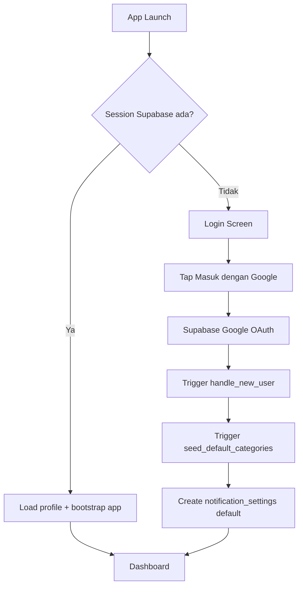
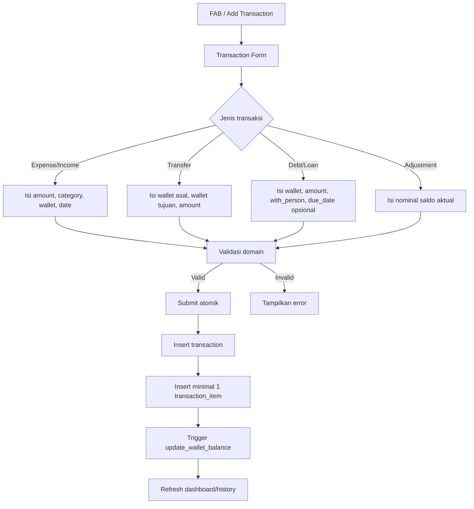
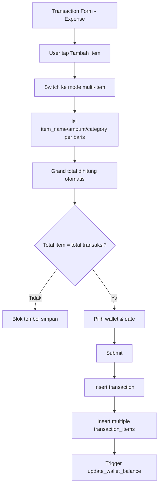
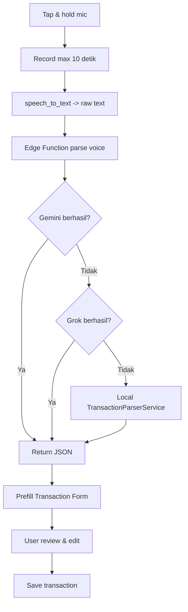
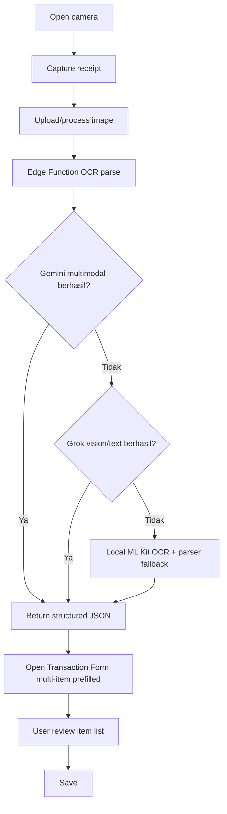
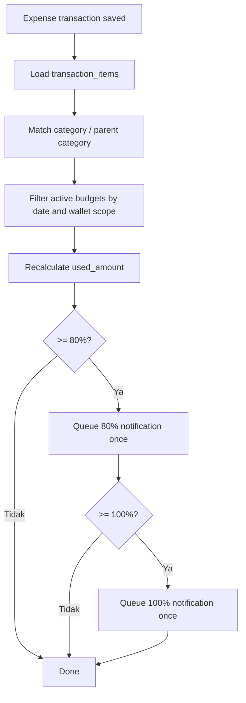
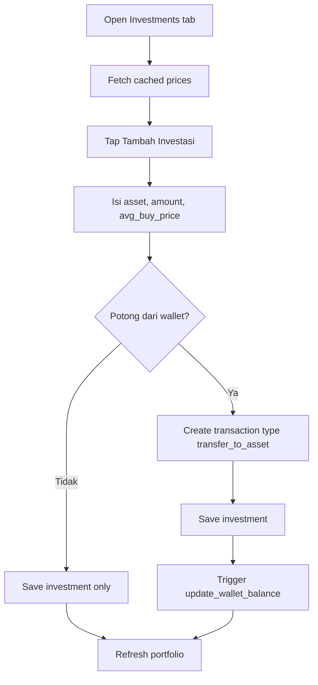

# SakuRapi — PRD Final v6.1
## Product Requirements Document (Copilot Ready)

> Dokumen ini adalah sumber kebenaran utama untuk requirement produk dan flow implementasi SakuRapi.
> Untuk schema, constraint database, trigger, RPC, dan indexing, lihat `02_DATABASE.md`.
> Untuk aturan implementasi Flutter + guardrails Copilot, lihat `03_COPILOT_RULES.md`.

**Tanggal revisi:** 2026-03-23  
**Platform:** Android Only  
**Bahasa UI default:** Bahasa Indonesia  
**Timezone aplikasi:** Asia/Jakarta  
**Currency MVP:** IDR only  
**Status:** Final for implementation

---

## 1. Tujuan Produk

### 1.1 Visi
SakuRapi membantu pengguna mencatat keuangan pribadi dengan cepat, rapi, dan minim friksi, terutama melalui input manual yang simpel, input suara, dan scan struk OCR.

### 1.2 Masalah yang diselesaikan
- Pengguna malas mencatat transaksi karena form terasa panjang.
- Pengguna sulit melacak banyak dompet.
- Pengguna ingin melihat ringkasan, budget, dan histori tanpa ribet.
- Pengguna ingin AI membantu mengisi transaksi dari suara atau foto struk.

### 1.3 Prinsip produk
1. **Fast capture first** — tambah transaksi harus cepat.
2. **Auditability** — semua perubahan saldo harus bisa ditelusuri.
3. **Consistent money model** — saldo, histori, report, budget, dan investasi harus memakai aturan yang konsisten.
4. **AI as assistant, not authority** — hasil Voice/OCR hanya prefill, user tetap konfirmasi sebelum simpan.
5. **Low ambiguity for Copilot** — semua rule penting harus eksplisit.

### 1.4 Non-goals MVP
- Multi-currency conversion.
- Sinkronisasi bank otomatis.
- Shared wallet multi-user.
- Export/import penuh.
- Debt budgeting / receivable cap sebagai budget utama.
- iOS support.

---

## 2. Scope Fitur

### 2.1 P0
1. Google Sign-In + profil
2. Multi-wallet CRUD
3. Dashboard
4. Transaksi manual: income, expense, transfer, debt, loan, adjustment
5. History + filter periode + grouping
6. Kategori parent-child
7. Settings: profil, tema, bahasa, entry point kategori

### 2.2 P1
1. Multi-item / split bill
2. Voice input AI
3. OCR struk AI
4. Parsing dictionary cache
5. Budgeting parent / child
6. Visual reports
7. Local notifications reminder / budget alert

### 2.3 P2
1. Wealth management / investasi
2. Lampiran lanjutan
3. Export/import
4. Improvement analytics

---

## 3. Outcome yang harus dicapai

### 3.1 KPI produk
- Waktu tambah transaksi manual < 20 detik
- Waktu tambah transaksi dari voice/OCR < 45 detik end-to-end
- 100% perubahan saldo wallet dapat dijelaskan dari transaction ledger
- Tidak ada mismatch antara total transaksi vs total item
- Tidak ada pengurangan saldo ganda saat investasi

### 3.2 Definition of done global
Sebuah fitur dianggap selesai jika:
- business rules-nya sudah terimplementasi,
- ada empty/loading/error states,
- ada validasi form,
- ada test minimal pada repository/controller,
- string memakai `.arb`,
- tidak ada hardcoded color/style/text,
- flow happy path dan failure path ditangani.

---

## 4. Domain Rules Finansial (Wajib)

### 4.1 Sumber kebenaran saldo
**Wallet balance hanya boleh berubah melalui tabel `transactions`.**  
Tidak boleh ada trigger lain yang mengurangi atau menambah `wallets.balance` di luar ledger transaksi.

### 4.2 Aturan laporan
Laporan pemasukan/pengeluaran **hanya** menghitung:
- `income`
- `expense`

Yang **tidak** masuk laporan P&L:
- `transfer`
- `adjustment`
- `transfer_to_asset`
- transaksi settlement hutang/piutang
- transaksi internal system correction

### 4.3 Aturan budget
Budget v6.1 hanya berlaku untuk **expense categories**.  
Budget tidak menghitung:
- income
- transfer
- adjustment
- transfer_to_asset
- debt
- loan
- settlement hutang/piutang

### 4.4 Aturan hutang/piutang
- `debt`: uang masuk ke wallet karena meminjam dari orang lain.
- `loan`: uang keluar dari wallet karena meminjamkan ke orang lain.
- Keduanya mencatat **principal position**.
- Saat ada pelunasan, sistem membuat transaksi baru dengan `reference_transaction_id` ke transaksi asal.
- Pelunasan **tidak** dihitung sebagai income/expense murni pada laporan.

### 4.5 Currency & timezone
- MVP hanya IDR.
- `wallet.currency` wajib default `IDR`.
- Total saldo dashboard hanya aman dijumlahkan karena semua wallet memakai currency yang sama.
- Semua filter hari/minggu/bulan menggunakan Asia/Jakarta saat rendering.

---

## 5. Accounting Rules Matrix

| `transactions.type` | Arah kas wallet asal | Masuk laporan? | Masuk budget? | Butuh wallet tujuan? | Butuh `with_person`? | Catatan |
|---|---:|---|---|---|---|---|
| `income` | + | Ya | Tidak | Tidak | Tidak | pemasukan normal |
| `expense` | - | Ya | Ya jika kategori expense | Tidak | Tidak | pengeluaran normal |
| `transfer` | - dari asal, + ke tujuan | Tidak | Tidak | Ya | Tidak | internal transfer |
| `debt` | + | Tidak | Tidak | Tidak | Ya | uang pinjaman diterima |
| `loan` | - | Tidak | Tidak | Tidak | Ya | uang dipinjamkan |
| `adjustment` | +/- sesuai selisih | Tidak | Tidak | Tidak | Tidak | koreksi saldo |
| `transfer_to_asset` | - | Tidak | Tidak | Tidak | Tidak | pembelian aset dari wallet |

### 5.1 Aturan settlement
Tambahkan field:
- `reference_transaction_id` nullable FK ke `transactions.id`
- `settlement_kind` nullable enum:
  - `debt_payment`
  - `loan_collection`

Aturan:
- `settlement_kind = debt_payment` harus memakai `type = expense`
- `settlement_kind = loan_collection` harus memakai `type = income`
- transaksi dengan `settlement_kind` **dikecualikan dari laporan dan budget**

---

## 6. User Flows (Mermaid)

## 6.1 Auth Flow


## 6.2 Manual Transaction Flow


## 6.3 Multi-item Flow


## 6.4 Voice Input Flow


## 6.5 OCR Receipt Flow


## 6.6 Budget Update Flow


## 6.7 Investment Buy Flow


---

## 7. Feature Requirements Detail

## 7.1 Auth & Profil
- Login hanya via Google Sign-In melalui Supabase Auth.
- Setelah login sukses:
  - trigger membuat / update `public.users`,
  - seed kategori default,
  - seed `notification_settings`.
- Flutter **tidak** insert manual ke `public.users`.
- User dapat edit `full_name` dan `avatar_url`.
- Avatar disimpan di Supabase Storage.

### Acceptance criteria
- Jika session valid, app langsung ke dashboard.
- Jika session tidak valid, app ke login.
- Login pertama kali membuat kategori default.
- Logout membersihkan session lokal dan kembali ke login.

## 7.2 Wallets
- CRUD wallet lengkap.
- Field wajib: `name`, `initial_balance`, `icon`, `color`.
- `exclude_from_total` default `false`.
- Wallet archived/deleted tidak boleh menyebabkan ledger orphan.
- Transfer antar dompet harus membuat satu transaction record `type='transfer'` dengan `destination_wallet_id` terisi.

### Acceptance criteria
- Tidak boleh transfer ke wallet yang sama.
- Wallet dengan transaksi tidak boleh hard delete; gunakan soft handling atau blok delete.
- Dashboard total hanya menghitung wallet `exclude_from_total = false`.

## 7.3 Transactions
### Field wajib minimal
- `type`
- `wallet_id`
- `total_amount`
- `date`

### Validasi domain
- `total_amount > 0` untuk semua type kecuali adjustment yang dihitung dari selisih.
- `destination_wallet_id` wajib untuk transfer dan tidak boleh sama dengan `wallet_id`.
- `with_person` wajib untuk `debt` dan `loan`.
- `transaction_items` minimal 1 record.
- `SUM(transaction_items.amount)` harus sama dengan `transactions.total_amount`.
- `category_id` item wajib untuk `income` dan `expense`.
- `category_id` item boleh null untuk `transfer`, `debt`, `loan`.
- Lampiran bersifat opsional.

### Edit/delete policy
- Edit transaksi boleh selama status belum locked.
- Delete transaksi harus mereverse dampak saldo melalui mekanisme trigger.
- Untuk transaksi settlement, delete harus dicek agar tidak membuat outstanding principal negatif.

## 7.4 Multi-item
- Hanya untuk `expense`.
- Setiap item punya:
  - `item_name` nullable
  - `qty` default 1
  - `unit_price` nullable
  - `amount` authoritative subtotal
  - `category_id`
  - `note`
  - `sort_order`
- Jika OCR memberi `qty` dan `unit_price`, maka `amount = qty * unit_price`.
- Untuk single-item, tetap simpan 1 row di `transaction_items`.

## 7.5 Voice Input
- Mic ditekan dan ditahan, maksimum 10 detik.
- Output pipeline:
  1. STT lokal menghasilkan teks
  2. Edge Function ke Gemini
  3. fallback ke Grok
  4. fallback lokal parser regex + dictionary
- Hasil akhir hanya prefill form, user harus konfirmasi.

### Kontrak JSON voice
```json
{
  "transaction_type": "expense",
  "amount": 20000,
  "merchant_name": "Kopi Kenangan",
  "suggested_category": "Makanan & Minuman",
  "suggested_wallet": "GoPay",
  "notes": "Beli kopi kenangan",
  "date": "2026-03-23T07:25:00Z"
}
```

## 7.6 OCR Receipt
- User memfoto struk.
- Sistem mencoba ekstrak:
  - merchant
  - tanggal
  - total
  - item list
  - qty
  - subtotal
  - suggested category
- Jika item extraction gagal, fallback minimal mengisi `total_amount`.
- Foto struk dapat disimpan sebagai lampiran.

### Kontrak JSON OCR
```json
{
  "merchant_name": "Indomaret",
  "date": "2026-03-23T14:30:00Z",
  "total_amount": 45000,
  "suggested_category": "Kebutuhan Harian",
  "is_multi_item": true,
  "items": [
    {
      "item_name": "Kopi Kenangan Mantan",
      "qty": 2,
      "price_per_item": 15000,
      "subtotal": 30000,
      "notes": "2x Kopi Kenangan Mantan"
    },
    {
      "item_name": "Roti Sobek Coklat",
      "qty": 1,
      "price_per_item": 15000,
      "subtotal": 15000,
      "notes": "1x Roti Sobek Coklat"
    }
  ]
}
```

## 7.7 Parsing Dictionary
- Disimpan di Supabase table `parsing_dictionaries`.
- Di-cache ke Hive selama 24 jam.
- Jika keyword tidak ditemukan, fallback ke kategori default “Lain-lain”.

## 7.8 History
- Filter periode:
  - Daily
  - Weekly
  - Monthly (default)
  - Quarterly
  - Yearly
  - Custom range
- Grouping mode:
  - by date
  - by category
- Query ke backend hanya berdasarkan:
  - date range
  - wallet filter
- Grouping by date/category dilakukan **lokal**, bukan query ulang.

## 7.9 Categories
- Parent-child max 2 level.
- `is_default = true` tidak boleh hard delete.
- Default category bisa di-hide.
- Hanya category `expense` dan `income` yang tampil di form sesuai type.
- Kategori debt/loan tidak memakai taxonomy kategori normal pada MVP.

## 7.10 Budgeting
- Hanya untuk `expense`.
- Dapat dibuat pada parent category atau child category.
- Scope:
  - global (`wallet_id = null`)
  - specific wallet
- Auto-renew opsional.
- Threshold alert:
  - 80%
  - 100%

## 7.11 Investments
- Asset type:
  - gold
  - crypto
  - custom
- Cache harga 1 jam.
- Harga live dipakai untuk portfolio display, bukan sumber kebenaran beli.
- Jika user mencentang “Potong dari Wallet”, sistem membuat transaksi `transfer_to_asset`.
- Simpan `linked_wallet_id` hanya sebagai relasi referensial, bukan untuk deduction langsung.

## 7.12 Settings
- Profil
- Bahasa
- Tema
- Entry point kategori
- Notifications settings
- Export/import: tampil sebagai coming soon

---

## 8. Default Categories

## 8.1 Expense
- Kebutuhan Rumah Tangga
  - Belanja Dapur / Bahan Makanan
  - Perlengkapan Rumah
  - Makan di Luar / Jajan
- Kesehatan & Kebugaran
  - Olahraga / Gym
  - Suplemen & Nutrisi
  - Medis / Dokter / Obat
- Transportasi
  - Bensin / Tol / Parkir
  - Transportasi Umum / Ojol
  - Servis Kendaraan
- Tagihan & Kewajiban
  - Listrik & Air
  - Internet & Pulsa
  - Cicilan / Asuransi
- Teknologi & Edukasi
  - Langganan Digital
  - Kursus / Buku
  - Server & Hosting
- Keluarga & Sosial
  - Kebutuhan Pasangan
  - Kondangan / Donasi
  - Nongkrong / Hiburan
- Lain-lain
  - Biaya Admin / Pajak / Selisih
  - Pengeluaran Tak Terduga

## 8.2 Income
- Gaji & Pendapatan Utama
  - Gaji Bulanan
  - Bonus / THR
- Pendapatan Tambahan
  - Pekerjaan Sampingan / Freelance
  - Hasil Investasi / Dividen
  - Pencairan Dana
- Lain-lain
  - Hadiah / Pemberian

## 8.3 System Categories
- Penyesuaian Saldo
- Transfer ke Aset

---

## 9. Edge Cases & Failure Handling

### 9.1 Voice/OCR
- Permission mic/kamera ditolak -> tampilkan explainer + CTA buka settings.
- Gemini timeout -> fallback Grok.
- Grok timeout -> fallback lokal.
- JSON invalid -> tampilkan raw parse preview, jangan auto-save.
- Wallet/kategori hasil AI tidak ditemukan -> form tetap terbuka dengan field kosong parsial.

### 9.2 Transactions
- Double tap submit -> request kedua diabaikan.
- Transfer ke wallet sama -> blok.
- Total item tidak cocok -> blok save.
- Delete wallet yang masih punya transaksi -> blok atau arahkan archive.
- Settlement melebihi outstanding principal -> blok.

### 9.3 Notifications
- Permission notifikasi ditolak -> fitur reminder dianggap disabled di UI.
- Android OEM battery restriction dapat membuat scheduled notification tidak konsisten; tampilkan info di settings jika diperlukan.

---

## 10. Permission Requirements

### Android runtime / platform
- Google Sign-In
- Camera
- Microphone
- Photos/Media bila perlu ambil lampiran
- Notifications (Android 13+)

### Rule
- Permission diminta **just in time**, bukan saat app launch.
- Jika ditolak permanen, tampilkan CTA ke app settings.

---

## 11. External API & Integration Rules

### 11.1 CoinGecko
- Digunakan untuk harga crypto.
- Gunakan Demo/Pro API key melalui Edge Function atau secure env.
- Jangan hardcode key di Flutter client.
- Cache 1 jam di Hive / backend layer sesuai kebutuhan.

### 11.2 Gold price
- Gunakan provider yang legal/stabil.
- Jika API gagal, pakai `custom_current_price`.
- Harga live hanya untuk display portfolio.

### 11.3 AI parsers
- Semua panggilan Gemini/Grok dilakukan melalui Supabase Edge Function.
- Flutter tidak memanggil API key provider AI secara langsung.

---

## 12. Testing Requirements

### Minimum
- Unit test repository untuk transaction create/update/delete.
- Unit test controller untuk history filter/grouping.
- Unit test parser fallback lokal.
- Widget test untuk form transaksi.
- Integration test minimal untuk:
  - login -> dashboard
  - create expense
  - create transfer
  - multi-item save
  - budget usage update

### Assertion penting
- saldo wallet berubah sesuai matrix
- budget tidak menghitung transfer/settlement
- settlement tidak masuk laporan
- investment deduction tidak double count

---

## 13. Acceptance Criteria Ringkas per Modul

## 13.1 Dashboard
- Menampilkan total saldo hanya dari wallet non-excluded.
- Menampilkan recent transactions.
- Menampilkan snapshot income vs expense bulan berjalan.
- FAB expandable berisi Manual, Voice, OCR.

## 13.2 History
- Ganti period tidak crash.
- Swipe period bekerja.
- Group by date/category tidak memicu refetch jika source data sama.
- Comparison view adaptif mengikuti period aktif.

## 13.3 Budget
- Expense pada child category dapat mengurangi budget parent.
- Scope wallet bekerja benar.
- Threshold 80% dan 100% hanya terkirim sekali per periode.

## 13.4 Investment
- Harga live tidak mengubah avg_buy_price.
- Pembelian dengan wallet membuat `transfer_to_asset`.
- Portfolio menampilkan profit/loss unrealized.

---

## 14. Pengembangan Bertahap

1. Phase 0 — Project setup, theme, localization, global widgets
2. Phase 1 — DB schema final, RLS, triggers, RPC
3. Phase 2 — Auth & bootstrap
4. Phase 3 — Wallets
5. Phase 4 — Manual transactions
6. Phase 5 — History & dashboard
7. Phase 6 — Categories
8. Phase 7 — Budgeting
9. Phase 8 — Voice parser
10. Phase 9 — OCR parser
11. Phase 10 — Notifications
12. Phase 11 — Investments
13. Phase 12 — Polish, QA, performance

---

## 15. Final Decision Summary

Jika ada konflik antara implementasi lama, asumsi Copilot, atau prompt lain, maka keputusan berikut yang menang:
- saldo wallet berubah hanya dari ledger `transactions`,
- report hanya menghitung income/expense non-settlement,
- budget hanya menghitung expense,
- multi-item selalu menggunakan `transaction_items`,
- transfer dan transfer_to_asset bukan expense,
- AI hanya prefill, user tetap review,
- semua nominal MVP memakai IDR.
