# SakuRapi — Product Requirements Document (PRD)

**Versi:** 7.0  
**Tanggal:** 2026-03-31  
**Platform:** Android Only  
**Bahasa UI default:** Bahasa Indonesia  
**Timezone:** Asia/Jakarta  
**Currency MVP:** IDR only  
**Status:** Final for implementation  

> **Dokumen terkait:**
> - Database schema, constraint, trigger, RPC → [`02_DATABASE.md`](02_DATABASE.md)
> - Coding rules & Copilot guardrails → [`03_COPILOT_RULES.md`](03_COPILOT_RULES.md)

---

# DAFTAR ISI

### BAGIAN I — RINGKASAN PRODUK
- [1. Tentang SakuRapi](#1-tentang-sakurapi)
  - [1.1. Apa itu SakuRapi?](#11-apa-itu-sakurapi)
  - [1.2. Masalah yang Diselesaikan](#12-masalah-yang-diselesaikan)
  - [1.3. Prinsip Desain Produk](#13-prinsip-desain-produk)
  - [1.4. Yang TIDAK Termasuk di MVP](#14-yang-tidak-termasuk-di-mvp)
- [2. Prioritas Fitur](#2-prioritas-fitur)
  - [2.1. P0 — Wajib Ada (Core)](#21-p0--wajib-ada-core)
  - [2.2. P1 — Penting (Enhanced)](#22-p1--penting-enhanced)
  - [2.3. P2 — Nice to Have (Future)](#23-p2--nice-to-have-future)
- [3. KPI Target & Definition of Done](#3-kpi-target--definition-of-done)

### BAGIAN II — ATURAN BISNIS
- [4. Aturan Keuangan Fundamental](#4-aturan-keuangan-fundamental)
  - [4.1. Sumber Kebenaran Saldo Wallet](#41-sumber-kebenaran-saldo-wallet)
  - [4.2. Matrix Tipe Transaksi](#42-matrix-tipe-transaksi)
  - [4.3. Aturan Settlement](#43-aturan-settlement-pelunasan-hutangpiutang)
  - [4.4. Aturan Hutang/Piutang](#44-aturan-hutangpiutang)
  - [4.5. Currency & Timezone](#45-currency--timezone)

### BAGIAN III — USER FLOWS
- [5. Flow Utama Aplikasi](#5-flow-utama-aplikasi)
  - [5.1. Overview — Alur Navigasi Utama](#51-overview--alur-navigasi-utama)
  - [5.2. Authentication Flow](#52-authentication-flow)
  - [5.3. Manual Transaction Flow](#53-manual-transaction-flow)
  - [5.4. Multi-item Transaction Flow](#54-multi-item-transaction-flow)
  - [5.5. Voice Input Flow](#55-voice-input-flow)
  - [5.6. OCR Receipt Flow](#56-ocr-receipt-flow)
  - [5.7. Debt/Loan Management Flow](#57-debtloan-management-flow)
  - [5.8. Budget Usage Update Flow](#58-budget-usage-update-flow-otomatis)
  - [5.9. Investment Buy Flow](#59-investment-buy-flow)

### BAGIAN IV — DETAIL FITUR
- [6. Auth & Profil](#6-auth--profil)
- [7. Dashboard](#7-dashboard)
- [8. Wallets](#8-wallets)
- [9. Transaksi](#9-transaksi)
- [10. Transaction Detail Page](#10-transaction-detail-page)
- [11. Debt/Loan Management](#11-debtloan-management)
- [12. History](#12-history)
- [13. Categories](#13-categories)
- [14. Budgeting](#14-budgeting)
- [15. Investasi](#15-investasi)
- [16. Settings](#16-settings)

### BAGIAN V — DATA & TEKNIS
- [17. Voice Input — Detail Teknis](#17-voice-input--detail-teknis)
- [18. OCR Receipt — Detail Teknis](#18-ocr-receipt--detail-teknis)
- [19. Parsing Dictionary](#19-parsing-dictionary)
- [20. External API & Integration](#20-external-api--integration)

### BAGIAN VI — DEFAULT CATEGORIES
- [21. Kategori Default](#21-kategori-default)

### BAGIAN VII — EDGE CASES & ERROR HANDLING
- [22. Edge Cases](#22-edge-cases)

### BAGIAN VIII — PERMISSION & TESTING
- [23. Permission Requirements](#23-permission-requirements)
- [24. Testing Requirements](#24-testing-requirements)

### BAGIAN IX — ROADMAP PENGEMBANGAN
- [25. Phase Pengembangan](#25-phase-pengembangan)

### BAGIAN X — FINAL DECISION SUMMARY
- [26. Keputusan Final](#26-keputusan-final)

---

# BAGIAN I — RINGKASAN PRODUK

## 1. Tentang SakuRapi

### 1.1. Apa itu SakuRapi?
Aplikasi pencatat keuangan pribadi untuk Android yang membantu user mencatat transaksi dengan **cepat dan rapi** — baik secara manual, lewat suara (voice input), maupun scan struk (OCR).

### 1.2. Masalah yang Diselesaikan

| # | Masalah User | Solusi SakuRapi |
|---|---|---|
| 1 | Malas mencatat karena form panjang | Form ringkas + voice input + scan struk |
| 2 | Sulit melacak banyak dompet | Multi-wallet dengan dashboard terpadu |
| 3 | Sulit lihat ringkasan keuangan | Dashboard visual + laporan chart |
| 4 | Ingin kontrol pengeluaran | Budgeting per kategori + notifikasi alert |
| 5 | Ingin lacak investasi | Portfolio investasi dengan harga live |

### 1.3. Prinsip Desain Produk

| # | Prinsip | Penjelasan |
|---|---|---|
| 1 | **Fast Capture First** | Tambah transaksi harus selesai < 20 detik |
| 2 | **Auditability** | Semua perubahan saldo wallet bisa ditelusuri dari ledger transaksi |
| 3 | **Consistent Money Model** | Saldo, histori, report, budget, investasi pakai aturan yang sama |
| 4 | **AI = Assistant, bukan Authority** | Hasil voice/OCR hanya prefill — user tetap konfirmasi sebelum simpan |
| 5 | **Low Ambiguity** | Semua rule penting harus eksplisit, tidak ada asumsi tersirat |

### 1.4. Yang TIDAK Termasuk di MVP

- Multi-currency conversion
- Sinkronisasi bank otomatis
- Shared wallet multi-user
- Export/import penuh
- iOS support

---

## 2. Prioritas Fitur

### 2.1. P0 — Wajib Ada (Core)

| # | Fitur | Deskripsi Singkat |
|---|---|---|
| 1 | Google Sign-In + Profil | Login OAuth via Supabase |
| 2 | Multi-Wallet | CRUD dompet, balance tracking |
| 3 | Dashboard | Rangkuman keuangan + chart |
| 4 | Transaksi Manual | Income, expense, transfer, debt, loan, adjustment |
| 5 | History + Filter | Riwayat transaksi dengan filter & grouping |
| 6 | Kategori Parent-Child | Manajemen kategori 2 level |
| 7 | Settings | Profil, tema, bahasa, entry point transaksi |

### 2.2. P1 — Penting (Enhanced)

| # | Fitur | Deskripsi Singkat |
|---|---|---|
| 1 | Multi-item / Split Bill | Beberapa item dalam 1 transaksi |
| 2 | Voice Input AI | Catat transaksi dari suara |
| 3 | OCR Struk AI | Scan struk → auto-isi form |
| 4 | Parsing Dictionary | Cache keyword → kategori untuk voice/OCR |
| 5 | Budgeting | Anggaran per kategori dengan alert |
| 6 | Visual Reports | Chart perbandingan & tren |
| 7 | Local Notifications | Reminder harian + budget alert |

### 2.3. P2 — Nice to Have (Future)

| # | Fitur | Deskripsi Singkat |
|---|---|---|
| 1 | Investasi | Portfolio gold/crypto/custom + harga live |
| 2 | Lampiran Lanjutan | Attachment management |
| 3 | Export/Import | Data portability |
| 4 | Analytics Improvement | Insight keuangan lanjutan |

---

## 3. KPI Target & Definition of Done

### 3.1. KPI Produk

| Metrik | Target |
|---|---|
| Waktu tambah transaksi manual | < 20 detik |
| Waktu tambah transaksi voice/OCR | < 45 detik end-to-end |
| Akurasi saldo wallet vs ledger | 100% match |
| Konsistensi total transaksi vs total item | 100% match (toleransi 0.01) |
| Tidak ada double-count saldo investasi | 100% |

### 3.2. Kapan Fitur Dianggap "Selesai"?

Sebuah fitur **selesai** jika memenuhi SEMUA kriteria berikut:

- [ ] Business rules terimplementasi sesuai PRD
- [ ] Ada state: loading, error, empty
- [ ] Ada validasi form
- [ ] Ada test minimal (repository/controller)
- [ ] String pakai `.arb` (tidak ada hardcode teks)
- [ ] Tidak ada hardcoded color/style
- [ ] Happy path + failure path ditangani

---

# BAGIAN II — ATURAN BISNIS (DOMAIN RULES)

> **Bagian ini WAJIB dipahami oleh semua developer.**
> Aturan ini berlaku di seluruh aplikasi dan tidak boleh dilanggar.

## 4. Aturan Keuangan Fundamental

### 4.1. Sumber Kebenaran Saldo Wallet

```
┌───────────────────────────────────────────────────────┐
│  ATURAN EMAS: Wallet balance HANYA berubah melalui    │
│  tabel `transactions` via database trigger.            │
│                                                       │
│  ❌ DILARANG mengubah balance langsung dari Flutter    │
│  ❌ DILARANG ada trigger lain di luar ledger          │
│  ✅ Semua mutasi saldo harus tercatat di transactions │
└───────────────────────────────────────────────────────┘
```

### 4.2. Matrix Tipe Transaksi

Tabel ini menjelaskan apa yang terjadi untuk setiap tipe transaksi:

| `type` | Arah Kas Wallet | Masuk Laporan? | Masuk Budget? | Butuh Wallet Tujuan? | Butuh `with_person`? |
|---|:---:|:---:|:---:|:---:|:---:|
| `income` | + (masuk) | ✅ Ya | ❌ Tidak | ❌ | ❌ |
| `expense` | - (keluar) | ✅ Ya | ✅ Ya | ❌ | ❌ |
| `transfer` | - asal, + tujuan | ❌ Tidak | ❌ Tidak | ✅ Wajib | ❌ |
| `debt` | + (pinjaman masuk) | ❌ Tidak | ❌ Tidak | ❌ | ✅ Wajib |
| `loan` | - (pinjamkan keluar) | ❌ Tidak | ❌ Tidak | ❌ | ✅ Wajib |
| `adjustment` | +/- (koreksi) | ❌ Tidak | ❌ Tidak | ❌ | ❌ |
| `transfer_to_asset` | - (beli aset) | ❌ Tidak | ❌ Tidak | ❌ | ❌ |

> **Ringkasan Sederhana:**
> - **Laporan** hanya menghitung `income` dan `expense` (bukan settlement).
> - **Budget** hanya menghitung `expense` (bukan settlement).
> - **Transfer, debt, loan, adjustment, transfer_to_asset** TIDAK masuk laporan maupun budget.

### 4.3. Aturan Settlement (Pelunasan Hutang/Piutang)

| Jenis Settlement | `settlement_kind` | `type` transaksi | Penjelasan |
|---|---|---|---|
| Bayar hutang | `debt_payment` | `expense` | User membayar hutangnya |
| Terima piutang | `loan_collection` | `income` | User menerima pembayaran piutang |

**Aturan penting:**
- Settlement **DIKECUALIKAN** dari laporan dan budget (meskipun type-nya income/expense)
- Setiap settlement wajib punya `reference_transaction_id` ke transaksi asal
- Amount settlement ≤ sisa outstanding

### 4.4. Aturan Hutang/Piutang

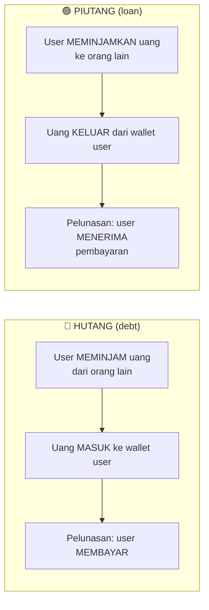

- `with_person` (teks) **wajib** diisi untuk identifikasi pihak terkait
- `contact_id` (FK ke `contacts`) **opsional** — diisi jika user pilih dari phonebook
- Status: `unpaid` → `partial` → `paid` (dihitung dari total settlement)

### 4.5. Currency & Timezone

| Aturan | Nilai |
|---|---|
| Currency MVP | IDR only |
| Default `wallet.currency` | `'IDR'` |
| Timezone rendering | `Asia/Jakarta` |
| Penyimpanan tanggal | UTC di database |

---

# BAGIAN III — USER FLOWS

> **Panduan membaca flowchart:**
> - Kotak persegi = aksi/halaman
> - Diamond (belah ketupat) = keputusan/kondisi
> - Panah = alur proses
> - Warna hijau = happy path, merah = error path

## 5. Flow Utama Aplikasi

### 5.1. Overview — Alur Navigasi Utama

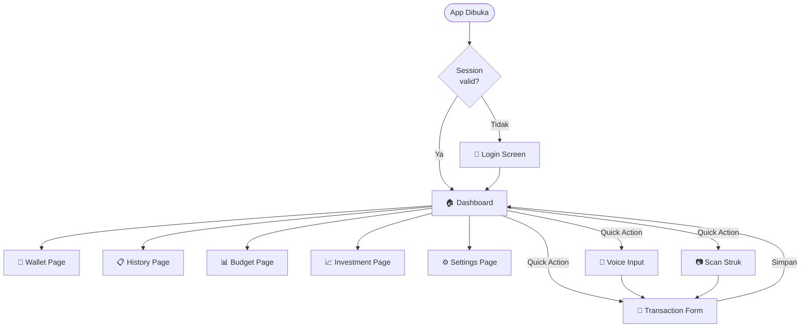

### 5.2. Authentication Flow

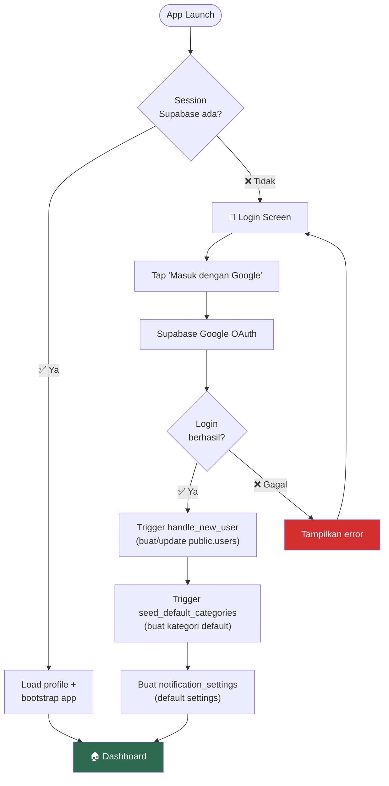

**Catatan penting:**
- Flutter **TIDAK** insert manual ke `public.users` — semua dilakukan oleh trigger database
- Login pertama kali otomatis membuat kategori default dan notification settings
- Logout membersihkan session lokal + cache Hive → navigasi ke login

### 5.3. Manual Transaction Flow

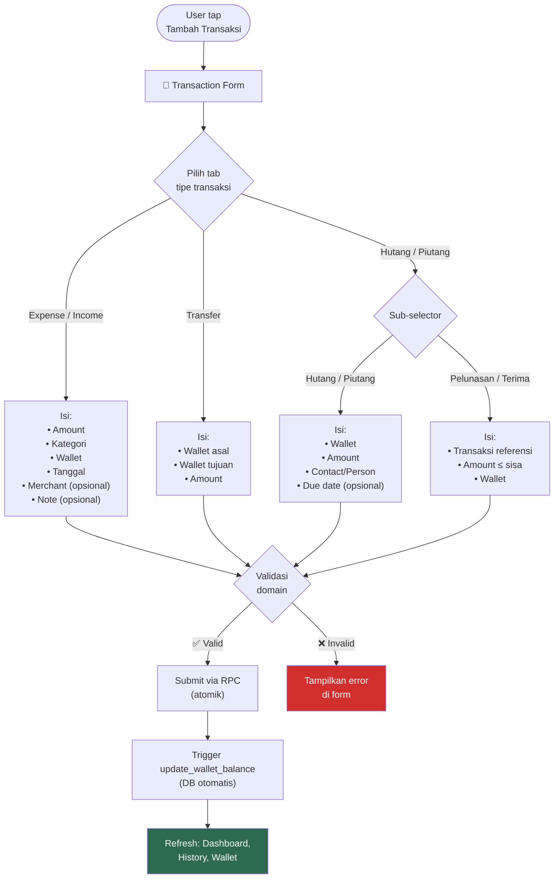

> **Catatan:** Tipe `adjustment` **TIDAK** ditampilkan di form transaksi manual.
> Adjustment hanya bisa dibuat dari fitur koreksi saldo wallet.

### 5.4. Multi-item Transaction Flow

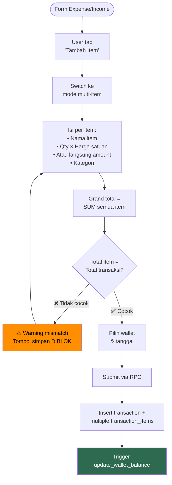

**Aturan perhitungan amount item:**
1. Jika `qty` dan `unit_price` terisi → `amount = qty × unit_price` (otomatis, read-only)
2. Jika tidak → user isi `amount` manual
3. Single-item tetap simpan 1 row di `transaction_items`

### 5.5. Voice Input Flow

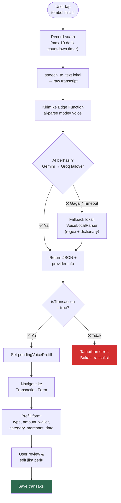

**Pipeline AI:**
1. STT lokal (`speech_to_text`, locale `id_ID`) → teks
2. Edge Function `ai-parse` mode `voice` → Gemini
3. Failover ke Groq (bukan Grok)
4. Fallback lokal: regex amount + keyword type + dictionary category

**Contoh parsing lokal:**
- `"1.5jt"` → 1.500.000
- `"25rb"` → 25.000
- `"transfer/kirim uang"` → type transfer
- `"kemarin"` → tanggal -1 hari

### 5.6. OCR Receipt Flow

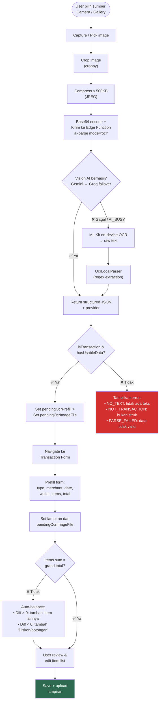

### 5.7. Debt/Loan Management Flow

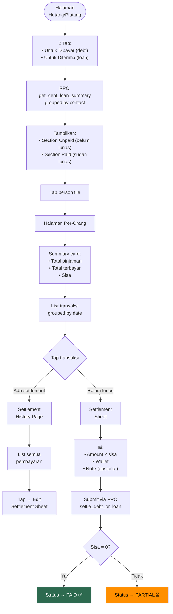

### 5.8. Budget Usage Update Flow (Otomatis)

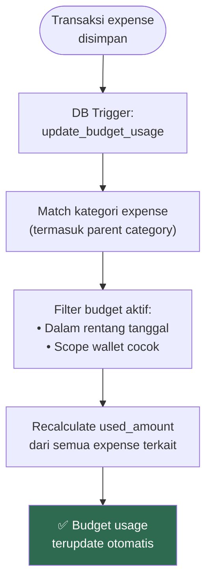

> **Penting:** Notifikasi alert budget (50%/80%/100%) bukan bagian dari trigger database.
> Alert dicek saat halaman budget dibuka oleh `BudgetAlertChecker` di Flutter.

### 5.9. Investment Buy Flow

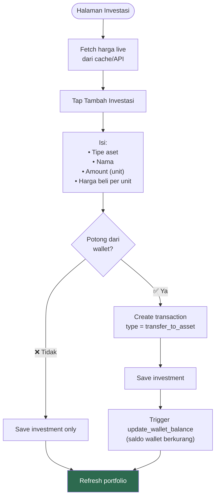

---

# BAGIAN IV — DETAIL FITUR

> Setiap fitur didokumentasikan dengan format standar:
> 1. Deskripsi — apa fitur ini
> 2. UI Layout — bagaimana tampilannya
> 3. Aturan Bisnis — logic & constraint
> 4. Data Layer — query & caching
> 5. Acceptance Criteria — kapan dianggap selesai

## 6. Auth & Profil

### 6.1. Deskripsi
Login hanya via Google Sign-In melalui Supabase Auth. Setelah login, sistem otomatis setup data awal user.

### 6.2. Alur Login
1. User tap "Masuk dengan Google"
2. Supabase handle OAuth flow
3. DB trigger `handle_new_user` → buat/update `public.users`
4. DB trigger `seed_default_categories` → buat kategori default
5. Buat `notification_settings` default
6. Navigasi ke Dashboard

### 6.3. Profil User
- User dapat edit `full_name` dan `avatar_url`
- Avatar disimpan di Supabase Storage

### 6.4. Acceptance Criteria
- [x] Session valid → langsung ke Dashboard
- [x] Session invalid → ke Login
- [x] Login pertama → kategori default dibuat
- [x] Logout → bersihkan session lokal → ke Login

---

## 7. Dashboard

### 7.1. Deskripsi
Halaman utama setelah login. Menampilkan rangkuman keuangan, quick actions, dan chart tren.

### 7.2. UI Layout (CustomScrollView + RefreshIndicator)

```
┌─────────────────────────────────────┐
│  Hello, {userName}!                 │  ← Greeting
├─────────────────────────────────────┤
│  ┌─────────────────────────────┐    │
│  │  TOTAL BALANCE    👁        │    │  ← DashboardBalanceCard
│  │  Rp 12.500.000              │    │     (gradient card)
│  │  ↗ Income  ↘ Expense       │    │
│  └─────────────────────────────┘    │
├─────────────────────────────────────┤
│  [✏️ Manual] [🎤 Voice]            │  ← DashboardQuickActions
│  [📷 Scan]  [💼 Wallets]           │     (4 tombol horizontal)
├─────────────────────────────────────┤
│  My Wallets              See All → │  ← DashboardWalletSection
│  ┌────┐ ┌────┐ ┌────┐              │     (horizontal scroll cards)
│  │Cash│ │Dana│ │OVO │              │
│  └────┘ └────┘ └────┘              │
├─────────────────────────────────────┤
│  ●Income    ●Expense    Net Flow   │  ← DashboardPeriodSummary
│  Rp 8jt     Rp 5jt      +Rp 3jt   │     + comparison badge
│               See Full Report →    │
├─────────────────────────────────────┤
│  ◀ [Chart Carousel - 2 pages] ▶   │  ← DashboardChartCarousel
│  [Monthly ▼]                       │     (toggle: Monthly/Weekly/Daily)
│  Page 0: Expense Comparison Bar    │
│  Page 1: Trend Report Line Chart   │
├─────────────────────────────────────┤
│  Recent Transactions                │  ← DashboardRecentTransactions
│  - Kopi Kenangan     -Rp 25.000   │     (5 terbaru)
│  - Gaji Bulanan     +Rp 8.000.000 │
│  - ...                             │
└─────────────────────────────────────┘
```

### 7.3. State Management — Split Controller

Dashboard menggunakan **2 controller terpisah** untuk mencegah rebuild seluruh halaman saat hanya chart mode berubah:

```mermaid
flowchart LR
    subgraph DashboardController["DashboardController (Parent)"]
        A[DashboardState]
        A1["• status (loading/loaded/error)"]
        A2["• recentTransactions"]
        A3["• isBalanceHidden"]
    end

    subgraph ChartController["DashboardChartController (Chart)"]
        B[DashboardChartState]
        B1["• chartMode (monthly/weekly/daily)"]
        B2["• currentPeriod income/expense"]
        B3["• previousPeriod income/expense"]
        B4["• daily data (current/prev/avg)"]
    end

    DashboardController -->|"loadDashboard() triggers"| ChartController
    ChartController -->|"mode change = chart reload only"| ChartController
```

**Widget consumers:**
- `DashboardController` → DashboardPage, BalanceCard, WalletSection, RecentTransactions
- `ChartController` → ChartCarousel, ComparisonChart, TrendChart, PeriodSummary

### 7.4. Data Queries
- Recent transactions: `ORDER BY date DESC, created_at DESC`, `LIMIT 5`, join wallet + items + categories
- Period summary: `type IN ('income','expense') AND settlement_kind IS NULL`
- Caching: recent transactions + period summary di-cache ke Hive (offline fallback)

### 7.5. Acceptance Criteria
- [x] Total saldo hanya dari wallet `exclude_from_total = false`
- [x] Quick actions: Manual → form, Voice → sheet → form, Scan → sheet → form, Wallets → wallet page
- [x] Chart mode toggle reload data dengan benar
- [x] Balance hide/show toggle berfungsi
- [x] Pull-to-refresh memuat ulang wallets + dashboard paralel
- [x] Loading/error/empty states ditangani

---

## 8. Wallets

### 8.1. Deskripsi
Manajemen multi-dompet. Setiap wallet punya nama, icon, warna, dan saldo. Balance hanya berubah melalui ledger transaksi.

### 8.2. UI Layout

```
┌─────────────────────────────────────┐
│  Dompet                    [+ FAB] │  ← AppBar
├─────────────────────────────────────┤
│  ┌─────────────────────────────┐    │
│  │  TOTAL SALDO               │    │  ← WalletSummaryCard
│  │  Rp 12.500.000  (3 dompet) │    │     (gradient card)
│  └─────────────────────────────┘    │
├─────────────────────────────────────┤
│  📂 Termasuk dalam total            │  ← Section header
│  ┌─ 💰 Cash         Rp 5.000.000 ┐ │
│  ├─ 📱 Dana         Rp 4.500.000 ┤ │  ← WalletTile + popup menu
│  └─ 📱 OVO          Rp 3.000.000 ┘ │     (Edit, Adjust, Delete)
├─────────────────────────────────────┤
│  📂 Dikecualikan dari total         │  ← Section header
│  └─ 🏦 Tabungan     Rp 50.000.000┘ │
└─────────────────────────────────────┘
```

### 8.3. Forms

**WalletFormSheet (Bottom Sheet):**

| Mode | Fields yang Tampil |
|---|---|
| **Create** | Name, Initial Balance, Icon Picker, Color Picker, Exclude Toggle |
| **Edit** | Name, Icon Picker, Color Picker, Exclude Toggle (**tanpa** Initial Balance) |

Validasi:
- Name required, trimmed, unique per user (case-insensitive)
- Initial balance ≥ 0 (hanya saat create)

**WalletAdjustSheet (Bottom Sheet) — Koreksi Saldo:**
- Tampilkan: nama wallet, saldo saat ini
- Input: target balance (saldo aktual sekarang)
- Tampilkan selisih: +/- berwarna (hijau/merah)
- Validasi: target ≠ saldo saat ini
- Save → RPC `create_adjustment_transaction`

### 8.4. Aturan Bisnis
- `balance` adalah **READ-ONLY** di client — hanya berubah via trigger
- Transfer antar dompet = 1 record `type='transfer'` + `destination_wallet_id`
- Ordering: `sort_order ASC`, `created_at ASC`
- Caching: list wallet di-cache ke Hive

### 8.5. Acceptance Criteria
- [x] Transfer ke wallet sama → diblok
- [x] Delete wallet yang punya transaksi → diblok
- [x] Dashboard total hanya wallet `exclude_from_total = false`
- [x] Name duplicate (case-insensitive) → diblok di create & update
- [x] Balance adjustment → buat transaksi `type = adjustment` via RPC

---

## 9. Transaksi

### 9.1. Form UI — 4 Tab

```
┌─────────────────────────────────────┐
│  [Expense] [Income] [Transfer] [H/P]│  ← Tab selector
├─────────────────────────────────────┤
│  (Form fields sesuai tipe)          │
└─────────────────────────────────────┘
```

Tab **Hutang/Piutang** punya 4 sub-mode via `DebtLoanKindSelector`:

| Sub-mode | Tipe Transaksi | Penjelasan |
|---|---|---|
| Hutang | `debt` | User meminjam dari orang lain |
| Piutang | `loan` | User meminjamkan ke orang lain |
| Pelunasan | `debt_payment` | User membayar hutangnya |
| Terima | `loan_collection` | User menerima piutangnya |

### 9.2. Field Wajib per Tipe

| Field | Expense | Income | Transfer | Debt/Loan | Settlement |
|:---|:---:|:---:|:---:|:---:|:---:|
| `wallet_id` | ✅ | ✅ | ✅ (asal) | ✅ | ✅ |
| `destination_wallet_id` | — | — | ✅ (tujuan) | — | — |
| `category_id` (item) | ✅ | ✅ | — | — | — |
| `with_person` | — | — | — | ✅ | Dari ref |
| `contact_id` | — | — | — | Opsional | Dari ref |
| `merchant_name` | Opsional | Opsional | — | — | — |
| `note` | Opsional | Opsional | Opsional | Opsional | Opsional |
| `attachment_url` | Opsional | Opsional | Opsional | Opsional | — |
| `due_date` | — | — | — | Opsional | — |
| `reference_transaction_id` | — | — | — | — | ✅ |
| Multi-item | ✅ | ✅ | ❌ | ❌ | ❌ |

### 9.3. Kontak (Contact Picker)
Untuk hutang/piutang, user dapat memilih kontak dari:
1. **Phonebook device** — via `FlutterContacts`, perlu permission
2. **Kontak tersimpan** — dari tabel `contacts` di database
3. Kontak dari phonebook di-upsert ke `contacts` via RPC `upsert_contact`

### 9.4. Validasi Domain

| Rule | Detail |
|---|---|
| Amount | `total_amount > 0` untuk semua type (kecuali adjustment) |
| Transfer | `destination_wallet_id ≠ wallet_id` |
| Debt/Loan | `with_person` wajib diisi |
| Items | Minimal 1 record di `transaction_items` |
| Item total | `SUM(items.amount) == total_amount` (toleransi 0.01) |
| Kategori | Wajib untuk `income` dan `expense`; boleh null untuk lainnya |
| Settlement | Amount ≤ remaining dari transaksi referensi |
| Anti double-submit | Status flag `saving` mencegah submit ganda |

### 9.5. Lampiran (Attachment)
- **Lazy upload:** Lampiran dipilih lokal, upload ke Supabase Storage saat simpan
- **Preview:** Tap thumbnail → dialog fullscreen + `InteractiveViewer` (pinch-to-zoom, max 5x)
- **Auto-expand:** Jika `localAttachmentPath` berubah (misal dari OCR), section otomatis expand
- Jika upload gagal → transaksi tetap tersimpan tanpa lampiran

### 9.6. Edit/Delete Policy

| Aksi | Transaksi Biasa | Settlement |
|---|---|---|
| Edit | Boleh (selama belum locked) | Via RPC `update_settlement` |
| Delete | Via mekanisme trigger (reverse saldo) | Via RPC `delete_settlement` |

- Delete settlement harus dicek agar outstanding principal tidak negatif
- Edit settlement via bottom sheet (bukan form page)

### 9.7. Acceptance Criteria
- [x] Double tap submit → diabaikan
- [x] Transfer ke wallet sama → diblok
- [x] Total item ≠ total transaksi → blok simpan
- [x] Settlement > outstanding → diblok
- [x] Lampiran lazy upload berfungsi

---

## 10. Transaction Detail Page

### 10.1. Deskripsi
Menampilkan detail lengkap satu transaksi (read-only) dengan aksi edit/delete.

### 10.2. Layout

```
┌─────────────────────────────────────┐
│  [Badge: EXPENSE]                   │
│  -Rp 45.000                        │  ← Header card
│  Indomaret                          │     (tipe + amount + merchant)
├─────────────────────────────────────┤
│  Wallet: Cash                       │
│  Tanggal: 29/03/2026               │  ← Detail section
│  Catatan: Belanja harian           │
├─────────────────────────────────────┤
│  Items (3)                   [▼]    │
│  • Kopi Kenangan    2x  Rp 30.000  │  ← Items section (expandable)
│  • Roti Sobek            Rp 15.000  │
│  Grand Total:            Rp 45.000  │
├─────────────────────────────────────┤
│  [✏️ Edit]  [🗑️ Delete]             │  ← Action buttons
└─────────────────────────────────────┘
```

**Khusus Debt/Loan:**
- Info kontak: avatar (huruf pertama), label lender/borrower
- Progress pelunasan: jumlah terbayar, sisa, progress bar
- Tombol: "Bayar Hutang" / "Terima Piutang" + "Riwayat Pelunasan"
- Label "Dikecualikan dari laporan"

---

## 11. Debt/Loan Management

### 11.1. Halaman Utama — 2 Tab

| Tab | Konten | Data dari |
|---|---|---|
| Untuk Dibayar | Daftar hutang user | RPC `get_debt_loan_summary` type=debt |
| Untuk Diterima | Daftar piutang user | RPC `get_debt_loan_summary` type=loan |

Setiap tab menampilkan:
- **Section Unpaid:** Kontak dengan sisa hutang/piutang + total remaining
- **Section Paid:** Kontak yang sudah lunas + total principal
- **Wallet filter** di AppBar

### 11.2. Halaman Per-Orang
- Summary card: total principal vs settled vs remaining
- List transaksi grouped by date
- Status badge per transaksi: Paid (hijau), Partial (oranye), Unpaid (abu)
- FAB settlement (hidden jika semua sudah paid)

### 11.3. Settlement Sheet

| Mode | Fitur |
|---|---|
| **Create** | Pilih referensi, info sisa, input amount + MAX, wallet ChoiceChips, note |
| **Edit** | Pre-filled amount + note, tombol delete (konfirmasi) |

Validasi: amount > 0, amount ≤ remaining, wallet dipilih.

### 11.4. RPC Terkait

| RPC | Kegunaan |
|---|---|
| `get_debt_loan_summary` | Summary grouped by contact per type |
| `get_debt_loan_transactions_by_person` | Semua transaksi dengan satu orang |
| `get_all_unpaid_debt_loan` | Semua transaksi belum lunas (untuk picker) |
| `get_settlement_history` | Riwayat pelunasan untuk satu referensi |
| `settle_debt_or_loan` | Buat transaksi pelunasan |
| `update_settlement` | Edit pelunasan |
| `delete_settlement` | Hapus pelunasan + recalc status |

---

## 12. History

### 12.1. Deskripsi
Riwayat transaksi dengan filter periode, filter tipe, grouping, dan pagination.

### 12.2. Period Selector — 6 Opsi

| Opsi | Rentang | Label Contoh |
|---|---|---|
| **Daily** | 30 hari terakhir | "29 Mar" atau "Hari Ini" |
| **Weekly** | 30 minggu terakhir | "24–30 Mar" atau "Minggu Ini" |
| **Monthly** (default) | 14 bulan terakhir | "Maret 2026" atau "Bulan Ini" |
| **Quarterly** | 2+ tahun | "Q1 2026" atau "Kuartal Ini" |
| **Yearly** | 5 tahun terakhir | "2026" atau "Tahun Ini" |
| **Custom** | Date range picker | "1 Mar – 31 Mar" |

Sub-period tabs sinkron dengan swipeable PageView. Tab terakhir = periode saat ini.

### 12.3. Filter Sheet (Bottom Modal)

| Filter | Opsi | Behavior |
|---|---|---|
| **Wallet** | All / per-wallet | ⚡ Trigger refetch dari server |
| **Type** | All / Expense / Income / Transfer / Debt / Loan | 🏠 Lokal (tanpa refetch) |
| **Grouping** | By Date (default) / By Category | 🏠 Lokal (tanpa refetch) |

Badge ditampilkan di icon filter jika ada filter aktif.

### 12.4. Summary Card
Di atas list, menampilkan:
- Total income (tanpa settlement) — hijau
- Total expense (tanpa settlement) — merah
- Jumlah transaksi
- Format compact: "Rp 1.2M"

### 12.5. Pagination & Caching
- Page size: 30 transaksi
- Infinite scroll via `VisibilityDetector`
- `hasMore` flag untuk stop loading
- Halaman pertama di-cache ke Hive

### 12.6. Acceptance Criteria
- [x] Ganti period tidak crash
- [x] Swipe antar sub-period bekerja (tab + PageView sync)
- [x] Filter type/grouping lokal (tanpa refetch)
- [x] Summary card exclude settlement
- [x] Infinite scroll berhenti saat data habis
- [x] Pull-to-refresh berfungsi

---

## 13. Categories

### 13.1. Aturan
- Parent-child max 2 level
- `is_default = true` → tidak boleh hard delete
- Default category bisa di-hide (`is_hidden = true`)
- Form transaksi hanya tampilkan kategori sesuai type (expense → expense categories)
- Tipe debt/loan tidak pakai taxonomy kategori normal di MVP

---

## 14. Budgeting

### 14.1. Deskripsi
Anggaran untuk kategori expense. Mendukung parent & child category, scope global/per-wallet, recurring otomatis, dan alert notifikasi di 50%/80%/100%.

### 14.2. Overview Flow

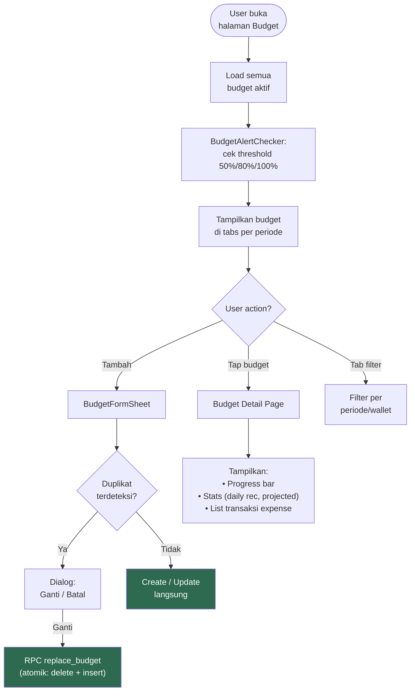

### 14.3. Period Types

| Tipe | Rentang | Auto-Renew |
|---|---|---|
| **Weekly** | Senin – Minggu | new_start = old_end + 1, new_end = new_start + 6 |
| **Monthly** (default) | Tgl 1 – akhir bulan | 1st next month – last day next month |
| **Quarterly** | Q1/Q2/Q3/Q4 | 1st next quarter – last day next quarter |
| **Yearly** | 1 Jan – 31 Des | Jan 1 next year – Dec 31 next year |
| **Custom** | Date range picker | Lihat aturan custom renew di bawah |

**Auto-renew Custom Recurring:**
- Cek apakah `end_date` = hari terakhir bulannya
- Jika akhir bulan → `new_end` = hari terakhir bulan dari new end's month
- Jika bukan akhir bulan → `new_end` = `new_start` + durasi asli (jumlah hari)
- Contoh: Jan 10–31 (akhir bulan) → Feb 10–28
- Contoh: Jan 10–29 (20 hari) → Feb 10 – Mar 1

### 14.4. Budget Page UI

```
┌─────────────────────────────────────┐
│  Anggaran              [🔽 Wallet] │  ← AppBar + wallet filter
├─────────────────────────────────────┤
│  [Mingguan] [Bulanan] [10/03-31/03]│  ← Dynamic period tabs
├─────────────────────────────────────┤
│  ┌─────────────────────────────┐    │
│  │     ╭───────────╮           │    │  ← BudgetSummaryCard
│  │    ╱  Arc Gauge  ╲          │    │     (semicircle 180°)
│  │   ╱    75%        ╲         │    │
│  │  Spendable: Rp 250.000     │    │
│  │  Budget | Used | Days Left  │    │
│  └─────────────────────────────┘    │
├─────────────────────────────────────┤
│  [+ Tambah Anggaran]               │  ← SakuButton
├─────────────────────────────────────┤
│  📊 Anggaran Aktif                  │
│  ┌─ Kebutuhan RT    Rp 2jt ────┐   │  ← Budget parent
│  │  ├─ Belanja Dapur  Rp 800rb │   │     dengan children
│  │  └─ Makan di Luar  Rp 500rb │   │
│  └──────────────────────────────┘   │
├─────────────────────────────────────┤
│  ⏰ Budget Mendatang                │  ← Upcoming budgets
│  └─ Transportasi      Rp 1jt       │
├─────────────────────────────────────┤
│  🕐 Lihat Budget Selesai →         │  ← Link to completed
└─────────────────────────────────────┘
```

### 14.5. Budget Detail Page

```
┌─────────────────────────────────────┐
│  [←] Kebutuhan RT    [✏️] [🗑️]    │  ← AppBar + actions
├─────────────────────────────────────┤
│  Spent           Remaining          │
│  Rp 1.500.000    Rp 500.000        │
│  ████████████░░░░ [Hari ini ↓]     │  ← Progress bar + marker
│  75%                                │
├─────────────────────────────────────┤
│  Periode: 01/03 – 31/03            │
│  Sisa hari: 2                       │
│  Wallet: Semua                      │
├─────────────────────────────────────┤
│  📈 Stats                           │
│  • Rekomendasi harian: Rp 64.500   │
│  • Proyeksi total: Rp 2.100.000    │
│  • Aktual harian: Rp 75.000        │
├─────────────────────────────────────┤
│  📋 Transaksi                       │
│  (termasuk sub-kategori child)      │
│  • Belanja Dapur    -Rp 150.000    │
│  • Makan McD        -Rp 85.000     │
└─────────────────────────────────────┘
```

### 14.6. BudgetFormSheet

| Field | Tipe | Wajib | Default |
|---|---|---|---|
| Category | Picker (expense only) | ✅ | — |
| Amount | Currency (> 0) | ✅ | 0 |
| Period | Presets + Custom | ❌ | Inherit tab aktif / This Month |
| Wallet scope | Global / per-wallet | ❌ | Global |
| Recurring | Toggle checkbox | ❌ | false |
| Carry-forward | Toggle (muncul jika Recurring = true) | ❌ | false |

**Period presets:** This Week, This Month, This Quarter, This Year, Custom.

**Duplicate detection (seragam create & edit):**
1. Saat submit → cek `findDuplicateBudgetId(categoryId, walletId, startDate, endDate, excludeBudgetId?)`
2. Jika duplikat → dialog konfirmasi "Ganti" / "Batal"
3. "Ganti" → RPC `replace_budget` (DELETE + INSERT atomik)

**Dirty check:** Jika ada perubahan unsaved lalu user close → dialog konfirmasi discard.

### 14.7. Progress Bar Color Coding

| Persentase Penggunaan | Warna | Arti |
|---|---|---|
| < 60% | 🟢 Hijau | Aman |
| 60% – 79% | 🟡 Kuning | Hati-hati |
| 80% – 99% | 🟠 Oranye | Mendekati limit |
| ≥ 100% | 🔴 Merah | Over budget |

Animasi fill: 400ms easeOutCubic.

### 14.8. Budget Alert (BudgetAlertChecker)

**Kapan dicek?** Saat halaman budget di-load (`ref.listenManual`). **Bukan** background worker.

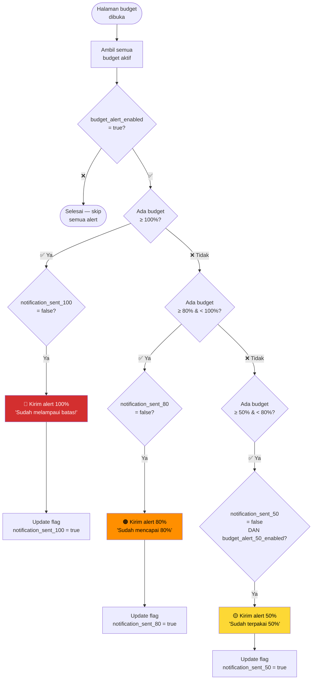

**Prioritas:** 100% > 80% > 50%. Hanya alert tertinggi yang dikirim.

**Notification channel:** `saku_rapi_budget` ("Alert Anggaran", importance HIGH).

**Reset:** Flag `notification_sent_50/80/100` di-reset oleh `auto_renew_budgets` pg_cron job saat budget di-clone ke periode baru.

### 14.9. Carry-Forward (Opsional)
- Jika `carry_forward = true` DAN budget recurring:
  - Sisa positif → ditambahkan ke nominal budget baru (`new_amount = amount + remaining`)
  - Sisa negatif (over budget) → **TIDAK** dikurangi; budget baru mulai dengan nominal asli

### 14.10. Acceptance Criteria
- [x] Expense child category mengurangi budget parent
- [x] Scope wallet bekerja benar
- [x] Alert 50%/80%/100% hanya terkirim sekali per periode
- [x] Period tabs dinamis (hanya tampil jika ada budget aktif)
- [x] Custom budget mendapat tab terpisah dengan label tanggal
- [x] Duplicate detection seragam di create & edit
- [x] Replace budget atomik via RPC
- [x] Transaksi sub-kategori tampil di detail page
- [x] BudgetAlertChecker triggered saat halaman budget load
- [x] Auto-renew via pg_cron aktif
- [x] Carry-forward menambah sisa positif ke budget baru
- [x] Spendable negatif saat over budget (bukan 0)
- [x] Detail page di-refresh setelah edit (bukan pop)
- [x] Form deteksi semua periode saat edit
- [x] Konfirmasi discard saat close form yang dirty

---

## 15. Investasi

### 15.1. Deskripsi
Portfolio investasi dengan 3 jenis aset, harga live, dan integrasi wallet.

### 15.2. Jenis Aset

| Tipe | Sumber Harga | Satuan | Icon | Warna |
|---|---|---|---|---|
| `gold` | Edge Function `gold-price` | gram | coins | #D4A017 (emas) |
| `crypto` | CoinGecko API (Bitcoin/IDR) | unit | bitcoin | #F7931A (oranye) |
| `custom` | Manual via `asset_types.current_price` | sesuai symbol | chart-line | primary |

### 15.3. Investment Page Layout

```
┌─────────────────────────────────────┐
│  Investasi        [🔽 Filter] [🔄] │  ← AppBar
├─────────────────────────────────────┤
│  ┌─────────────────────────────┐    │
│  │  📈 PORTFOLIO               │    │  ← PortfolioSummaryCard
│  │  Total: Rp 25.000.000      │    │     (emerald gradient)
│  │  P/L: +12.5% 📈            │    │
│  │  Modal: Rp 22.000.000      │    │
│  │  Gold: 5gr | BTC: 0.001    │    │
│  └─────────────────────────────┘    │
├─────────────────────────────────────┤
│  Aset Saya      Manage Types →     │
│  ┌──────────────────────────────┐   │
│  │ 🪙 Emas Antam        LIVE   │   │  ← Asset Card (dismissible)
│  │    5 gram    Rp 8.500.000   │   │
│  │              +5.2% 📈       │   │
│  ├──────────────────────────────┤   │
│  │ ₿ Bitcoin             LIVE  │   │
│  │    0.001     Rp 16.500.000  │   │
│  └──────────────────────────────┘   │
├─────────────────────────────────────┤
│                [+ FAB]              │
└─────────────────────────────────────┘
```

### 15.4. Investment Form Page

| Field | Kapan Tampil | Wajib | Validasi |
|---|---|---|---|
| Type Selector | Selalu | ✅ | Gold / Crypto / Custom |
| Custom Asset Type | type = custom | ✅ | Pilih dari `asset_types` |
| Asset Name | type ≠ custom | ✅ | Not empty, autocomplete |
| Amount (unit) | Selalu | ✅ | > 0 |
| Buy Price per Unit | Selalu | ✅ | > 0 |
| Current Price | custom tanpa asset type | ✅ | > 0 |
| Deduct from Wallet | Create mode only | ❌ | Toggle + wallet picker |
| Notes | Selalu | ❌ | Multiline |

**Deduct from Wallet:**
- Toggle switch → pilih wallet → tampilkan estimated cost (amount × buy_price)
- Validasi: saldo wallet ≥ total cost
- RPC atomik: insert investment + create `transfer_to_asset` transaction

### 15.5. Price Service

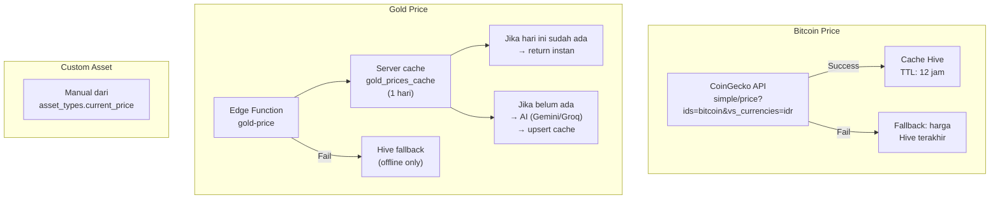

### 15.6. Computed Providers

| Provider | Deskripsi |
|---|---|
| `investmentTotalValueProvider` | Sum (aset × harga terkini) |
| `investmentTotalInvestedProvider` | Sum (aset × avg_buy_price) |
| `investmentTotalPLProvider` | Total value − total invested |
| `investmentTotalPLPercentProvider` | (P/L / total invested) × 100 |
| `investmentByTypeProvider(type)` | Filter list per tipe |
| `investmentUnitSummaryProvider` | Breakdown per type (gold: Xgr, crypto: Y) |
| `investmentSuggestionsProvider` | Autocomplete nama aset |

### 15.7. Asset Type Management
- CRUD custom asset types
- Soft delete (`is_deleted = true`)
- Fields: Name (max 50, unique), Symbol (max 10, uppercase), Current Price (> 0)

### 15.8. Acceptance Criteria
- [x] Harga live tidak mengubah `avg_buy_price`
- [x] Deduct wallet → buat `transfer_to_asset` via RPC atomik
- [x] P/L unrealized ditampilkan
- [x] 3 jenis aset dengan icon/warna berbeda
- [x] Filter & sort berfungsi
- [x] Cache harga: 12 jam (BTC), 1 hari (gold server-side)
- [x] Custom asset types: CRUD + soft delete
- [x] Delete investasi via swipe + konfirmasi

---

## 16. Settings

### 16.1. Layout

```
┌─────────────────────────────────────┐
│  ┌───┐                             │
│  │ 👤│  John Doe                   │  ← Section 1: Profile (read-only)
│  └───┘  john@example.com           │
├─────────────────────────────────────┤
│  AKUN                               │  ← Section 2
│  ├─ 📂 Categories                   │
│  ├─ 🤝 Debt/Loan                    │
│  └─ 🔔 Notifications                │
├─────────────────────────────────────┤
│  PREFERENSI                         │  ← Section 3
│  ├─ 🎨 Theme       [System ▼]      │
│  ├─ 🌐 Language    [Indonesia ▼]   │
│  └─ ⚡ Entry Point [Manual ▼]      │
├─────────────────────────────────────┤
│  DATA                               │  ← Section 4
│  └─ 📤 Export/Import  [Coming Soon]│
├─────────────────────────────────────┤
│  LAINNYA                            │  ← Section 5
│  ├─ ℹ️ App Version   1.0.0 (1)     │
│  └─ 🚪 Logout                      │
└─────────────────────────────────────┘
```

### 16.2. Notification Settings Page

| Section | Kontrol | Default |
|---|---|---|
| Permission banner | Request / Open Settings | Tampil jika permission ditolak |
| Pengingat Harian | Toggle + Time Picker | OFF, 20:00 |
| Alert Anggaran 80%/100% | Toggle | ON |
| Alert Anggaran 50% | Toggle | OFF |
| Pengingat Piutang | Toggle + Days Before | ON, 3 hari |
| Tombol Save | Full-width button | — |

**Notification channels:**

| Channel ID | Nama | Importance |
|---|---|---|
| `saku_rapi_reminder` | Pengingat Harian | HIGH |
| `saku_rapi_budget` | Alert Anggaran | HIGH |

**Implementation:**
- Daily reminder: `zonedSchedule` + `DateTimeComponents.time` (repeat harian), timezone Asia/Jakarta
- WorkManager: re-sync jadwal setelah device restart dari cache Hive
- Debt reminder: settings tersimpan, **logika pengiriman belum implementasi**

### 16.3. Preferences (Hive-persisted)

| Preference | Key Hive | Opsi |
|---|---|---|
| Theme | `theme_mode` | System / Light / Dark |
| Language | `app_locale` | Indonesian / English |
| Entry Point | `transaction_entry_point` | Manual / Voice / Scan |

### 16.4. Acceptance Criteria
- [x] Semua preference survive restart (Hive)
- [x] Theme & language berubah langsung setelah dipilih
- [x] Logout → bersihkan session + cache → ke Login
- [x] Notification settings simpan ke server via save button
- [x] Permission check: request jika belum granted, settings jika permanently denied

---

# BAGIAN V — DATA & TEKNIS

## 17. Voice Input — Detail Teknis

### 17.1. Request ke Edge Function

```json
{
  "mode": "voice",
  "text": "beli kopi kenangan 20 ribu pakai gopay",
  "categories": [
    { "id": "uuid", "name": "Makanan & Minuman", "type": "expense" }
  ]
}
```

### 17.2. Response dari Edge Function

```json
{
  "success": true,
  "mode": "voice",
  "provider": "gemini",
  "data": {
    "isTransaction": true,
    "type": "expense",
    "amount": 20000,
    "categoryId": "uuid-kategori",
    "categoryKeyword": "kopi",
    "note": "Beli kopi kenangan",
    "suggestedWallet": "GoPay",
    "destinationWallet": null,
    "withPerson": null,
    "merchantName": "Kopi Kenangan",
    "date": "2026-03-29"
  }
}
```

### 17.3. Mapping Response → Form

| Voice Field | Form Field | Matching Logic |
|---|---|---|
| `type` | Tab selection | Direct enum match |
| `amount` | `totalAmount` + single item | Direct |
| `suggestedWallet` | `wallet` | Case-insensitive name match |
| `destinationWallet` | `destinationWallet` | Case-insensitive name match |
| `categoryId` | Item category | Direct UUID |
| `categoryKeyword` | Item category | Fallback: dictionary lookup |
| `merchantName` | `merchantName` | Direct |
| `note` | `note` | Direct |
| `date` | `date` | Parse yyyy-MM-dd |
| `withPerson` | `withPerson` | Direct (debt/loan) |

### 17.4. Local Fallback Parser Patterns

| Pola | Contoh | Hasil |
|---|---|---|
| Amount | `"1.5jt"` | 1.500.000 |
| Amount | `"25rb"` | 25.000 |
| Amount | `"150.000"` | 150.000 |
| Type keyword | `"transfer/kirim uang"` | transfer |
| Type keyword | `"hutang/ngutang"` | debt |
| Type keyword | `"piutang/kasih pinjam"` | loan |
| Type keyword | `"gaji/terima uang"` | income |
| Type keyword | (default) | expense |
| Date | `"kemarin"` | -1 hari |
| Date | `"tadi/hari ini"` | today |
| Date | `"X hari lalu"` | dynamic |

---

## 18. OCR Receipt — Detail Teknis

### 18.1. Request ke Edge Function

```json
{
  "mode": "ocr",
  "image": "<base64-encoded-jpeg>",
  "mimeType": "image/jpeg",
  "categories": [
    { "id": "uuid", "name": "Kebutuhan Harian" }
  ]
}
```

### 18.2. Response dari Edge Function

```json
{
  "success": true,
  "mode": "ocr",
  "provider": "gemini",
  "data": {
    "isTransaction": true,
    "type": "expense",
    "merchantName": "Indomaret",
    "date": "2026-03-29",
    "grandTotal": 45000,
    "categoryId": null,
    "categoryKeyword": null,
    "suggestedWallet": null,
    "destinationWallet": null,
    "withPerson": null,
    "note": null,
    "items": [
      {
        "name": "Kopi Kenangan Mantan",
        "qty": 2,
        "unitPrice": 15000,
        "subtotal": 30000,
        "categoryId": "uuid-kategori"
      },
      {
        "name": "Roti Sobek Coklat",
        "qty": 1,
        "unitPrice": 15000,
        "subtotal": 15000,
        "categoryId": "uuid-kategori"
      }
    ]
  }
}
```

### 18.3. OCR Error States

| Error Code | Arti | Aksi UI |
|---|---|---|
| `NO_TEXT` | ML Kit tidak menemukan teks | Pesan + rescan |
| `NOT_TRANSACTION` | `isTransaction = false` | Pesan: "bukan struk/nota" |
| `PARSE_FAILED` | Tidak ada data berguna | Pesan + rescan |

### 18.4. Local OCR Parser Patterns

| Target | Teknik |
|---|---|
| Grand total | Cari "GRAND TOTAL" dari bawah, fallback "TOTAL" (skip SUBTOTAL) |
| Items | Extract nama + harga, detect qty ("2x", "2 x"), unit price ("@15.000") |
| Skip lines | TOTAL, SUBTOTAL, TUNAI, CASH, KEMBALIAN, CHANGE, DISKON, TAX, PPN |
| Amount format | "15.000" → 15000 (dot=thousands), strip "Rp" |
| Date | dd/MM/yyyy, dd-MM-yyyy, dd.MM.yyyy |
| Merchant | 3 baris pertama non-numerik, skip "STRUK"/"RECEIPT"/"NOTA" |

---

## 19. Parsing Dictionary
- Tabel: `parsing_dictionaries`
- Cache ke Hive selama 24 jam (key: `cached_parsing_dictionaries` + timestamp)
- Keyword lowercase, matching case-insensitive
- Fallback: kategori "Lain-lain" jika keyword tidak ditemukan

---

## 20. External API & Integration

### 20.1. Ringkasan Integrasi

| API | Digunakan Untuk | Dipanggil Dari | Cache |
|---|---|---|---|
| CoinGecko | Harga Bitcoin/IDR | Flutter langsung | Hive 12 jam (TTL) |
| Edge Function `gold-price` | Harga emas Antam | Flutter → Supabase | Server 1 hari |
| Edge Function `ai-parse` | Voice/OCR parsing | Flutter → Supabase | Tidak |
| Google Sign-In | Authentication | Flutter → Supabase Auth | Session |

### 20.2. Aturan Penting
- Flutter **TIDAK** memanggil API key AI (Gemini/Groq) secara langsung
- Semua AI call melalui Edge Function `ai-parse`
- Edge Function handle failover internal: Gemini → Groq
- CoinGecko API key via environment variable

---

# BAGIAN VI — DEFAULT CATEGORIES

## 21. Kategori Default

### 21.1. Expense (Pengeluaran)

| Parent | Children |
|---|---|
| Kebutuhan Rumah Tangga | Belanja Dapur / Bahan Makanan, Perlengkapan Rumah, Makan di Luar / Jajan |
| Kesehatan & Kebugaran | Olahraga / Gym, Suplemen & Nutrisi, Medis / Dokter / Obat |
| Transportasi | Bensin, Tol, Parkir, Transportasi Umum, Ojol, Servis Kendaraan |
| Tagihan & Kewajiban | Listrik & Air, Internet & Pulsa, Cicilan / Asuransi |
| Teknologi & Edukasi | Langganan Digital, Kursus, Buku, Server & Hosting |
| Keluarga & Sosial | Kebutuhan Pasangan, Kondangan / Donasi, Nongkrong / Hiburan |
| Lain-lain | Biaya Admin / Pajak / Selisih, Pengeluaran Tak Terduga, Pengeluaran yang tidak diketahui |

### 21.2. Income (Pemasukan)

| Parent | Children |
|---|---|
| Gaji & Pendapatan Utama | Gaji Bulanan, Bonus / THR |
| Pendapatan Tambahan | Pekerjaan Sampingan / Freelance, Hasil Investasi / Dividen, Pencairan Dana |
| Lain-lain | Hadiah / Pemberian |

### 21.3. System (Internal)

| Kategori | Kegunaan |
|---|---|
| Penyesuaian Saldo | Untuk transaksi `adjustment` |
| Transfer ke Aset | Untuk transaksi `transfer_to_asset` |

---

# BAGIAN VII — EDGE CASES & ERROR HANDLING

## 22. Edge Cases

### 22.1. Voice/OCR

| Skenario | Penanganan |
|---|---|
| Permission mic/kamera ditolak | Explainer + CTA buka settings |
| Permission ditolak permanen | `isPermanentlyDenied` → tombol "Buka Settings" |
| Gemini timeout | Failover ke Groq |
| Groq timeout / AI_BUSY | Fallback lokal parser |
| `isTransaction = false` | Error "bukan transaksi", jangan prefill |
| `hasUsableData = false` | Error `PARSE_FAILED` |
| JSON invalid | Tampilkan raw parse preview, jangan auto-save |
| Wallet/kategori AI tidak ditemukan | Form terbuka dengan field kosong parsial |
| OCR items_sum ≠ grandTotal | Auto-balance dengan item tambahan |
| Voice: tidak ada suara | `no_speech` error |

### 22.2. Transaksi

| Skenario | Penanganan |
|---|---|
| Double tap submit | Request kedua diabaikan (flag `saving`) |
| Transfer ke wallet sama | Diblok |
| Total item ≠ total transaksi | Blok simpan |
| Delete wallet yang punya transaksi | Diblok |
| Settlement > outstanding | Diblok |

### 22.3. Notifikasi

| Skenario | Penanganan |
|---|---|
| Permission notifikasi ditolak | Reminder dianggap disabled di UI |
| Android OEM battery restriction | Info di settings jika perlu |

---

# BAGIAN VIII — PERMISSION & TESTING

## 23. Permission Requirements

| Permission | Kapan Diminta |
|---|---|
| Google Sign-In | Saat login |
| Camera | Saat scan struk |
| Microphone | Saat voice input |
| Photos/Media | Saat pilih lampiran |
| Contacts | Saat buka contact picker (debt/loan) |
| Notifications (Android 13+) | Saat pertama kali aktifkan reminder |

**Aturan:** Permission diminta **just in time**, bukan saat app launch. Jika ditolak permanen → CTA ke app settings.

## 24. Testing Requirements

### 24.1. Minimum Test Coverage

| Layer | Yang Ditest |
|---|---|
| Unit test | Repository: transaction create/update/delete |
| Unit test | Controller: history filter/grouping |
| Unit test | Local parser: voice & OCR fallback |
| Widget test | Form transaksi |
| Integration test | Login → dashboard |
| Integration test | Create expense, create transfer |
| Integration test | Multi-item save |
| Integration test | Budget usage update |

### 24.2. Assertion Penting
- Saldo wallet berubah sesuai matrix tipe transaksi
- Budget **TIDAK** menghitung transfer/settlement
- Settlement **TIDAK** masuk laporan
- Investment deduction **TIDAK** double count

---

# BAGIAN IX — ROADMAP PENGEMBANGAN

## 25. Phase Pengembangan

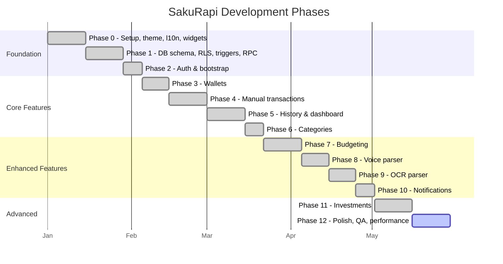

---

# BAGIAN X — FINAL DECISION SUMMARY

## 26. Keputusan Final

> Jika ada konflik antara implementasi lama, asumsi Copilot, atau prompt lain,
> keputusan berikut yang **MENANG**:

| # | Keputusan | Tidak Boleh Dilanggar |
|---|---|---|
| 1 | Saldo wallet berubah hanya dari ledger `transactions` | ❌ Bypass trigger |
| 2 | Report hanya menghitung income/expense non-settlement | ❌ Include settlement |
| 3 | Budget hanya menghitung expense | ❌ Include income/transfer |
| 4 | Multi-item selalu menggunakan `transaction_items` | ❌ Simpan di field JSON |
| 5 | Transfer dan transfer_to_asset bukan expense | ❌ Masukkan ke laporan |
| 6 | AI hanya prefill, user tetap review | ❌ Auto-save tanpa konfirmasi |
| 7 | Semua nominal MVP memakai IDR | ❌ Multi-currency |

---

*Dokumen ini adalah sumber kebenaran utama untuk requirement produk SakuRapi.*  
*Last updated: 2026-03-31 — PRD v7.0*
