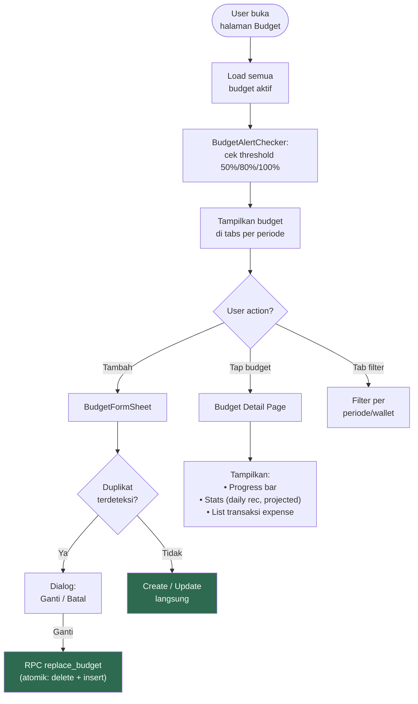
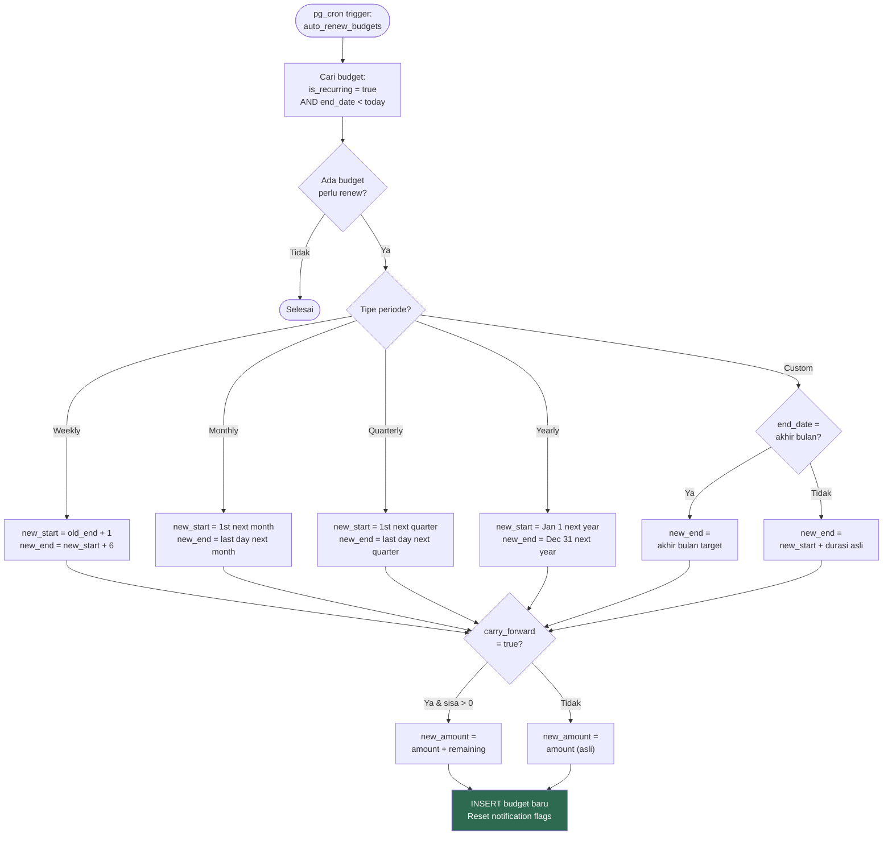
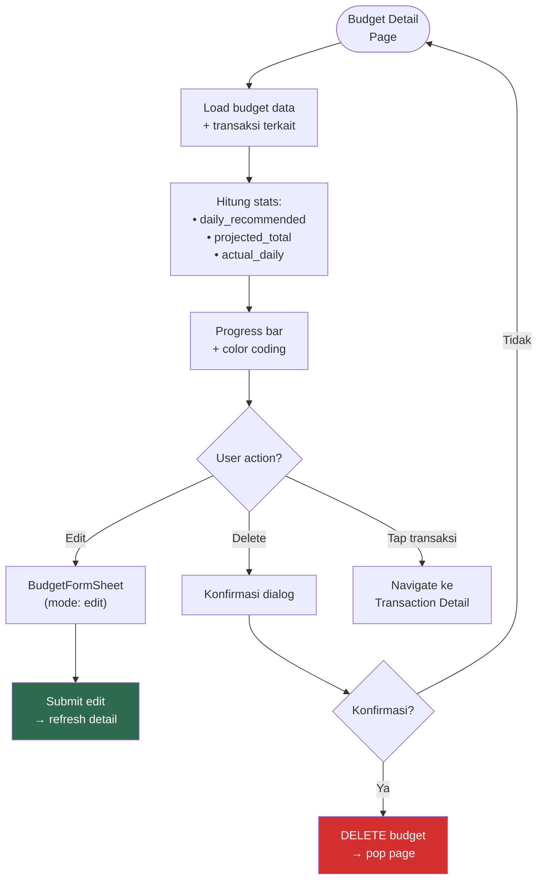
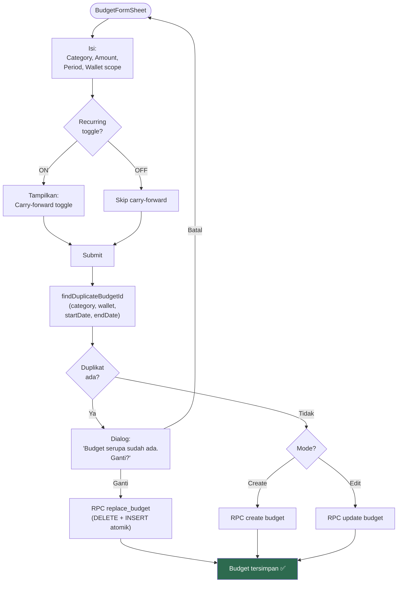
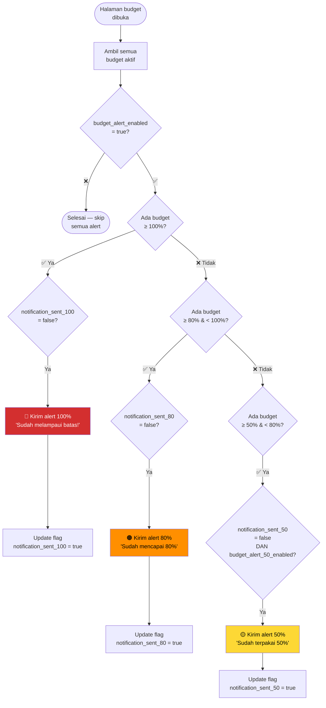

# 14. Budgeting

[← Categories](13_CATEGORIES.md) · [Index](00_INDEX.md) · [Investasi →](15_INVESTASI.md)

---

## 14.1. Deskripsi
Anggaran untuk kategori expense. Mendukung parent & child category, scope global/per-wallet, recurring otomatis, dan alert notifikasi di 50%/80%/100%.

## 14.2. Overview Flow



## 14.3. Period Types

| Tipe | Rentang | Auto-Renew |
|---|---|---|
| **Weekly** | Senin – Minggu | new_start = old_end + 1, new_end = new_start + 6 |
| **Monthly** (default) | Tgl 1 – akhir bulan | 1st next month – last day next month |
| **Quarterly** | Q1/Q2/Q3/Q4 | 1st next quarter – last day next quarter |
| **Yearly** | 1 Jan – 31 Des | Jan 1 next year – Dec 31 next year |
| **Custom** | Date range picker | Lihat aturan custom renew di bawah |

**Auto-renew Custom Recurring:**
- Cek apakah `end_date` = hari terakhir bulannya
- Jika akhir bulan → `new_end` = hari terakhir bulan dari new end's month
- Jika bukan akhir bulan → `new_end` = `new_start` + durasi asli (jumlah hari)
- Contoh: Jan 10–31 (akhir bulan) → Feb 10–28
- Contoh: Jan 10–29 (20 hari) → Feb 10 – Mar 1

### Flowchart: Auto-Renew Logic



## 14.4. Budget Page UI

```
┌─────────────────────────────────────┐
│  Anggaran              [🔽 Wallet] │  ← AppBar + wallet filter
├─────────────────────────────────────┤
│  [Mingguan] [Bulanan] [10/03-31/03]│  ← Dynamic period tabs
├─────────────────────────────────────┤
│  ┌─────────────────────────────┐    │
│  │     ╭───────────╮           │    │  ← BudgetSummaryCard
│  │    ╱  Arc Gauge  ╲          │    │     (semicircle 180°)
│  │   ╱    75%        ╲         │    │
│  │  Spendable: Rp 250.000     │    │
│  │  Budget | Used | Days Left  │    │
│  └─────────────────────────────┘    │
├─────────────────────────────────────┤
│  [+ Tambah Anggaran]               │  ← SakuButton
├─────────────────────────────────────┤
│  📊 Anggaran Aktif                  │
│  ┌─ Kebutuhan RT    Rp 2jt ────┐   │  ← Budget parent
│  │  ├─ Belanja Dapur  Rp 800rb │   │     dengan children
│  │  └─ Makan di Luar  Rp 500rb │   │
│  └──────────────────────────────┘   │
├─────────────────────────────────────┤
│  ⏰ Budget Mendatang                │  ← Upcoming budgets
│  └─ Transportasi      Rp 1jt       │
├─────────────────────────────────────┤
│  🕐 Lihat Budget Selesai →         │  ← Link to completed
└─────────────────────────────────────┘
```

## 14.5. Budget Detail Page

```
┌─────────────────────────────────────┐
│  [←] Kebutuhan RT    [✏️] [🗑️]    │  ← AppBar + actions
├─────────────────────────────────────┤
│  Spent           Remaining          │
│  Rp 1.500.000    Rp 500.000        │
│  ████████████░░░░ [Hari ini ↓]     │  ← Progress bar + marker
│  75%                                │
├─────────────────────────────────────┤
│  Periode: 01/03 – 31/03            │
│  Sisa hari: 2                       │
│  Wallet: Semua                      │
├─────────────────────────────────────┤
│  📈 Stats                           │
│  • Rekomendasi harian: Rp 64.500   │
│  • Proyeksi total: Rp 2.100.000    │
│  • Aktual harian: Rp 75.000        │
├─────────────────────────────────────┤
│  📋 Transaksi                       │
│  (termasuk sub-kategori child)      │
│  • Belanja Dapur    -Rp 150.000    │
│  • Makan McD        -Rp 85.000     │
└─────────────────────────────────────┘
```

### Flowchart: Budget Detail Flow



## 14.6. BudgetFormSheet

| Field | Tipe | Wajib | Default |
|---|---|---|---|
| Category | Picker (expense only) | ✅ | — |
| Amount | Currency (> 0) | ✅ | 0 |
| Period | Presets + Custom | ❌ | Inherit tab aktif / This Month |
| Wallet scope | Global / per-wallet | ❌ | Global |
| Recurring | Toggle checkbox | ❌ | false |
| Carry-forward | Toggle (muncul jika Recurring = true) | ❌ | false |

**Period presets:** This Week, This Month, This Quarter, This Year, Custom.

**Duplicate detection (seragam create & edit):**
1. Saat submit → cek `findDuplicateBudgetId(categoryId, walletId, startDate, endDate, excludeBudgetId?)`
2. Jika duplikat → dialog konfirmasi "Ganti" / "Batal"
3. "Ganti" → RPC `replace_budget` (DELETE + INSERT atomik)

**Dirty check:** Jika ada perubahan unsaved lalu user close → dialog konfirmasi discard.

### Flowchart: Budget Form Submission



## 14.7. Progress Bar Color Coding

| Persentase Penggunaan | Warna | Arti |
|---|---|---|
| < 60% | 🟢 Hijau | Aman |
| 60% – 79% | 🟡 Kuning | Hati-hati |
| 80% – 99% | 🟠 Oranye | Mendekati limit |
| ≥ 100% | 🔴 Merah | Over budget |

Animasi fill: 400ms easeOutCubic.

## 14.8. Budget Alert (BudgetAlertChecker)

**Kapan dicek?** Saat halaman budget di-load (`ref.listenManual`). **Bukan** background worker.



**Prioritas:** 100% > 80% > 50%. Hanya alert tertinggi yang dikirim.

**Notification channel:** `saku_rapi_budget` ("Alert Anggaran", importance HIGH).

**Reset:** Flag `notification_sent_50/80/100` di-reset oleh `auto_renew_budgets` pg_cron job saat budget di-clone ke periode baru.

## 14.9. Carry-Forward (Opsional)
- Jika `carry_forward = true` DAN budget recurring:
  - Sisa positif → ditambahkan ke nominal budget baru (`new_amount = amount + remaining`)
  - Sisa negatif (over budget) → **TIDAK** dikurangi; budget baru mulai dengan nominal asli

## 14.10. Acceptance Criteria
- [x] Expense child category mengurangi budget parent
- [x] Scope wallet bekerja benar
- [x] Alert 50%/80%/100% hanya terkirim sekali per periode
- [x] Period tabs dinamis (hanya tampil jika ada budget aktif)
- [x] Custom budget mendapat tab terpisah dengan label tanggal
- [x] Duplicate detection seragam di create & edit
- [x] Replace budget atomik via RPC
- [x] Transaksi sub-kategori tampil di detail page
- [x] BudgetAlertChecker triggered saat halaman budget load
- [x] Auto-renew via pg_cron aktif
- [x] Carry-forward menambah sisa positif ke budget baru
- [x] Spendable negatif saat over budget (bukan 0)
- [x] Detail page di-refresh setelah edit (bukan pop)
- [x] Form deteksi semua periode saat edit
- [x] Konfirmasi discard saat close form yang dirty

---

[← Categories](13_CATEGORIES.md) · [Index](00_INDEX.md) · [Investasi →](15_INVESTASI.md)
